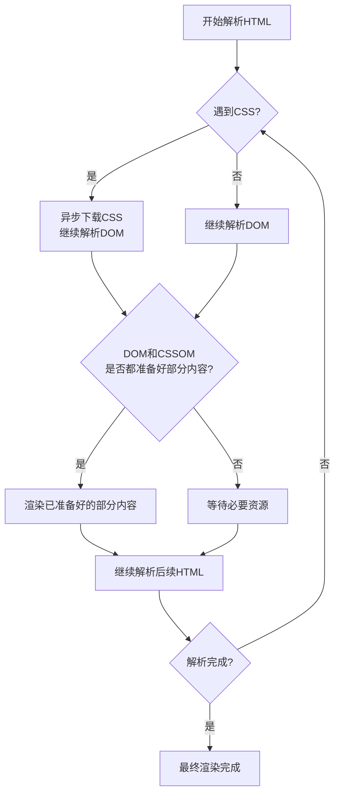

[toc]

## 1.HTML解析流程




## 3.浏览器及其内核

| 浏览器        | 内核                          |
| ------------- | ----------------------------- |
| IE            | Trident（单词是三叉戟的意思） |
| Google Chrome | webkit / blink                |
| safari        | webkit                        |
| Firefox       | gecko                         |
| Opera         | presto                        |

webkit最开始是有chrome和safari一起研发的，后来因为版权问题，chrome从webkit中剥离了自己的核心技术自己单独研发，所以有了blink

## 4.权重

| 选择器                            | 权重（256进制，实操IE7.0版本测出来的） |
| --------------------------------- | -------------------------------------- |
| !important                        | Infinity                               |
| 行间样式                          | 1000                                   |
| id                                | 100                                    |
| class \| 属性选择器 \| 伪类选择器 | 10                                     |
| 标签选择器 \| 伪元素              | 1                                      |
| 通配符 *                          | 0                                      |

浏览器内部原理，选择器是从右向左找，因为快

选择器类型：

1. 父子选择器
2. 并列选择器
3. 分组选择器

## 5.CSS属性和属性值

1. 浏览器默认字体大小是 16px
2. px 是相对单位，在同一台机器上就是绝对单位。（每英寸垂直方向能切割多少个像素点就是分辨率，像素点越大，屏幕分辨率越垃圾）
3. 字体大小设置的是字体的高
4. <strong>标签的font-weight属性值默认是blod
5. font-weight设置500及500以下，没有变化，是因为，即使你设置了字体的font-weight，那也得看浏览器的这个字体包中支不支持你设置的字体的weight，比如你设置了font-weight为300，但是该字体包的最小weight为500，就算你设置了300也没用，显示的还是500
6. 互联网用的最多的通用字体是arial
7. 为中文而设计的字体是 cursive 字体，比较好看
8. css只有块注释，没有行注释
9. 首行缩进 text-indent，只能用于block或者inline-block元素
10. padding 为3个值的时候，上、左右、下
11. 给 inline 元素设置padding，会有bug，左、右padding没有问题，但是上、下边的padding有问题，其他元素跟看不见该元素的上下padding一样，可以说等于没有上下padding

## 6.元素性质

##### 行级元素

1. 内容决定元素所占位置
2. 不可以通过css改变宽高
3. 凡是带有inline的元素都有文字特性（inline、inline-block）

##### 块级元素

1. 独占一行
2. 可以通过css改变宽高

##### 行级块元素

1. 内容决定大小
2. 可以通过css改变宽高

## 7.压缩代码

压缩代码分为两个步骤

1. 把代码中较长的单词，缩短为1个字母
2. 去空格，去回车  

## 8.盒模型

1. 标准盒模型 margin + border +  padding + content
2. IE盒模型 margin +border + content（padding + content）

## 9.定位（层模型）

0. margin 和 position 是可以叠加使用的
1. 绝对定位：absolute，脱离文档流，不保留原来的位置。相对最近的有定位的父级元素定位，如果所有父级元素都没有定位，就相对文档定位。
2. 相对定位：relative，也脱离文档流，但是保留原来的位置。相对于自己原来的位置定位的。
3. 固定定位：fixed
4. 值为百分比的话，相对于谁定位，就是谁的百分比

## 10.两栏布局

```html
<html>
    <head>
        <meta charset="utf-8">
        <title>DOcument</title>
        <style>
            * {
                margin: 0;
                padding:0;
            }
            
            .right {
                position:absolute;
                right:0;
                width: 100px;
                height: 100px;
                background-color: #fcc;
                opacity: 0.5;
            }
            
            .left {
                margin-right: 100px;
                height: 100px;
                background-color: #123;
            }
        </style>
    </head>
    <body>
        <div class="right"></div>
        <div class="left"></div>
    </body>
</html>
```

为什么right和left的顺序要反着写，如果不反着写的话，可以给right加上一个 top: 0;

## 11.margin塌陷（父子元素）

垂直方向的margin，父子会取大的那一个margin

解决办法是：

1. 在父元素加上border-top：1px solid red, 不可取。
2. 让父元素触发BFC（块级格式化上下文，block format context）。

## 12.如何触发一个盒子的BFC

1. position为absolute
2. display为inline-block
3. float为left/right
4. overflow为hidden

## 13.margin合并（兄弟元素）

块元素的上下margin也会合并

1. 使用BFC解决，添加一个父元素（可以是公共的父元素，也可以是某一个元素的父元素），触发父元素的BFC
2. 一般不解决，不能因为解决bug，而去随意的修改html（结构），结构一动，可能引起一系列问题

## 14.float（浮动模型）

1. float：right的时候。元素会倒序，比如left的时候为123，那么right的时候就是321，但是如果元素比较多的时候，1,2,3,4,5,6,7,8,9，right的时候就是：第一行321、第二行654、第三行987
2. 浮动的基础上可以叠加margin
3. 浮动元素产生了浮动流，所有产生了浮动流元素，只有块级元素看不到他们（包括父级元素是块级元素也看不到可门，这样就可以解释父元素的高度没有被撑开），产生了BFC的元素（包括使用float产生的BFC，也就是浮动元素可以看到浮动流）和文本类属性的元素（带有inline的）以及文本都能看到浮动元素
4. 让最后一个元素（必须是块级元素）清除浮动（clear: both）可以清除浮动流
5. 浮动元素不会占据父元素的100%，而是由子元素撑开的（即使float元素会自动变成block，宽度也不是100%，也是撑开）

## 15.伪元素

伪元素其实一直都存在，我们只是通过选择器去选择它，然后操作他的样式

伪元素的content属性必须写，哪怕属性值是空字符串

伪元素默认是 inline 元素

## 16.float和position的特点

凡是 设置了position：absolute 或 float：left 、right的元素，打内部把元素转换成block，虽然它是block，但是宽高都是根绝内容撑开的

## 17.文字溢出处理

单行文本

```css
white-space: nowrap;
overflow: hidden;
text-overflow: ellipsis;
```

多行文本没有更好的办法，至少css2没有更好的办法

## 18.图片代替文字

当网速不好的情况下，放弃下载css和javascript，只下载html，这种情况下，怎样展示文字

```html
<html>
    <head>
        <meta charset="utf-8">
        <title>Document</title>
    </head>
    <body>
        <a href="http://www.taobao.com">淘宝网</a>
    </body>
</html>
```

方法一

```css
a {
    display: inline-block;
    text-decoration: none;
    color: #424242;
    width: 190px;
    height: 90px;
    border: 1px solid black;
    background-image: url(img);
    background-size:190px 90px;
    
    text-indent: 200px; //首行缩进，把文字移出去
    white-space: nowrap;
    overflow: hidden;
}
```

方法二：padding可以展示背景图片

```css
a {
    display: inline-block;
    text-decoration: none;
    color: #424242;
    width: 190px;
    height: 0;
    padding-top: 90px;
    border: 1px solid black;
    background-image: url(img);
    background-size:190px 90px;
    overflow: hidden;
}
```

## 其他注意点

1. 行级元素只能嵌套行级元素，块级元素可以嵌套任何元素
2. p里面不能套块级元素，如果嵌套了，会跟下面一样

```html
<p>
	<div><div>
</p>
```

会变成一下这样

```html
<p></p>
<div><div>
<p></p>
```

3. a 标签里面不能套 a 标签
4. 一旦一个文本类元素里面包含了文字，那么外面的文字就会与元素里面的文字底对齐

以下的样式是文字与 span 的底对齐

```html
<span></span>呵呵
```

```css
span {
    display: inline-block;
    width: 100px;
    height: 100px;
    background-color: pink;
}
```

以下的样式是，文字与 span 元素里面的文字底对齐

```html
<span>123</span>呵呵
```

```css
span {
    display: inline-block;
    width: 100px;
    height: 100px;
    background-color: pink;
}
```

5. 调整文字类元素的对齐线

```css
vertical-align: middle;
```

6. 伪元素是两个冒号，写一个冒号也不报错，系统会自动给你加一个

