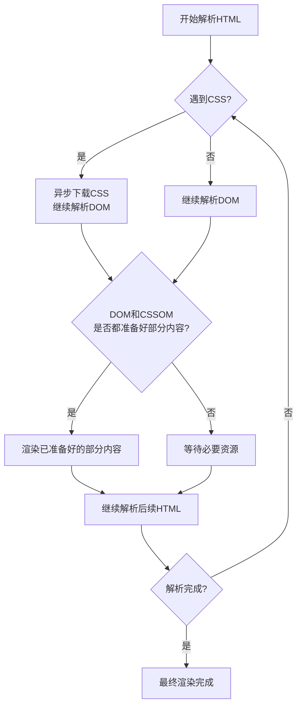

[toc]

作者：姬成

## 1.HTML解析流程




## 3.浏览器及其内核

| 浏览器        | 内核                          |
| ------------- | ----------------------------- |
| IE            | Trident（单词是三叉戟的意思） |
| Google Chrome | webkit / blink                |
| safari        | webkit                        |
| Firefox       | gecko                         |
| Opera         | presto                        |

webkit最开始是有chrome和safari一起研发的，后来因为版权问题，chrome从webkit中剥离了自己的核心技术自己单独研发，所以有了blink

## 4.权重

| 选择器                            | 权重（256进制，实操IE7.0版本测出来的） |
| --------------------------------- | -------------------------------------- |
| !important                        | Infinity                               |
| 行间样式                          | 1000                                   |
| id                                | 100                                    |
| class \| 属性选择器 \| 伪类选择器 | 10                                     |
| 标签选择器 \| 伪元素              | 1                                      |
| 通配符 *                          | 0                                      |

浏览器内部原理，选择器是从右向左找（树梢向着树干找），因为快

选择器类型：

1. 父子选择器
2. 并列选择器
3. 分组选择器

## 5.CSS属性和属性值


1. 浏览器默认基准字体大小是 16px（基准字体大小，可以在浏览器设置里面设置基准字体大小）
2. px 是相对单位，在同一台机器上就是绝对单位。（每英寸垂直方向能切割多少个像素点就是分辨率，像素点越大，屏幕分辨率越垃圾）
3. 字体大小设置的是字体的高度
4. <strong>标签的font-weight属性值默认是blod
5. font-weight设置500及500以下，没有变化，是因为，即使你设置了字体的font-weight，那也得看浏览器的这个字体包中支不支持你设置的字体的weight，比如你设置了font-weight为300，但是该字体包的最小weight为500，就算你设置了300也没用，显示的还是500
6. 互联网用的最多的通用字体是arial
7. 为中文而设计的字体是 cursive 字体，比较好看
8. css只有块注释，没有行注释
9. 首行缩进 text-indent，只能用于block或者inline-block元素
10. padding 为3个值的时候，上、左右、下
11. 给 inline 元素设置padding，会有bug，左、右padding没有问题，但是上、下边的padding有问题，其他元素跟看不见该元素的上下padding一样，可以padding不占位置

## 6.元素性质

##### 行级元素

1. 内容决定元素所占位置
2. 不可以通过css改变宽高
3. 凡是带有inline的元素都有文字特性（inline、inline-block）

##### 块级元素

1. 独占一行
2. 可以通过css改变宽高

##### 行级块元素

1. 内容决定大小
2. 可以通过css改变宽高

## 7.压缩代码

压缩代码分为两个步骤

1. 把代码中较长的单词，缩短为1个字母
2. 去空格，去回车  

## 8.盒模型

1. 标准盒模型 margin + border +  padding + content
2. IE盒模型 margin +border + content（padding + content）

## 9.定位（层模型）

0. margin 和 position 是可以叠加使用的
1. 绝对定位：absolute，脱离文档流，不保留原来的位置。相对最近的有定位的父级元素定位，如果所有父级元素都没有定位，就相对文档定位。
2. 相对定位：relative，<del>也脱离文档流</del>，但是保留原来的位置。相对于自己原来的位置定位的。
3. 固定定位：fixed
4. 值为百分比的话，相对于谁定位，就是谁的百分比

## 10.两栏布局

```html
<html>
    <head>
        <meta charset="utf-8">
        <title>DOcument</title>
        <style>
            * {
                margin: 0;
                padding:0;
            }
            
            .right {
                position:absolute;
                right:0;
                width: 100px;
                height: 100px;
                background-color: #fcc;
                opacity: 0.5;
            }
            
            .left {
                margin-right: 100px;
                height: 100px;
                background-color: #123;
            }
        </style>
    </head>
    <body>
        <div class="right"></div>
        <div class="left"></div>
    </body>
</html>
```

为什么right和left的顺序要反着写，如果不反着写的话，可以给right加上一个 top: 0;

## 11.margin合并（父子元素）

垂直方向的margin，父子会取大的那一个margin

解决办法是：

1. 在父元素加上border-top：1px solid red, 不可取。
2. 让父元素触发BFC（块级格式化上下文，block format context）。

## 12.如何触发一个盒子的BFC

1. position为absolute
2. display为inline-block
3. float为left/right
4. overflow为hidden

## 13.margin合并（兄弟元素）

块元素的上下margin也会合并

1. 使用BFC解决，添加一个父元素（是某一个元素的父元素），触发父元素的BFC
2. 一般不解决，不能因为解决bug，而去随意的修改html（结构），结构一动，可能引起一系列问题

## 14.body的margin合并

根据CSS规范，如果html元素没有设置背景色，那么body的背景色会覆盖整个画布（即整个视口）。而如果html元素设置了背景色，那么body的背景色就只覆盖body的内容区域。

## 15.float（浮动模型）

1. float：right的时候。元素会倒序，比如left的时候为123，那么right的时候就是321，但是如果元素比较多的时候，1,2,3,4,5,6,7,8,9，right的时候就是：第一行321、第二行654、第三行987
2. 浮动的基础上可以叠加margin
3. 浮动元素产生了浮动流，所有产生了浮动流元素，只有块级元素看不到他们（包括父级元素是块级元素也看不到它们，这样就可以解释父元素的高度没有被撑开），产生了BFC的元素（包括使用float产生的BFC，也就是浮动元素可以看到浮动流）和文本类属性的元素（带有inline的）以及文本都能看到浮动元素
4. 让最后一个元素（必须是块级元素）清除浮动（clear: both）可以清除浮动流
5. 浮动元素不会占据父元素的100%，而是由子元素撑开的（即使float元素会自动变成block，宽度也不是100%，也是撑开）
6. 浮动元素会使元素的display变为bloak，但是属性与inline-block很像

## 16.伪元素

<del>伪元素其实一直都存在（），我们只是通过选择器去选择它，然后操作他的样式</del>

伪元素的content属性必须写，哪怕属性值是空字符串

伪元素默认是 inline 元素

## 17.float和position的特点

凡是 设置了position：absolute 或 float：left 、right的元素，打内部把元素转换成block，虽然它是block，但是宽高都是根绝内容撑开的，不会与父元素的宽一样

## 18.文字溢出处理

单行文本

```css
white-space: nowrap;
overflow: hidden;
text-overflow: ellipsis;
```

多行文本没有更好的办法，至少css2没有更好的办法

## 19.图片代替文字

当网速不好的情况下，放弃下载css和javascript，只下载html，这种情况下，怎样展示文字

```html
<html>
    <head>
        <meta charset="utf-8">
        <title>Document</title>
    </head>
    <body>
        <a href="http://www.taobao.com">淘宝网</a>
    </body>
</html>
```

方法一

```css
a {
    display: inline-block;
    text-decoration: none;
    color: #424242;
    width: 190px;
    height: 90px;
    border: 1px solid black;
    background-image: url(img);
    background-size:190px 90px;
    
    text-indent: 200px; //首行缩进，把文字移出去
    white-space: nowrap;
    overflow: hidden;
}
```

方法二：padding可以展示背景图片

```css
a {
    display: inline-block;
    text-decoration: none;
    color: #424242;
    width: 190px;
    height: 0;
    padding-top: 90px;
    border: 1px solid black;
    background-image: url(img);
    background-size:190px 90px;
    overflow: hidden;
}
```

## 其他注意点

1. <del>行级元素只能嵌套行级元素，块级元素可以嵌套任何元素(在HTML5中不适用了，比如p标签不能嵌套ul标签)</del>
2. p里面不能套块级元素，如果嵌套了，会跟下面一样

```html
<p>
	<div><div>
</p>
```

会变成一下这样

```html
<p></p>
<div><div>
<p></p>
```

3. a 标签里面不能套 a 标签
4. 一旦一个文本类元素里面包含了文字，那么外面的文字就会与元素里面的文字底对齐

以下的样式是文字与 span 的底对齐

```html
<span></span>呵呵
```

```css
span {
    display: inline-block;
    width: 100px;
    height: 100px;
    background-color: pink;
}
```

以下的样式是，文字与 span 元素里面的文字底对齐

```html
<span>123</span>呵呵
```

```css
span {
    display: inline-block;
    width: 100px;
    height: 100px;
    background-color: pink;
}
```

5. 调整文字类元素的对齐线

```css
vertical-align: middle;
```

6. 伪元素是两个冒号，写一个冒号也不报错，系统会自动给你加一个


作者：袁进

## style

1. style 写在 head 标签中，主要是想优先加载css文件，先加载html没有样式的话会很丑
2. 为什么推荐使用外部样式表
   1. 解决重复样式多次书写，便于维护
   2. **有利于浏览器缓存**（把样式卸载一个文件里面，缓存之后不需要重新加载）、从而提高页面的响应速度
   3. 有利于代码分离

## 常见的元素声明

font-family：必须在客户端安装了（存在了）该字体，才会生效，所以一般都会设置多个字体，如果第一个字体客户端没有，那就显示第二个字体，依次往后类推。如果客户端是很老很老的电脑，最后在字体加上一个sans- serif（表示如果前面的字体都不存在的话，那计算机随便选一个‘非衬线字体’，每台电脑出厂时都有一个非衬线字体）

text-decoration：给文字加上、中、下 线

text-indent：文字首行缩进，只有块级元素才生效

lin-height：多行文本的话，可以设置纯数字（1.5 而不是 1.5em），表示相当于当前元素的字体大小，值对inline元素有效，对inline-block和block都无效，inline-block的时候，基线对齐，但是如果inline-block里面又有inline元素，inline-block会跑到最上面，inline-block里面的inline会居中

width：如果是绝对定位元素，宽度为百分比，那么参照最近的定位元素

letter-space：文字间隙

## 选择器

1. 属性选择器：选择包含某个属性的选择器（[attr]、[attr=value]、[attr~=value]、[attr|=value]、[attr^=value]、[attr$=value]、[attr*=value]、ol[type="B" s]、ol[type="c" i]）i是忽略大小写、s是区分大小写

2. 伪类选择器：选中某些元素的某种状态（:hover、:active、:link、visited），如果这四个伪类都要写的话，**必须按照顺序 link、visited、hover、active来写，link和visited只有a元素才可以使用，因为最开始是link，然后是hover，再是active(鼠标按下)**
3. 伪元素选择器：选中某个伪元素（::before、::after）
4.  相邻兄弟元素选择器 +
5. 后面出现的所有兄弟元素 ~
6. 分组选择器是语法糖，编译后还是会被分开

## 层叠（权重计算）

声明冲突：同一个样式多次应用到了同一个元素

层叠：解决声明冲突的过程，浏览器自动处理

一、比较重要性

> 作者样式表：开发者书写的样式

1) 作者样式表中的 !important 样式
2) 作者样式表中的普通样式
3) 浏览器默认样式表

二、比较特殊性

看选择器

总体规则：选择器选中的范围越窄，越特殊

具体规则：通过选择器计算出一个4位数

1. 千位：如果是内联样式，记1，否则记0
2. 百位：等于选择器中所有id选择器的数量
3. 十位：等于选择器中所有类选择器、属性选择器、伪类选择器的数量
4. 个位：等于选择器中所有元素选择器、伪元素选择器的数量

三、比较源次序

代码书写靠后的覆盖靠前的

常用的重置样式表：normalize.css、reset.css、meyer.css

## 继承

子元素会继承父元素的某些css属性

通常，跟文字相关的属性是可以继承的

## 属性值的计算过程

页面的渲染过程是一个元素一个元素依次渲染的，顺序按照页面文档的树形目录结构进行

渲染每一个元素的前提条件：该元素的所有css属性必须有值

一个元素，从所有属性都没有值，到所有属性都有值，这个计算过程，叫做属性值计算过程

1. 确定声明值：参考样式表（作者样式表、浏览器默认样式表）中没有长途的声明，作为css属性值
2. 层叠样式冲突：对样式表有冲突的声明使用层叠规则，确定css属性
3. 使用继承：对仍然没有值的属性，若可以继承，则继承父元素的值（强制继承使用 inherit）
4. 使用默认值：对任然没有值的属性，使用默认值

## 两个特殊的css取值

- inherit 继承
- initial 默认值

## 盒模型

盒子类型：

1. 块盒：display等于block的元素
2. 行盒：display等于inline的元素

盒子的组成部分

无论是行盒、还是块盒，都由以下几个部分组成，从内到外分别是

块盒：

1. 内容content
   1. width、height，设置的是盒子内容的高度
   2. 内容部分通常叫做整个盒子的**内容盒 content-box**
2. 填充（内边距）padding
   1. 盒子边框单盒子内容的距离
   2. padding-top、padding-right、padding-bottom、padding-left
   3. 简写：padding：上 右 下 左
   4. 填充区 + 内容区 = **填充盒 padding-box**
3. 边框border
   1. 边框 =  边框宽度 + 边框样式  + 边框颜色
   2. 边框样式：border-width：上 右 下 左
   3. 边框样式：border-style：上 右 下 左
   4. 边框颜色：border-color：上 右 下 左
   5. 边框 + 填充区 + 内容区 = **边框盒 border-box**
4. 外边距margin
   1. 边框到其他盒子的距离
   2. margin-top、 margin-right、margin-bottom、margin-left
   3. 速写属性：margin：上 右 下 左

盒子边框的颜色如果不设置的话，那么边框的颜色就是文字的颜色

## 盒模型应用

默认情况下：background是包含边框的，但是可以通过background-clip

### 短词规则

word-break，会影响文字在什么位置被截断

normal：普通。CJK字符（文字位置截断），非CJK字符（单词位置截断）

break-all：截断所有，所有字符都在文字处截断

keep-all：保持所有，所有文字都在单词之间截断（空格单词分隔符）

## 行盒盒模型

常见的行盒：包含具体内容的元素一般为行盒

span、em、i、video、strong、img、audio...

padding：水平方向正常，但是垂直方向能显示，只影响背景，不占据空间

border：水平方向正常，但是垂直方向只只能显示边框，但是不会占据空间

**margin：水平方向正常，但是垂直方法完全无效**

line-height：可以影响高度，但是背景不会跟着高度变化，背景还是跟内容一样高

## 行块盒

1. 不独占一行
2. 盒模型中的所有尺寸都有效

## 可替换元素 和 非可替换元素

大部分元素，页面上显示的结果，取决于元素内容，称为**非可替换元素**

少部分元素，页面上显示的结果，取决于元素属性，称为**可替换元素**

可替换元素：img、video、audio

绝大部分可替换元素为行盒

可替换元素类似于行块盒，盒模型中所有尺寸都有效

## 常规流

盒模型：规定单个盒子的规则

视觉格式化模型（布局规则）：页面中的多个盒子排列规则

视觉格式化模型，大体上将页面中盒子的排列分为三种当时

1. 常规流
2. 浮动流
3. 定位

### 常规流布局

常规流、文档流、普通文档流、常规文档流都是指一个东西，就是常规流

所有元素，默认情况下，都属于常规流布局

总体规则：块盒独占一行，行盒水平依次排列

包含块（containing block）：每个盒子都有它的包含块，包含块决定了盒子的排列区域

绝大部分情况下：盒子的包含块为其父元素的内容盒

**块盒**

1. 每个块盒的总宽度，必须刚好等于包含块的宽度

宽度的默认值是auto：将剩余空间吸收掉

margin的取值也可以是auto，默认值是0

当margin为auto并且宽度也是auto，那么宽度的auto占绝对优势，会占满包含盒的内容盒

若宽度、边框、内边距、外边距计算后，仍然有剩余空间，该剩余空间被margin-right全部吸收

在常规流中，块盒在其包含块中居中，可以定宽，然后左右margin设置为auto

2. 每个块盒在垂直方向上的auto

margin为auto其实就是0

3. 百分比取值

padding、width、margin

以上所有百分比，相对于包含块的内容宽度，跟高度没有任何关系

高度百分比：

1. 包含块的高度是取决于子元素的高度，子元素高度设置百分比无效，相当于auto
2. 包含块的高度不取决于子元素的高度，子元素高度设置百分比是相对于父元素的高度

4. 上下外边距合并

两个常规流块盒的上下外边距会合并

## 浮动

 应用场景

- 文字环绕

- 横向排列

默认值：none

1. 浮动元素的包含块，和常规流一样，为父元素的内容盒

盒子尺寸

1. 宽度为auto时，表示适应内容宽度
2. 高度为auto时，与常规流一致，适应内容高度
3. margin为auto，为0
4. 边框、内边距、百分比与常规流一样

盒子排列

1. 左浮动盒子靠左靠上排列

2. 右浮动盒子靠右靠上排列

3. 在包含快中排列时，会避开常规流的块盒子

4. 常规流块盒在排列时，无视浮动盒子

5. ```html
   <div class="wrap">
     <div class="conventional"></div>
     <div class="content">1</div>
     <div class="content">2</div>
     <div class="content">3</div>
     <div class="content">4</div>
     <div class="content">5</div>
     <div class="content">6</div>
     <div class="content">7</div>
     <div class="content">8</div>
     <div class="content">9</div>
     <div class="content">10</div>
      <!--<div class="conventional"></div>-->
   </div>
   <style>
       .conventional{
     		height: 50px;
     		background-color: pink
   	}
   	.content {
     		width: 100px;
     		height: 100px;
     		background-color: gainsboro;
     		float: left;
   	}
   </style>
   ```

6. 如果文字没有在行盒中，浏览器会自动生成一个行盒包裹文字，该行盒为匿名行盒

7. 高度坍塌的根源：常规流盒子 的自动高度，在计算时，不会考虑浮动盒子

8. 清除浮动：该元素必须出现在前面所有浮动元素的下方（必须是块盒

9. 浮动盒子里面不会发生margin合并

```html
<div class="wrap">
  <div class="left">测试：</div>
  <div class="right">
    <div class="item">aaa</div>
    <div class="item">aaa</div>
    <div class="item">aaa</div>
    <div class="item">aaa</div>
    <div class="item">aaa</div>
    <div class="item">aaa</div>
    <div class="item">aaa</div>
    <div class="item">aaa</div>
    <div class="item">aaa</div>
    <div class="item">aaa</div>
    <div class="item">aaa</div>
    <div class="item">aaa</div>
    <div class="item">aaa</div>
    <div class="item">aaa</div>
    <div class="item">aaa</div>
    <div class="item">aaa</div>
  </div>
</div>
```

```css
.left {
  float: left;
}
.right {
  float: left;
  /* width: 600px; */  /*如果没有这个定宽，right盒子会换行，因为宽度太宽了，left的这一行显示不下*/
}
.right .item {
  float: left;
  width: 80px;
  height: 30px;
  background-color: pink;
  margin: 5px 10px;
}
```

![示例](data:image/png;base64,iVBORw0KGgoAAAANSUhEUgAAA0MAAADHCAIAAABUax/rAAAACXBIWXMAAA7EAAAOxAGVKw4bAAAM60lEQVR4nO3df2yV9aHH8edYxNFWu6akYIEiZXiFm10EUTRgZBiJjhgSXJaBBKdIVBqS6siYLm5sLgGjS/hDozMZBozGRIEEJVYhzJli3KwwYaZAbmKqQGkVKKVdEU577h+9cViO7Nuf8j28Xn/BeTiH53z+eudpz3lSmUwmAQAgQpd81ycAAEAvKTkAgFgpOQCAWCk5AIBYKTkAgFgpOQCAWCk5AIBYKTkAgFgNOfeh1ra2zw81HG9u6ezs/C5OCQCA/3fJJZcUf/+KMaOuLCwoOPdoqts9Hlrb2vZ8sn/c2NGlw0vy8vIG8TwBAOiuo6Oj6cujn9Yf/J///q9zY657ydUd+N/vF11x5YjSwT1JAAC+VUNjU/OJlolX/6Db491/T+54c0vp8JJBPDEAAP6D0uElx5tbzn28e8l1dnb6oSoAwAUlLy8v6wcYfHYVACBWA15yp06damxsPHPmzED/RwAAF5vsJVdbW7t06dKDBw+e55l79+69+eab9+7dmyRJW1vb3XffvWLFinOLbdu2bRUVFUuXLp00aVJ9fX2/njwAwEUte8nl5+d//PHHFRUVTzzxxKhRo1Jnueeeew4dOvTWW2+dOHGivr7+9OnTSZIUFBQsXLjwueeeq6yszHr57YEHHpg+ffqSJUtOnDgx8G8KAOCikL3kJk2atHPnzlWrVp04cSKVSm3ZsiWTyWQymcWLFydJsmvXrgcffPD48eNnP2Xu3LkbNmx44403Pvzww7MfLy4uLiwsHDp06OOPPz5t2rRUKjXA7wgA4GKR5R4PXS699NLHHnusoaHhtddeO3ny5KxZs+64447zv9b8+fNvv/32Z555ZsaMGd0OTZs2resPxcXFK1euTJLk6NGjd955Z11d3dtvv33DDTf0x3sBALi4ZLkmd+bMmZdeeun8vyTX7d83NjY2NDQcOXIkk8lUVlYePkt1dfWwYcPWr1/f9dfKysquZzU1Ne3fv7+5uXn37t39+o4AAC4WWUqusbFx06ZN5eXly5cvb2nJ8h103ezZs6eioqKsrKysrOzZZ58tLCy88iwTJkwoKirKy8vr+mthYWHXs6655podO3a88847XT+xBQCgp7KU3OjRozdt2rR9+/avvvqq2728srruuuva2toOHz5cXl6eJElra+usWbO+/oTEfffdN3To0HOv8KVSqcmTJ992223Dhg3rv7cDAHARyf6Jh1QqNXv27BdeeKGoqKinr1hQULBx48bq6uqysrLq6up169aVlpYeOnSoP84WAIB/+9ZvBm5tbX311Vfb29t7+oqpVKqkpGT48OF5eXnDhw8fMWJEUVHR4cOH0+l0n88WAIB/+9aSq6mpWbx48bvvvpskSSaT6ejoGD16dC/+g4KCgquuuqq+vv7kyZN9O1UAAL4h+7eQpNPp9evXT5069dZbbz1w4EA6nf7ss88qKiqWLVuWJMlll122YMGCrL/f1tzcvGzZsilTpkydOrWzs3Pbtm1vvvnm+PHjN2/efOTIkZUrV06ZMuWhhx7qqsM9e/Y0NTXNnDnTr8oBAPRC9mty+/btq66uXrRo0dixY1evXr179+6hQ4dWVVUdPHhw+vTp11577Zo1a4qLi89+Snt7++nTp9esWbNx48aampr777//0KFDTz755Jdffjlx4sTW1taamppjx459/dGHffv2zZ49e86cORs2bBiUdwoAkGuyXJPLZDLPP/98QUHB3Llz29vbn3rqqZdffnnr1q1JksybNy9JkrvuuqvbU9Lp9Lp165qamlavXr1o0aKqqqoFCxZs3rx57NixqVSqtbX1pptuevjhh9Pp9NffOVJSUjJ27NjOzs4pU6YMyjsFAMg1WUounU6PGzeuqqqqvLx8xYoVO3fu3Llz59VXX50kydq1a7ds2TJ+/Pg5c+Z88cUXM2bMGDNmTJIkQ4YMuffee+fPnz916tQkSV5//fWzX7CwsPDpp5+eN2/exIkTb7nllq4HS0tLd+3aNVhvEwAgB6W6fWNczQe1M2+c9t2dDwAAWWSNtG/97CoAABc4JQcAECslBwAQKyUHABArJQcAECslBwAQKyUHABArJQcAEKss93j4D/5aOyAncsG6pQ/fk2yrcLYKZ6twtgpnq3C2CmergeeaHABArJQcAECslBwAQKyUHABArJQcAECslBwAQKyUHABArJQcAECslBwAQKx6U3ItbW2/ffFPo37y49Ss61Ozrv/pqkePHDval0M5zFbhbBXOVuFsFc5W4WwVzlYDrTclt+X9917Z/vYfl1V9/trW5x95dON7O/7w0p8zmUyvD+UwW4WzVThbhbNVOFuFs1U4Ww20VLddaj6onXnjee8a9s17qKU7On72u8fqGxveefqZ4suv6PuhC07/3W/OVudjq3C2CmercLYKZ6twtupXWSNtSK9frrX9X7X76/6yu/ajA3Wdmcyp06f7eCiH2SqcrcLZKpytwtkqnK3C2Wrg9Oanq8daWhb8/tdFc3+06sUXRhSXjCkd2cdDOcxW4WwVzlbhbBXOVuFsFc5WA63H1+TSHR2Va5/8+75P9m14fcLoMUmS/K3un/WNDb0+lMNsFc5W4WwVzlbhbBXOVuFsNQh6fE3ui+bj73+yZ+YPr+0aN5PJpDs6+nIoh9kqnK3C2SqcrcLZKpytwtlqEPS45C7Pzx83suzdf3y0Y9eHdfWf3vWbX76yvbovh3KYrcLZKpytwtkqnK3C2SqcrQZBj0uucFj+2uW/yL/se7c+smzykoXlI0b+auHP+3Ioh9kqnK3C2SqcrcLZKpytwtlqEPT1W0hyX/99+jr32SqcrcLZKpytwtkqnK3CfRffQuJuXQAAsVJyAACxUnIAALFScgAAsVJyAACxUnIAALFScgAAsVJyAACxUnIAALFScgAAser53boAABh07tYFAJBTlBwAQKyUHABArJQcAECslBwAQKyUHABArJQcAECslBwAQKyUHABArIb0+Bl/rR2QE7lg3dKHO17YKpytwtkqnK3C2SqcrcLZauC5JgcAECslBwAQKyUHABArJQcAECslBwAQKyUHABArJQcAECslBwAQKyUHABCr3pRcS1vbb1/806if/Dg16/rUrOt/uurRI8eO9uVQDrNVOFuFs1U4W4WzVThbhbPVQOtNyW15/71Xtr/9x2VVn7+29flHHt343o4/vPTnTCbT60M5zFbhbBXOVuFsFc5W4WwVzlYDLdVtl5oPamfeeN67hn3zHmrpjo6f/e6x+saGd55+pvjyK/p+6ILTf/ebs9X52CqcrcLZKpytwtkqnK36VdZIG9Lrl2tt/1ft/rq/7K796EBdZyZz6vTpPh7KYbYKZ6twtgpnq3C2CmercLYaOL356eqxlpYFv/910dwfrXrxhRHFJWNKR/bxUA6zVThbhbNVOFuFs1U4W4Wz1UDr8TW5dEdH5don/77vk30bXp8wekySJH+r+2d9Y0OvD+UwW4WzVThbhbNVOFuFs1U4Ww2CHl+T+6L5+Puf7Jn5w2u7xs1kMumOjr4cymG2CmercLYKZ6twtgpnq3C2GgQ9LrnL8/PHjSx79x8f7dj1YV39p3f95pevbK/uy6EcZqtwtgpnq3C2CmercLYKZ6tB0OOSKxyWv3b5L/Iv+96tjyybvGRh+YiRv1r4874cymG2CmercLYKZ6twtgpnq3C2GgR9/RaS3Nd/n77OfbYKZ6twtgpnq3C2CmercN/Ft5C4WxcAQKyUHABArJQcAECslBwAQKyUHABArJQcAECslBwAQKyUHABArJQcAECslBwAQKx6frcuAAAGnbt1AQDkFCUHABArJQcAECslBwAQKyUHABArJQcAECslBwAQKyUHABArJQcAECslBwAQKyUHABArJQcAECslBwAQKyUHABArJQcAECslBwAQKyUHABArJQcAECslBwAQKyUHABArJQcAECslBwAQKyUHABArJQcAECslBwAQKyUHABArJQcAECslBwAQKyUHABArJQcAECslBwAQKyUHABArJQcAECslBwAQKyUHABArJQcAECslBwAQKyUHABArJQcAECslBwAQKyUHABArJQcAECslBwAQKyUHABArJQcAECslBwAQKyUHABArJQcAECslBwAQKyUHABArJQcAECslBwAQKyUHABArJQcAECslBwAQKyUHABArJQcAECslBwAQKyUHABArJQcAECslBwAQKyUHABArJQcAECslBwAQKyUHABArJQcAECslBwAQKyUHABArJQcAECslBwAQKyUHABArJQcAECslBwAQKyUHABArJQcAECslBwAQKyUHABArJQcAECslBwAQKyUHABArJQcAECslBwAQKyUHABArJQcAECslBwAQKyUHABArJQcAECslBwAQKyUHABCr/wOPlbx3iYIgGQAAAABJRU5ErkJggg==)

## 定位

手动控制元素在包含块中的精准位置

相对定位

margin与reactive的区别：margin也属于盒子模型的一部分，块盒模型会自动占满包容和的内容区（width），如果设置了margin，那么盒子的width会变小，因为margin也需要空间，也说与盒子模型，但是reactive不会

左右冲突一左边为准，上下冲突一上面为准

绝对定位

1.宽度为auto，适应内容

2.包含块变化：找祖先元素中第一个定位元素，该元素的填充盒为其包含块 。若找不到，则他的包含块就是整个网页（初始包含块）

固定定位

其他情况和绝对定位一样

包含块不同：固定为视口（浏览器的可视窗口）

视口与整个网页的区别：视口就是浏览器的可见区域，整个网页是整个html，整个网页的宽高可能比视口的宽高大，此时会出现滚动条

定位下的居中

某个方向居中：

1.定宽（高）

2.将左右（上下）距离（left、right、top、bottom）设置为0

3.将左右（上下）margin设置为0

绝对定位和固定定位中，margin为auto时，会自动吸收剩余空间

多个定位元素重叠时

堆叠上下文：暂时不讲

设置z-index，通常情况下，这个值越大，越靠近用户

只有定位元素设置z-index有效

z-index可以是负数，如果是负数，则遇到常规流、浮动流，会被覆盖

绝对定位、固定定位一定是块盒，宽高根据内容撑开

绝对定位、固定定位元素一定不是浮动，绝对定位、固定定位优先级高于浮动

绝对定位、固定定位没有外边距合并

## 透明

rgba：红 绿 蓝 alpha(阿尔法透明通道0~1)

hex：#红 绿 蓝 透(0~ff)

## 更多伪类选择器

1. first-child：选中第一个子元素

```html
<!DOCTYPE html>
<html lang="cmn-hans">
    <head>
        <meta charset="utf-8">
    <title></title>
    <style type="css/stylesheet">
        a:first-child {
            color:red;
        }
    </style>
    </head>
    <body>
        <div>
            <nav>
                <p>
                    选中a元素，并且a元素必须是第一个子元素，
                    该示例没有满足条件的元素
                </p>
                <a href=""></a>
                <a href=""></a>
                <a href=""></a>
            </nav>
        </div>
    </body>
</html>
```

```html
<!DOCTYPE html>
<html lang="cmn-hans">
    <head>
        <meta charset="utf-8">
    <title></title>
    <style type="css/stylesheet">
        a:first-child {
            color:red;
        }
    </style>
    </head>
    <body>
        <div>
            <nav>
                <a href="">此元素满足条件</a>
                <a href=""></a>
                <a href=""></a>
            </nav>
        </div>
    </body>
</html>
```

这样才可以选中第一个a元素

1. last-child：选择最后一个子元素
2. nth-child：选中指定位置的子元素，与first-child和last-child相似（必须是某个元素，且必须是第几个，even偶数，odd奇数）
3. nth-of-type：选中指定的元素中第几个子元素
4. first-of-type：选中子元素中第一个自定类型的元素

```html
<!DOCTYPE html>
<html lang="cmn-hans">
    <head>
        <meta charset="utf-8">
    <title></title>
    <style type="css/stylesheet">
        a:first-of-type {
            color:red;
        }
    </style>
    </head>
    <body>
        <div>
            <nav>
                <p>选中的是子元素中第一个a元素</p>
                <a href=""></a>
                <a href=""></a>
                <a href=""></a>
            </nav>
        </div>
    </body>
</html>
```


## 更多伪元素选择器

1. first-letter：选择元素中的第一个字母或文字
2. first-line：选择元素中第一行文字
3. selection：选中被用户框选的文字

## 更多的样式

鼠标

cursor：使用图片最为光标的时候，图片一般为.ico或者.cur结尾，auto表示如果浏览器不支持的话，就是用默认的，类似于font-fimily

```css
cursor: url("./imgs/target.ico"), auto;
```

背景

img元素是html的概念

背景图属于css的概念

1.当图片属于网页内容时，必须使用img元素

2.当图片仅用于美化页面时，使用背景

设计的css属性

1. background-image

2. background-repeat

3. background-size

   1. 预设值：contain、cover，类似于object-fit
   2. 数值或百分比

4. background-position

   1. 预设值：center、top、left、right、bottom分别设置横纵向的位置
   2. 百分比或数字：可以为负数

5. background-attachment

   1. 通常用它控制背景图是否固定，当body中的文字特别多的时候，出现滚动条，滚动滚动条的时候，背景图被翻上去了，设置background-attachment: fixed;有点像固定定位一样

   ```css
   body {
       background-image: url("imgs/main_bg.jpg");
       background-repeat: no-repeat;
      	background-size: 100%;
       background-attachment: fixed;
   }
   ```

6. 背景色与背景图可以混在一起用，背景图会在背景色的上面

7. 符合写法

   background: url no-repeat position/size attachment color
