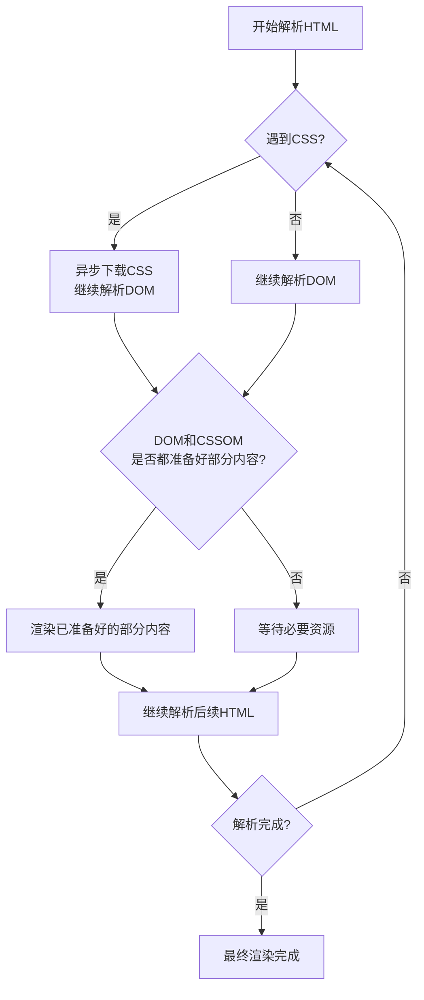

[toc]

> 📚 **CSS 基础学习笔记（整理版）**
> 
> 本文档由两位学习者的笔记整合而成。整理过程中修正了笔误，补充了技术细节，并对易混淆的概念添加了说明。
> 
> **图例说明：**
> - 📌 补充说明或技术细节
> - ⚠️ 常见误区或注意事项
> - 💡 记忆技巧或通俗解释

---

# 第一部分：CSS 基础篇（姬成）

## 1. HTML 解析流程


```mermaid
flowchart TD
    A[开始解析HTML] --> B{遇到CSS?}
    B -- 是 --> C[异步下载CSS<br>继续解析DOM]
    B -- 否 --> D[继续解析DOM]
    C --> E{DOM和CSSOM<br>是否都准备好部分内容?}
    D --> E
    E -- 是 --> F[渲染已准备好的部分内容]
    E -- 否 --> G[等待必要资源]
    F --> H[继续解析后续HTML]
    G --> H
    H --> I{解析完成?}
    I -- 否 --> B
    I -- 是 --> J[最终渲染完成]
```

> 💡 **理解**：浏览器解析 HTML 时，遇到 CSS 会异步下载（不会阻塞 DOM 解析），但需要等 CSSOM 构建完成后才能将 DOM 和 CSSOM 合并成渲染树进行渲染。

---

## 3. 浏览器及其内核

| 浏览器 | 内核 | 说明 |
|--------|------|------|
| IE | Trident | 单词是"三叉戟"的意思 |
| Google Chrome | WebKit / Blink | 早期使用 WebKit，现使用 Blink |
| Safari | WebKit | — |
| Firefox | Gecko | — |
| Opera | Presto | 早期内核，现也已改用 Blink |

> 📌 **说明**：WebKit 最开始是由 Chrome 和 Safari 一起研发的。后来因为理念分歧及版权问题，Chrome 从 WebKit 中剥离了核心技术单独研发，于是有了 Blink 内核。

---

## 4. 选择器权重（优先级）

| 选择器 | 权重值 | 现代 Specificity |
|--------|--------|------------------|
| `!important` | Infinity（最高） | 覆盖一切，但应谨慎使用 |
| 行间样式（内联样式） | 1000 | `(1, 0, 0, 0)` |
| `id` 选择器 | 100 | `(0, 1, 0, 0)` |
| `class` / 属性选择器 / 伪类选择器 | 10 | `(0, 0, 1, 0)` |
| 标签选择器 / 伪元素 | 1 | `(0, 0, 0, 1)` |
| 通配符 `*` | 0 | `(0, 0, 0, 0)` |

> ⚠️ **注意**：原笔记提到的"256进制"是早期 IE 浏览器的内部实现细节。**现代浏览器采用的是 Specificity 元组比较法**（如 `(a, b, c, d)`），从高位到低位逐位比较，不存在进位溢出问题。
>
> 💡 **技巧**：浏览器渲染引擎匹配选择器时，**是从右向左查找**（从树梢向树干找），因为这样能更快地排除不匹配的分支，提升效率。

**选择器类型：**

1. **父子选择器**（后代/子代选择器）
2. **并列选择器**（交集选择器，如 `div.active`）
3. **分组选择器**（并集选择器，如 `h1, h2, p`）

---

## 5. CSS 属性与属性值

1. **基准字体大小**：浏览器默认基准字体大小是 `16px`（可在浏览器设置中调整）。
2. **`px` 的本质**：CSS 规范中 `px` 属于**相对单位**（相对于显示设备的分辨率），但在同一台设备上使用时可以视为绝对单位。
   
   > 📌 **说明**：分辨率指的是每英寸能切割的像素点数。注意：这里的"像素点"是逻辑概念；物理像素点越大，屏幕显示的精细度反而越低（即分辨率越"垃圾"）。

3. **字体大小设置的是字体的高度**（em-square，即字体的设计网格高度）。
4. `<strong>` 标签的 `font-weight` 属性默认值是 **`bold`**（不是 `blod`）。

5. **`font-weight` 生效的前提**：即使设置了 `font-weight`，也要看该字体包是否支持你设置的字重。
   
   > 💡 **举例**：你设置了 `font-weight: 300`，但如果该字体包的最小字重只有 `400`，那么最终显示的还是 `400`。

6. 互联网最常用的通用西文字体是 **Arial**。
7. 为中文设计的装饰性字体是 **`cursive`**（手写体），视觉效果比较好看。
8. **CSS 只有块注释**（`/* */`），没有行注释（`//` 在标准 CSS 中无效，仅在 Sass/Less 等预处理器中可用）。
9. `text-indent`（首行缩进）只能用于 `block` 或 `inline-block` 元素。
10. `padding` 为 3 个值时，依次表示：**上、左右、下**。
11. 给 `inline` 元素设置 `padding` 会有特殊表现：
    - 左右 `padding` 正常生效，会占据空间；
    - 上下 `padding` 虽然能显示背景，但**不会推开其他元素**（即不占据文档流中的垂直空间）。

    > ⚠️ **注意**：原笔记说"可以 padding 不占位置"表述不够清晰。准确来说是：上下 padding 不会影响行高和周围元素的布局，但背景色/边框可能会溢出到相邻行。

---

## 6. 元素性质

##### 🔹 行级元素（Inline）

1. 内容决定元素所占位置（宽度由内容撑开）。
2. **不可以通过 CSS 改变宽高**（设置 `width`/`height` 无效）。
3. 凡是带有 `inline` 的元素都具有**文字特性**（如基线对齐、受 `line-height` 影响等）。

##### 🔹 块级元素（Block）

1. 独占一行（默认宽度撑满父容器）。
2. 可以通过 CSS 改变宽高。

##### 🔹 行级块元素（Inline-Block）

1. 内容决定大小（不设置宽高时由内容撑开）。
2. 可以通过 CSS 改变宽高。
3. 既有行内元素的并排特性，又有块级元素的盒模型特性。

---

## 7. 压缩代码

生产环境中的 CSS 压缩通常分为两步：

1. **缩短标识符**：把代码中较长的类名、变量名缩短为 1~2 个字母。
2. **去除空白**：去空格、去回车、去多余分号。

> 💡 **理解**：压缩是为了减小文件体积，加快网络传输。开发环境保留可读性代码，生产环境使用压缩后的代码。

---

## 8. 盒模型

| 模型 | 计算公式 | 说明 |
|------|----------|------|
| **标准盒模型（W3C）** | `margin + border + padding + content` | `width`/`height` 只指 `content` |
| **IE 盒模型（怪异模式）** | `margin + border + (padding + content)` | `width`/`height` 包含 `padding` 和 `border` |

> 📌 **说明**：在 CSS3 中，可以通过 `box-sizing` 属性切换两种模型：
> - `box-sizing: content-box`（标准盒模型，默认值）
> - `box-sizing: border-box`（IE 盒模型，更直观，推荐使用）

---

## 9. 定位（层模型）

1. `margin` 和 `position` **可以叠加使用**。
2. **绝对定位（`absolute`）**：脱离文档流，**不保留原来的位置**。相对最近的有定位（非 `static`）的父级元素定位；如果所有父级都没有定位，则相对**初始包含块**（通常是视口或文档）定位。
3. **相对定位（`relative`）**：~~也脱离文档流~~ ❌ **不脱离文档流**，保留原来的位置。相对于自己原来的位置进行偏移。
   
   > ⚠️ **注意**：相对定位最大的特点是**仍然占据原来的空间**，其他元素不会挤占它的位置。

4. **固定定位（`fixed`）**：相对于**视口**（浏览器可视区域）定位，滚动页面时位置不变。
5. **百分比定位**：如果定位值使用百分比（如 `left: 50%`），则相对于其**定位参考元素**的宽高计算。

---

## 10. 两栏布局（自适应 + 固定）

```html
<!DOCTYPE html>
<html>
<head>
    <meta charset="utf-8">
    <title>两栏布局</title>
    <style>
        * {
            margin: 0;
            padding: 0;
        }
        
        .right {
            position: absolute;
            right: 0;
            width: 100px;
            height: 100px;
            background-color: #fcc;
            opacity: 0.5;
        }
        
        .left {
            margin-right: 100px;
            height: 100px;
            background-color: #123;
        }
    </style>
</head>
<body>
    <div class="right"></div>
    <div class="left"></div>
</body>
</html>
```

> 💡 **为什么要反着写（`.right` 在 `.left` 前面）？**
> 
> 因为 `.right` 是绝对定位（脱离文档流），后面的 `.left` 是常规流块盒，会自动占据整行。如果反过来写（`.left` 在前），`.left` 会先占据整行，此时再写 `.right`，虽然 `.right` 是绝对定位，但视觉上可能会产生覆盖顺序问题。
>
> 如果不反着写，可以给 `.right` 加上 `top: 0`，确保它贴到右上角。

---

## 11. Margin 合并（父子元素）

垂直方向的 `margin`，父子元素会**取较大的那个值**（而不是相加）。

**解决办法：**

1. 在父元素加上 `border-top: 1px solid red` —— 会破坏样式，**不推荐**。
2. **让父元素触发 BFC**（块级格式化上下文，Block Formatting Context）。

> 💡 **通俗理解**：BFC 就像给父元素加了一个"独立小房间"，房间里面的 margin 不会和房间外面的 margin 发生合并。

---

## 12. 如何触发一个盒子的 BFC

以下条件任满足其一即可触发 BFC：

| 条件 | 示例 |
|------|------|
| `position` 为 `absolute` 或 `fixed` | `position: absolute;` |
| `display` 为 `inline-block` | `display: inline-block;` |
| `float` 为 `left` / `right` | `float: left;` |
| `overflow` 不为 `visible` | `overflow: hidden;` |

> 📌 **说明**：最常用的触发 BFC 方式是 `overflow: hidden`，因为它对布局影响最小。

---

## 13. Margin 合并（兄弟元素）

块级元素在垂直方向相邻时，它们的上下 `margin` 也会合并（取最大值）。

**解决办法：**

1. 使用 BFC 解决：给其中一个元素包裹一个父元素，并触发父元素的 BFC。
2. **一般不专门解决** —— 不能因为解决一个 bug 而随意修改 HTML 结构，结构一动可能引起一系列连锁反应。

> ⚠️ **注意**：水平方向的 `margin` 永远不会合并，只有垂直方向会。

---

## 14. Body 的 Margin 合并与背景色传播

根据 CSS 规范：
- 如果 `html` 元素**没有设置背景色**，那么 `body` 的背景色会**向上传播**覆盖整个画布（即整个视口）。
- 如果 `html` 元素**设置了背景色**，那么 `body` 的背景色就只覆盖 `body` 的内容区域。

```html
<body>
    <div class="wrap"></div>
</body>
```

```css
body {
    background-color: red;
}

.wrap {
    background-color: white;
    margin-top: 100px;
}
```

> 💡 **理解**：上面代码中，如果 `html` 没有背景色，`body` 的红色背景会铺满整个视口。此时 `.wrap` 的 `margin-top: 100px` 可能会与 `body` 的 margin 发生合并，导致顶部出现"空白"。

---

## 15. Float（浮动模型）

1. **`float: right` 时的排列特性**：元素会在容器中**从右向左、从上到下**排列。
   
   > 💡 **举例**：元素为 `1, 2, 3, 4, 5, 6, 7, 8, 9` 时：
   > - `float: left`：`1 2 3` / `4 5 6` / `7 8 9`
   > - `float: right`：`3 2 1` / `6 5 4` / `9 8 7`（每行内部倒序）

2. 浮动元素上**可以叠加 `margin`**。

3. **浮动流与文档流的关系**：
   - 浮动元素产生了**浮动流**。
   - 后面的元素中，**常规流块级元素**在布局时会"无视"浮动元素（即浮动不撑开父元素高度）。
   - 但**文字/行内元素**和**触发了 BFC 的元素**（包括浮动元素自身）可以看到浮动元素并避开它。

   > ⚠️ **注意**：这就是为什么"父元素高度塌陷"的原因 —— 父元素作为常规流块盒，计算自动高度时不会包含浮动子元素。

4. **清除浮动**：让最后一个元素（必须是**块级元素**）设置 `clear: both`，可以清除前面的浮动流，使其回到常规流的下方。
   
   > 💡 **最佳实践**：通常使用伪元素清除浮动（`.clearfix::after`），而不是添加空标签。

5. 浮动元素的宽度**不会占据父元素的 100%**，而是由内容撑开的（即使 `float` 会自动把元素变成 `block`，宽度也不是 100%）。
6. 浮动元素会使元素的 `display` 变为 `block`，但表现特征与 `inline-block` 很像。
7. **浮动元素的层级关系**：
   - 浮动元素会覆盖在常规流**块盒**的上面（从视觉上看）。
   - 但常规流块盒中的**行内内容（文字/行盒）**会环绕浮动元素。

   > 📌 **说明**：这里容易混淆。准确来说，块盒的背景和边框可能被浮动元素覆盖，但块盒内部的行内内容会环绕浮动元素，不会被遮住。

```html
<div class="clearfix">
  <div class="first">
    <ul>
      <li>1</li>
      <li>2</li>
      <li>3</li>
      <li>4</li>
      <li>5</li>
      <li>6</li>
    </ul>
  </div>
</div>
<div class="two">
  <!-- 如果把 span 换成 div，ul 的溢出部分会显示在 div 的上面 -->
  <span class="child">hfjdshjakhfhjkdsh</span>
</div>
```

```css
.first {
  width: 100px;
  height: 100px;
  background-color: pink;
  float: left;
}

.two {
  width: 100px;
  height: 100px;
  background-color: lightblue;
}

.two .child {
  background-color: white;
}

.clearfix::after {
  content: "";
  display: block;
  clear: both;
}
```

---

## 16. 伪元素

- ~~伪元素其实一直都存在，我们只是通过选择器去选择它，然后操作它的样式~~
  
  > 📌 **纠正**：伪元素（如 `::before`、`::after`）**并不是 DOM 中真实存在的元素**，而是由 CSS 渲染引擎动态生成的。它们虽然可以显示内容、应用样式，但无法通过 JavaScript 直接操作（除非使用 CSSOM API）。

- 伪元素的 **`content` 属性必须写**，哪怕属性值是空字符串 `""`。
- 伪元素默认是 **`inline`** 元素（行内元素）。

---

## 17. Float 和 Position 的共同特点

凡是设置了 `position: absolute` / `fixed`，或 `float: left` / `right` 的元素，**内部都会被强制转换成 `block` 元素**。

> ⚠️ **注意**：虽然它们都变成 `block`，但宽高默认都是由内容撑开的（`width: auto` 时不会占满父元素），这一点和常规流中的 `div` 不同。

---

## 18. 文字溢出处理

**单行文本溢出显示省略号：**

```css
white-space: nowrap;      /* 不换行 */
overflow: hidden;         /* 隐藏溢出 */
text-overflow: ellipsis;  /* 显示省略号 */
```

> 📌 **前提条件**：容器必须有明确的宽度（或最大宽度），否则 `white-space: nowrap` 会让文本无限延伸。

**多行文本溢出**：CSS2 没有原生完美解决方案。现代 CSS 可以使用：
```css
display: -webkit-box;
-webkit-box-orient: vertical;
-webkit-line-clamp: 3;
overflow: hidden;
```
> ⚠️ **注意**：`-webkit-line-clamp` 是目前最实用的方案，但属于非标准属性（WebKit 内核支持，绝大多数现代浏览器可用）。

---

## 19. 图片代替文字（图片替换技术）

当网络不好时，如果浏览器放弃下载 CSS 和 JavaScript，只下载 HTML，此时页面上应该仍然能展示文字内容（SEO 和可访问性也需要）。

```html
<!DOCTYPE html>
<html>
<head>
    <meta charset="utf-8">
    <title>图片替换文字</title>
</head>
<body>
    <a href="http://www.taobao.com">淘宝网</a>
</body>
</html>
```

**方法一：文字缩进移出可视区域**

```css
a {
    display: inline-block;
    text-decoration: none;
    color: #424242;
    width: 190px;
    height: 90px;
    border: 1px solid black;
    background-image: url(logo.png);
    background-size: 190px 90px;
    
    text-indent: 200px;  /* 首行缩进，把文字移出可视区域 */
    white-space: nowrap;
    overflow: hidden;
}
```

**方法二：利用 padding 撑开背景**

```css
a {
    display: inline-block;
    text-decoration: none;
    color: #424242;
    width: 190px;
    height: 0;           /* 高度为0 */
    padding-top: 90px;   /* 用 padding 撑开背景图显示区域 */
    border: 1px solid black;
    background-image: url(logo.png);
    background-size: 190px 90px;
    overflow: hidden;
}
```

> ⚠️ **注意**：原笔记中使用了 `//` 注释，这在标准 CSS 中是无效的！CSS 标准注释只有 `/* */` 这一种。

---

## 20. 其他注意点

1. ~~行级元素只能嵌套行级元素，块级元素可以嵌套任何元素~~
   
   > 📌 **纠正**：HTML5 中嵌套规则更加复杂，不完全遵循"块套一切"的说法。例如：
   > - `<p>` 里面**不能嵌套块级元素**（如 `<div>`）
   > - `<a>` 里面**不能嵌套另一个 `<a>`**

2. `<p>` 里面不能套块级元素，如果强行嵌套：

```html
<!-- 你写的代码 -->
<p>
    <div></div>
</p>
```

浏览器解析时会自动修正为：

```html
<!-- 浏览器实际解析的结果 -->
<p></p>
<div></div>
<p></p>
```

> 💡 **原因**：`<p>` 的 Content Model 是 Phrasing Content（行内内容），遇到 `<div>` 这类块级元素时，浏览器会自动闭合 `<p>` 标签。

3. **`<a>` 标签里面不能套 `<a>` 标签**（嵌套链接在 HTML 规范中禁止）。

4. **文本类元素的基线对齐**：
   - 一旦一个文本类元素（如 `span`）里面**没有文字**，那么外面的文字会与该元素的**底边**对齐。
   - 如果文本类元素里面**包含文字**，那么外面的文字会与元素内部文字的**基线**对齐。

```html
<!-- span 为空：文字与 span 元素的底对齐 -->
<span></span>呵呵
```

```css
span {
    display: inline-block;
    width: 100px;
    height: 100px;
    background-color: pink;
}
```

```html
<!-- span 内有文字：外部文字与 span 内部文字底对齐（基线对齐） -->
<span>123</span>呵呵
```

```css
span {
    display: inline-block;
    width: 100px;
    height: 100px;
    background-color: pink;
}
```

5. **调整文字类元素的对齐线**：
```css
vertical-align: middle;  /* 常用值：baseline(默认) | top | middle | bottom */
```

> 📌 **说明**：`vertical-align` 只对行内元素和表格单元格有效，对块级元素无效。

6. **伪元素的冒号写法**：
   - CSS3 推荐使用**两个冒号**（`::before`、`::after`）。
   - 写一个冒号（`:before`）在大多数浏览器中也能工作（为了向后兼容），系统会自动解析。
   
   > ⚠️ **建议**：新代码统一写双冒号 `::`，单冒号是 CSS2 时期的遗留写法。


---

# 第二部分：CSS 进阶篇（袁进）

## 1. 样式引入方式

1. `style` 标签写在 `head` 中，主要是为了**优先加载 CSS**。如果先加载 HTML 但没有样式，页面会出现"无样式内容闪烁"（FOUC），很难看。

2. **为什么推荐使用外部样式表？**
   1. **解决重复书写**：同一套样式可在多个页面复用，便于维护。
   2. **有利于浏览器缓存**：样式单独放在文件中，首次加载后会被缓存，后续页面不需要重新下载，从而提高响应速度。
   3. **代码分离**：结构（HTML）、表现（CSS）、行为（JS）分离，符合 Web 标准。

---

## 2. 常见的元素声明

### font-family

`font-family` 指定的字体必须在客户端已安装（或已加载）才会生效。因此通常会设置多个字体作为备选：

```css
body {
    font-family: "Helvetica Neue", Arial, "Microsoft YaHei", sans-serif;
}
```

> 📌 **说明**：如果前面的字体都不存在，最后加上 `sans-serif`，表示让浏览器随便选一个系统自带的"非衬线字体"。每台电脑出厂时至少有一种非衬线字体。

### text-decoration

给文字加上划线：

| 值 | 效果 |
|----|------|
| `none` | 无装饰（常用于去掉 a 标签下划线） |
| `underline` | 下划线 |
| `line-through` | 删除线 |
| `overline` | 上划线 |

### text-indent

文字首行缩进，**只在块级元素上生效**。

### line-height

- 多行文本建议设置**纯数字**（如 `1.5` 而不是 `1.5em`），表示相对于当前元素的字体大小的倍数。
- `line-height` 只对**行内子元素**有效，对 `inline-block` 和 `block` 子元素的垂直居中效果有限。
- 当子元素为 `inline-block` 时，会触发基线对齐。如果 `inline-block` 内部又有行内元素，`inline-block` 的基线位置会变化，可能导致布局跳动。

> ⚠️ **注意**：`line-height` 是面试高频考点。设置纯数字（无单位）时，子元素会继承这个比例因子，而不是计算后的像素值，这是最佳实践。

---

## 3. 选择器

### 属性选择器

选择包含某个属性的元素：

| 选择器 | 含义 |
|--------|------|
| `[attr]` | 具有 attr 属性 |
| `[attr=value]` | attr 属性值等于 value |
| `[attr~=value]` | attr 属性值包含 value（空格分隔的列表中） |
| `[attr\|=value]` | attr 属性值等于 value 或以 value- 开头 |
| `[attr^=value]` | 以 value 开头 |
| `[attr$=value]` | 以 value 结尾 |
| `[attr*=value]` | 包含 value 子串 |
| `[attr="val" i]` | 忽略大小写匹配（现代浏览器） |
| `[attr="val" s]` | 区分大小写匹配 |

### 伪类选择器

选中某些元素的某种状态：

| 伪类 | 状态 | 适用元素 |
|------|------|----------|
| `:link` | 未访问过的链接 | `<a>` |
| `:visited` | 已访问过的链接 | `<a>` |
| `:hover` | 鼠标悬停 | 所有元素 |
| `:active` | 鼠标按下 | 所有元素 |

> ⚠️ **爱恨法则（LoVe HAte）**：如果这四个伪类都要写，必须按照 **`link → visited → hover → active`** 的顺序书写。`:link` 和 `:visited` 只有 `<a>` 元素可以使用。

### 伪元素选择器

| 选择器 | 作用 |
|--------|------|
| `::before` | 元素内容之前插入生成的内容 |
| `::after` | 元素内容之后插入生成的内容 |

### 其他组合选择器

| 选择器 | 名称 | 示例 |
|--------|------|------|
| `A + B` | 相邻兄弟选择器 | 选中紧跟在 A 后面的 B |
| `A ~ B` | 通用兄弟选择器 | 选中 A 后面所有兄弟 B |
| `A, B` | 分组选择器 | 同时选中 A 和 B |

> 📌 **说明**：分组选择器是"语法糖"，编译后浏览器仍然是分开处理的。

---

## 4. 层叠（权重计算）

**声明冲突**：同一个样式多次应用到了同一个元素。

**层叠**：浏览器解决声明冲突的过程。

### 一、比较重要性

1. 作者样式表中的 `!important` 样式
2. 作者样式表中的普通样式
3. 浏览器默认样式表

### 二、比较特殊性（Specificity）

总体规则：**选择器选中的范围越窄，越特殊**。

具体规则：通过选择器计算出一个 4 位数（a, b, c, d）：

| 位 | 计算规则 |
|----|----------|
| **千位 (a)** | 如果是内联样式，记 1；否则记 0 |
| **百位 (b)** | 等于选择器中所有 `id` 选择器的数量 |
| **十位 (c)** | 等于选择器中所有 `class`、属性选择器、伪类选择器的数量 |
| **个位 (d)** | 等于选择器中所有元素选择器、伪元素选择器的数量 |

> 📌 **与现代笔记的对应**：这里的 `(a,b,c,d)` 就是第一部分中 `1000/100/10/1` 规则的现代标准解释。不存在 256 进制溢出问题。

### 三、比较源次序

如果重要性和特殊性都相同，则**代码书写靠后的覆盖靠前的**。

**常用的重置样式表**：
- `normalize.css`（保留有用默认样式，统一差异）
- `reset.css`（粗暴重置所有样式）
- `meyer.css`（经典重置方案）

---

## 5. 继承

子元素会继承父元素的某些 CSS 属性。

通常，**跟文字相关的属性**是可以继承的，例如：
- `color`
- `font-family`、`font-size`、`font-weight`
- `line-height`
- `text-align`

> 💡 **记忆技巧**：你想让子元素"自然地"和父元素文字保持一致的那些属性，基本都是可继承的。

---

## 6. 属性值的计算过程

页面的渲染过程是**一个元素一个元素依次渲染**的，顺序按照页面文档的树形目录结构进行（深度优先遍历）。

渲染每一个元素的前提条件：**该元素的所有 CSS 属性必须有值**。

一个元素从所有属性都没有值，到所有属性都有值，这个计算过程叫做**属性值计算过程**：

1. **确定声明值**：参考样式表（作者样式表、浏览器默认样式表）中**没有冲突**的声明，作为 CSS 属性值。
2. **层叠冲突**：对样式表中有冲突的声明，使用层叠规则确定 CSS 属性。
3. **使用继承**：对仍然没有值的属性，若可以继承，则继承父元素的值（强制继承使用 `inherit`）。
4. **使用默认值**：对仍然没有值的属性，使用默认值。

---

## 7. 两个特殊的 CSS 取值

| 取值 | 含义 |
|------|------|
| `inherit` | 强制继承父元素的值 |
| `initial` | 恢复为属性的默认值 |
| `unset` | 如果是可继承属性，则等于 `inherit`；否则等于 `initial` |

> 📌 **说明**：原笔记写了 `normal`，但 `normal` 只是某些属性的一个普通值（如 `font-weight: normal`），不是特殊的全局关键字。

---

## 8. 盒模型

### 盒子类型

| 类型 | 说明 |
|------|------|
| **块盒** | `display` 等于 `block` 的元素 |
| **行盒** | `display` 等于 `inline` 的元素 |

### 盒子的组成部分

无论是行盒还是块盒，都由以下几个部分组成，从内到外：

#### 内容（Content）

- `width`、`height` 设置的是盒子内容的高度。
- 内容部分通常叫做整个盒子的 **内容盒（content-box）**。

#### 填充 / 内边距（Padding）

- 盒子边框到盒子内容的距离。
- `padding-top`、`padding-right`、`padding-bottom`、`padding-left`
- 简写：`padding: 上 右 下 左`
- **填充区 + 内容区 = 填充盒（padding-box）**

#### 边框（Border）

- 边框 = 边框宽度 + 边框样式 + 边框颜色
- 边框宽度：`border-width: 上 右 下 左`
- 边框样式：`border-style: 上 右 下 左`
- 边框颜色：`border-color: 上 右 下 左`
- **边框 + 填充区 + 内容区 = 边框盒（border-box）**
- **外边框（`outline`）**：不占用尺寸，不影响布局

#### 外边距（Margin）

- 边框到其他盒子的距离。
- `margin-top`、`margin-right`、`margin-bottom`、`margin-left`
- 速写属性：`margin: 上 右 下 左`

> 💡 **小技巧**：盒子边框的颜色如果不设置，默认会继承文字的 `color` 值。

---

## 9. 盒模型应用

默认情况下，`background` 的绘制区域包含边框（即覆盖到 `border-box`），但可以通过 `background-clip` 改变。

### 断词规则（`word-break`）

影响文字在什么位置被截断：

| 值 | 行为 |
|----|------|
| `normal` | 默认规则。CJK 字符在文字位置截断，非 CJK 字符在单词间截断 |
| `break-all` | 所有字符都可以在任意文字处截断（对英文也逐字母换行） |
| `keep-all` | 所有文字都在单词之间截断（CJK 也不截断，只在空格处分隔） |

---

## 10. 行盒盒模型

常见的行盒：包含具体内容的元素一般为行盒，如 `span`、`em`、`i`、`strong`、`img`、`video`、`audio` 等。

**行盒的盒模型特性：**

| 属性 | 表现 |
|------|------|
| `padding` | 水平方向正常生效；垂直方向能显示背景，但不占据空间 |
| `border` | 水平方向正常生效；垂直方向能显示边框，但不占据空间 |
| `margin` | **水平方向正常生效，垂直方向完全无效** |
| `line-height` | 可以影响行高，但背景不会跟着高度变化，背景仍与内容一样高 |

> ⚠️ **注意**：行盒设置 `width` 和 `height` 是无效的！要改变行盒尺寸，需要将其设置为 `inline-block` 或 `block`。

---

## 11. 行块盒（Inline-Block）

1. 不独占一行（可以和其他行内/行块元素并排）。
2. 盒模型中的所有尺寸都有效（`width`、`height`、`padding`、`margin` 垂直方向均有效）。

> 💡 **理解**：`inline-block` 是"像行内元素一样排列，像块级元素一样设置尺寸"。

---

## 12. 可替换元素与非可替换元素

| 类型 | 定义 | 示例 |
|------|------|------|
| **非可替换元素** | 页面上显示的结果取决于元素内容 | `div`、`p`、`span`、`h1` 等绝大多数元素 |
| **可替换元素** | 页面上显示的结果取决于元素属性 | `img`、`video`、`audio`、`iframe`、`input`、`textarea` |

**可替换元素的特点：**

- 绝大部分可替换元素在默认样式下表现为行盒。
- 类似于行块盒，盒模型中所有尺寸都有效。
- 里面的样式一般不允许修改（例如你不能用 CSS 把图片里的人物从黑人变成白人）。
- 表单元素一般都是可替换元素。

---

## 13. 常规流（Normal Flow）

**盒模型**规定的是**单个盒子**的规则。

**视觉格式化模型（布局规则）**规定的是页面中**多个盒子**的排列规则。

视觉格式化模型大体上将页面中盒子的排列分为三种方式：
1. **常规流**（Normal Flow）
2. **浮动流**（Float）
3. **定位**（Position）

> 📌 **术语统一**：常规流、文档流、普通文档流、常规文档流，都是指同一个概念 —— **Normal Flow**。

### 常规流布局规则

- 所有元素默认情况下都属于常规流布局。
- 总体规则：**块盒独占一行，行盒水平依次排列**。

**包含块（Containing Block）**：每个盒子都有它的包含块，包含块决定了盒子的排列区域。

> 💡 **理解**：绝大部分情况下，盒子的包含块就是其父元素的**内容盒（content-box）**。

### 块盒在常规流中的规则

1. **总宽度必须等于包含块的宽度**
   - 宽度的默认值是 `auto`：将剩余空间吸收掉。
   - `margin` 的默认值是 `0`，取值也可以是 `auto`。
   - 当 `margin` 为 `auto` 且宽度也是 `auto` 时，**宽度的 `auto` 占绝对优势**，会占满包含块的内容盒。
   - 若宽度、边框、内边距、外边距计算后仍有剩余空间，该剩余空间被 `margin-right` 全部吸收。
   - **块盒水平居中**：定宽后，设置 `margin: 0 auto;`（左右 margin 自动分配剩余空间）。

2. **垂直方向的 `auto`**
   - `height` 为 `auto` 时，适应内容高度。
   - `margin` 为 `auto` 时，在垂直方向上等同于 `0`。

3. **百分比取值**
   - `padding`、`width`、`margin` 的百分比都是相对于**包含块的内容宽度**，跟高度没有任何关系。
   
   **高度百分比**：
   - 如果包含块的高度**取决于子元素**（即父元素 height 为 auto），则子元素高度百分比**无效**，相当于 `auto`。
   - 如果包含块的高度**不取决于子元素**（父元素有明确高度），则子元素高度百分比相对于父元素高度。

4. **上下外边距合并**
   - 两个常规流块盒的上下外边距会合并（取最大值）。
   - 水平方向的 margin 永远不会合并。

---

## 14. 浮动（Float）

### 应用场景

- 文字环绕效果
- 横向排列布局（现代布局更推荐 Flex / Grid）

### 默认值

`none`（不浮动）

### 盒子尺寸

| 属性 | 规则 |
|------|------|
| 宽度 `auto` | 适应内容宽度（不再是 100%） |
| 高度 `auto` | 与常规流一致，适应内容高度 |
| `margin: auto` | 为 `0`（浮动元素中 auto margin 不会居中） |
| 边框、内边距、百分比 | 与常规流一致 |

### 盒子排列

1. 左浮动盒子靠左靠上排列。
2. 右浮动盒子靠右靠上排列。
3. 在包含块中排列时，**会避开常规流的块盒子**（即浮动元素不会覆盖常规流块盒的背景）。
4. **常规流块盒在排列时，无视浮动盒子**（这就是高度塌陷的根源）。

```html
<div class="wrap">
  <div class="conventional"></div>
  <div class="content">1</div>
  <div class="content">2</div>
  <div class="content">3</div>
  <!-- ...更多浮动元素 -->
</div>
```

```css
.conventional {
    height: 50px;
    background-color: pink;
}
.content {
    width: 100px;
    height: 100px;
    background-color: gainsboro;
    float: left;
}
```

5. 如果文字没有在行盒中，浏览器会自动生成一个**匿名行盒**包裹文字。

6. **高度坍塌的根源**：常规流盒子的自动高度在计算时，**不会考虑浮动盒子**。

7. **清除浮动**：设置 `clear: both` 的元素必须出现在前面所有浮动元素的下方，且必须是**块盒**。

8. **浮动盒子里面不会发生 margin 合并**。

```html
<div class="wrap">
  <div class="left">测试：</div>
  <div class="right">
    <div class="item">aaa</div>
    <!-- ...更多 item -->
  </div>
</div>
```

```css
.left {
  float: left;
}
.right {
  float: left;
  /* width: 600px; */
  /* 如果没有定宽，right 盒子会换行，因为宽度太宽，left 这一行显示不下 */
}
.right .item {
  float: left;
  width: 80px;
  height: 30px;
  background-color: pink;
  margin: 5px 10px;
}
```

> 💡 **理解**：当多个元素连续浮动时，如果总宽度超过父容器，就会"换行"。右浮动时，换行的元素会从下一行的最右边开始排列。

---

## 15. 定位（Position）

手动控制元素在包含块中的精准位置。

### 相对定位（Relative）

- 元素**不脱离文档流**，保留原来的位置。
- 相对于自己**原来的位置**进行偏移（`top`、`left`、`right`、`bottom`）。

**`margin` 与 `relative` 的区别：**

- `margin` 属于盒子模型的一部分。块盒模型会自动占满包含块的内容区（`width: auto`），如果设置了 `margin`，那么盒子的内容宽度会变小，因为 `margin` 也需要空间。
- `relative` 的偏移**不会改变元素在文档流中占据的空间大小**。

> ⚠️ **注意**：原笔记将 `relative` 误写为 `reactive`，将"包含块"误写为"包容和"，此处已修正。

**定位冲突时的规则**：左右冲突以左边为准，上下冲突以上面为准。

### 绝对定位（Absolute）

1. 宽度为 `auto` 时，适应内容（不再是 100%）。
2. **包含块变化**：找祖先元素中第一个**定位元素**（`position` 不是 `static`），该元素的**填充盒（padding-box）**为其包含块。若找不到，则包含块为**初始包含块**（Initial Containing Block，通常是视口）。

### 固定定位（Fixed）

其他情况和绝对定位一样，但**包含块固定为视口**（浏览器的可视窗口）。

> 📌 **视口 vs 整个网页**：
> - **视口**：浏览器的可见区域（窗口大小）。
> - **整个网页**：整个 HTML 文档，可能比视口大，超出部分会出现滚动条。

### 定位下的居中

某个方向居中（水平或垂直）的三步法：

1. 定宽（或定高）。
2. 将左右（或上下）距离设置为 `0`（如 `left: 0; right: 0;`）。
3. 将左右（或上下）`margin` 设置为 `auto`。

> 💡 **原理**：在绝对定位和固定定位中，`margin: auto` 会自动吸收剩余空间，从而实现居中。这是常规流中 `margin: 0 auto` 的延伸。

### 多个定位元素重叠时

- 设置 `z-index`，值越大越靠近用户（越在上层）。
- **只有定位元素**（`position` 不是 `static`）设置 `z-index` 才有效。
- `z-index` 可以是负数。如果是负数，遇到常规流或浮动流元素时会被覆盖在下面。

### 定位与浮动的关系

- 绝对定位、固定定位的元素一定是**块盒**，宽高根据内容撑开。
- 绝对定位、固定定位的元素**一定不是浮动**（如果同时写了 `float` 和 `position: absolute/fixed`，`float` 会失效）。
- **定位优先级高于浮动**。
- 绝对定位、固定定位的**外边距不会合并**。

---

## 16. 透明

| 表示法 | 格式 | 说明 |
|--------|------|------|
| `rgba()` | `rgba(红, 绿, 蓝, alpha)` | alpha（阿尔法通道）范围 `0 ~ 1` |
| `hex` | `#RRGGBBAA` | 最后两位表示透明度，范围 `00 ~ ff` |

> 📌 **示例**：`#ff000080` 表示红色 50% 透明度。注意：8 位十六进制透明度支持 IE 较晚，现代浏览器均已支持。

---

## 17. 更多伪类选择器

| 选择器 | 作用 |
|--------|------|
| `:first-child` | 选中父元素下的第一个子元素，且该子元素必须是匹配的选择器 |
| `:last-child` | 选中父元素下的最后一个子元素，且必须是匹配的选择器 |
| `:nth-child(n)` | 选中父元素下第 n 个子元素，且必须是匹配的选择器 |
| `:nth-of-type(n)` | 选中父元素下第 n 个**指定类型**的子元素 |
| `:first-of-type` | 选中父元素下第一个指定类型的子元素 |

> ⚠️ **`:first-child` 的陷阱**：它要求元素**既是选择器匹配的元素，又是父元素的第一个子元素**。

```html
<!DOCTYPE html>
<html lang="zh-CN">
<head>
    <meta charset="utf-8">
    <title>伪类选择器示例</title>
    <style>
        /* 这个选择器选不中任何元素！ */
        /* 因为 nav 的第一个子元素是 p，不是 a */
        a:first-child {
            color: red;
        }
    </style>
</head>
<body>
    <div>
        <nav>
            <p>选中 a 元素，并且 a 元素必须是第一个子元素。该示例没有满足条件的元素。</p>
            <a href="#">链接1</a>
            <a href="#">链接2</a>
            <a href="#">链接3</a>
        </nav>
    </div>
</body>
</html>
```

```html
<!DOCTYPE html>
<html lang="zh-CN">
<head>
    <meta charset="utf-8">
    <title>伪类选择器示例</title>
    <style>
        /* 这个可以选中！因为 a 是 nav 的第一个子元素 */
        a:first-child {
            color: red;
        }
    </style>
</head>
<body>
    <div>
        <nav>
            <a href="#">此元素满足条件</a>
            <a href="#">链接2</a>
            <a href="#">链接3</a>
        </nav>
    </div>
</body>
</html>
```

> 💡 **对比**：`:first-of-type` 不要求它是第一个子元素，只要求它是同类型兄弟中的第一个，因此更灵活。

```html
<style>
    a:first-of-type {
        color: red;
    }
</style>
<nav>
    <p>前面有个 p，但不影响</p>
    <a href="#">选中的是子元素中第一个 a 元素</a>
    <a href="#">链接2</a>
</nav>
```

---

## 18. 更多伪元素选择器

| 选择器 | 作用 |
|--------|------|
| `::first-letter` | 选中元素中的第一个字母或文字 |
| `::first-line` | 选中元素中第一行文字 |
| `::selection` | 选中被用户鼠标框选的文字 |
| `::placeholder` | 选中表单元素 placeholder 的文字 |

---

## 19. 更多的样式

### 鼠标光标（Cursor）

使用自定义图片作为光标时，图片格式一般为 `.ico` 或 `.cur`。

```css
cursor: url("./imgs/target.ico"), auto;
```

> 📌 **说明**：`auto` 表示如果浏览器不支持自定义光标，就使用默认光标。这和 `font-family` 设置后备字体的思路一样。

### 背景（Background）

- `img` 元素是 **HTML 的概念**，图片属于网页内容的一部分。
- 背景图属于 **CSS 的概念**，仅用于美化页面。

**使用原则：**
1. 当图片属于网页内容时（如商品图、用户头像），必须使用 `` 元素。
2. 当图片仅用于美化页面时（如装饰图案、纹理背景），使用 CSS 背景。

#### 相关 CSS 属性

| 属性 | 说明 |
|------|------|
| `background-image` | 设置背景图片 |
| `background-repeat` | 是否重复（`repeat` / `no-repeat` / `repeat-x` / `repeat-y`） |
| `background-size` | 背景图尺寸。预设值：`contain`（完整显示）、`cover`（铺满裁切）；也可设数值或百分比 |
| `background-position` | 背景图位置。预设值：`center`、`top`、`left`、`right`、`bottom`；也可设百分比或数字（可为负数） |
| `background-attachment` | 背景图是否固定。`fixed` 时背景图相对于视口固定，滚动时背景不动 |
| `background-color` | 背景色 |

> 💡 **理解**：`background-attachment: fixed` 的效果有点像固定定位，背景图会"粘"在视口上。

```css
body {
    background-image: url("imgs/main_bg.jpg");
    background-repeat: no-repeat;
    background-size: 100%;
    background-attachment: fixed;
}
```

- 背景色与背景图可以混用，**背景图会覆盖在背景色的上面**（如果背景图有透明部分，会透出背景色）。

#### 复合写法

```css
background: url("img.png") no-repeat center/cover fixed #f00;
```

> ⚠️ **注意**：复合写法有固定顺序，且 `position` 和 `size` 之间要用 `/` 分隔。

---

> 📚 **整理完成** — 如有遗漏或新的疑问，建议配合实际代码演练加深理解。CSS 的很多规则在"纸面上"比较抽象，动手写一写就明白了！
