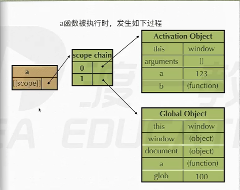
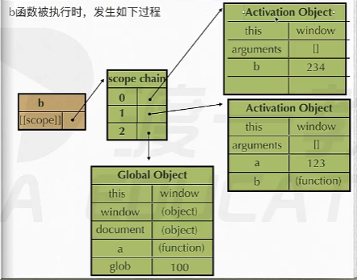

# 📘 JavaScript 基础笔记

> 🎯 **学习导航**：本笔记涵盖 JS 核心执行机制、单线程模型、运算符优先级与内存管理基础。

---

## 目录

### JavaScript 核心基础
- [一、JavaScript 的执行方式](#一javascript-的执行方式编译-vs-解释)
- [二、JavaScript 是单线程语言](#二javascript-是单线程语言)
- [三、运算符优先级](#三运算符优先级)
- [四、内存管理基础](#四内存管理基础栈内存与变量赋值)
- [五、本节小结](#五本节小结)
- [补充：表达式求值与变量的区别](#补充表达式求值与变量的区别)
- [补充：隐式类型转换](#补充隐式类型转换)
- [补充：函数参数与 arguments](#补充函数参数与-arguments)
- [补充：预编译与作用域链](#补充预编译与作用域链)
- [补充：闭包](#补充闭包)
- [补充：立即执行函数](#补充立即执行函数)
- [补充：构造函数与包装类](#补充构造函数与包装类)
- [补充：原型与原型链](#补充原型与原型链)
- [补充：call 和 apply](#补充call-和-apply)
- [补充：继承](#补充继承)
- [补充：命名空间](#补充命名空间)
- [补充：this 指向](#补充this-指向)
- [补充：数组排序 sort](#补充数组排序-sort)
- [补充：类数组](#补充类数组)
- [补充：Error 错误类型](#补充error-错误类型)

### 系统内置对象、DOM、BOM
- [二、系统内置对象](#二系统内置对象)
- [三、DOM 文档对象模型](#三dom-文档对象模型)
- [四、BOM 浏览器对象模型](#四bom-浏览器对象模型)

---


## 一、JavaScript 的执行方式：编译 vs 解释

### 1. 为什么需要"翻译"？

> 💡 **一句话理解**：我们写的代码是人类能看懂的（英文单词、符号），但计算机的 CPU 只认识**二进制**（`0` 和 `1` 组成的机器码）。所以需要"翻译官"把代码翻译成机器能懂的语言。

---

### 2. 两种翻译方式对比

|    对比项    |                 **编译型语言**<br>（如 C、C++）                 |  **解释型语言**<br>（如 JavaScript、PHP）   |
| :----------: | :-------------------------------------------------------------: | :-----------------------------------------: |
| **翻译方式** |                    通篇读完，一次性全部翻译                     |         读一行，翻译一行，执行一行          |
| **生成文件** | ✅ 会生成一个独立的可执行文件<br>（如 C 生成 `.exe` 或 `.obj`） |     ❌ 不生成特定文件，直接在环境中运行     |
| **运行速度** |               ⚡ **快**（已经翻译好了，直接运行）               |    🐢 **稍慢**（边读边翻译，有额外开销）    |
| **跨平台性** |        ❌ **差**（Windows 的 `.exe` 不能在 Mac 上运行）         | ✅ **好**（只要有对应的解释器，哪里都能跑） |
| **典型应用** |                 游戏引擎、操作系统、高性能计算                  |       网页交互、脚本工具、服务端开发        |

---

### 3. 图解：两种执行方式的区别

#### 🏭 编译型语言流程

```
┌─────────────┐      ┌─────────────┐      ┌─────────────┐      ┌─────────────┐
│             │      │             │      │             │      │             │
│  程序员写的  │ ──▶ │   编译器     │ ──▶ │  可执行文件  │ ──▶ │  操作系统    │
│  源代码      │      │  （翻译官）  │      │ .exe/.obj   │      │  直接执行    │
│  (.c文件)   │      │  通篇翻译    │      │             │      │             │
│             │      │             │      │             │      │             │
└─────────────┘      └─────────────┘      └─────────────┘      └─────────────┘

特点：翻译一次，反复执行。
💡 比喻：就像把一本外文书整本翻译成中文书，以后看中文书就行。
```

#### 🎙️ 解释型语言流程

```
┌─────────────┐      ┌─────────────────────────┐      ┌─────────────┐
│             │      │                         │      │             │
│  程序员写的  │ ──▶ │      解释器              │ ──▶ │  直接输出    │
│  源代码      │      │    （实时翻译）           │      │  执行结果    │
│  (.js文件)  │      │  读一行 → 翻一行 → 执行一行│      │             │
│             │      │                         │      │             │
└─────────────┘      └─────────────────────────┘      └─────────────┘

特点：边读边翻译边执行。
💡 比喻：就像有个翻译员在旁边，你读一句他翻一句。
```

---

### 4. 特别说明：Java 是什么类型？

Java 比较特殊，它是**"半编译半解释"**：

```
【Java 的执行流程】

┌──────────┐    javac编译    ┌──────────┐         ┌──────────┐         ┌──────────┐
│          │ ─────────────▶ │          │ ──────▶ │          │ ──────▶ │          │
│ .java    │    （翻译一次）  │ .class   │         │   JVM    │         │  机器码   │
│ 源代码   │                │ 字节码   │         │ 虚拟机   │         │ 执行     │
│(人写的)  │                │(中间语言) │         │(解释执行)│         │(CPU运行) │
│          │                │          │         │          │         │          │
└──────────┘                └──────────┘         └──────────┘         └──────────┘
                                   ↑
                         .class 文件不是直接的机器码，而是"字节码"
                         它需要 JVM（Java 虚拟机）再解释成对应平台的机器码
```

**为什么这样设计？**

- ✅ 既保留了编译一次的好处（比纯解释快）
- ✅ 又实现了**"一次编写，到处运行"**（跨平台）

> 🎯 **通俗理解**：Java 先快速翻译成一种"世界语"（字节码），然后到不同国家（平台）时，再由当地的翻译（JVM）翻译成当地方言（机器码）。

---

## 二、JavaScript 是单线程语言

### 1. 什么是"线程"？

> 💡 **通俗比喻**：
>
> - **单线程** = 一个人（一条流水线）干活，一次只能做一件事
> - **多线程** = 多个人（多条流水线）同时干活，可以同时做多件事
>
> JavaScript 就是"一个人干活"的模式。

---

### 2. 单线程的执行队列

JS 虽然只能"一个人干活"，但它很聪明——它会把要做的事情排好队，一件一件按顺序来：

```
【JS 执行队列示意图】

        ┌────────────────────────────────────────┐
        │         🔧 JavaScript 主线程            │
        │          （只有一个工人）                │
        └────────────────────────────────────────┘
                          │
                          ▼
        ┌────────────────────────────────────────┐
        │  📋 任务队列（Task Queue）              │
        │  ┌─────┐   ┌─────┐   ┌─────┐   ┌─────┐│
        │  │Task1│──▶│Task2│──▶│Task3│──▶│Task4││
        │  └─────┘   └─────┘   └─────┘   └─────┘│
        │     ↑ 按顺序排队，先进先出（FIFO）       │
        └────────────────────────────────────────┘
```

---

### 3. ⚠️ 关于"轮转时间片"的澄清

> **重要说明**：轮转时间片（Time Slicing）本质上是**操作系统层面的进程/线程调度机制**，不是 JS 引擎自己的行为。
>
> JS 作为单线程语言，本身**不会**主动把时间切成小片分配给多个 JS 任务。真正的并发感是由浏览器或 Node.js 的运行时环境通过**事件循环**来实现的。

```
【操作系统层面的轮转时间片示意图】

时间轴 ──▶

Task1:  ██░░░░░░░░░░██░░░░░░░░░░██░░░░░░░░░░
Task2:  ░░██░░░░░░░░░░██░░░░░░░░░░██░░░░░░░░
Task3:  ░░░░██░░░░░░░░░░██░░░░░░░░░░██░░░░░░

图例: ██ = 该任务正在执行    ░░ = 等待执行

解释：
  - 这是操作系统给多个进程/线程分配 CPU 时间的方式
  - 每个任务执行很短的时间（比如几毫秒）
  - 然后切换到下一个任务
  - 因为切换非常快，人类感觉像是"同时进行"
```

> 💡 **JS 的区别**：JS 自己只有**一个线程**，它不靠"时间片轮转"来处理任务，而是靠下面的 **事件循环（Event Loop）** 机制。

---

### 4. 更贴近 JS 的真相：事件循环（Event Loop）

实际上，JS 的单线程背后有一个更核心的机制——**事件循环**。这个在后续课程中会深入讲，这里先简单了解：

```
【事件循环简化模型】

     同步代码（立即执行）         异步任务（先等待）
          │                         │
          ▼                         ▼
   ┌───────────────┐        ┌──────────────┐
   │               │        │              │
   │   调用栈       │        │   任务队列    │
   │ (Call Stack)  │        │ (Task Queue) │
   │               │        │              │
   │  console.log  │        │  setTimeout  │
   │  函数调用      │        │  Promise     │
   │  加减乘除      │        │  回调函数     │
   │               │        │  DOM事件     │
   └───────┬───────┘        └──────┬───────┘
           │                       │
           └──────────┬────────────┘
                      │
                      ▼
               ┌────────────┐
               │            │
               │ Event Loop │  ◄── 像个监工，一直在问：
               │  事件循环   │      "栈空了没？队列里有任务吗？"
               │            │      "栈空了就把队列里的任务拿进来执行！"
               └────────────┘
```

**事件循环的工作流程**：

```
Step 1: 同步代码优先进入调用栈，执行完毕立刻出栈

        调用栈: [console.log("A")] ──执行──▶ 出栈
        调用栈: [console.log("B")] ──执行──▶ 出栈
        调用栈: []  ← 空了！

Step 2: Event Loop 发现栈空了，检查任务队列

        任务队列: [setTimeout回调, Promise回调, ...]
                    ↑
              最先进入的任务

Step 3: 把队列中的任务逐个放入调用栈执行

        调用栈: [setTimeout回调] ──执行──▶ 出栈
        调用栈: []  ← 又空了！

        ...循环往复
```

> 📝 **一句话总结**：
>
> - JS 是**单线程**的，意味着同一时间只能做一件事
> - 但通过**事件循环 + 任务队列**，它可以实现"异步"效果
> - 比如点击按钮、网络请求、定时器这些不会阻塞后面的代码

---

## 三、运算符优先级

### 1. 优先级核心规则

> 💡 **记住这句话**：**运算符的优先级高于赋值运算符**。
>
> 也就是说，等号 `=` 右边的表达式会先计算完，再把结果赋给左边的变量。

```
【执行顺序图解】

var result = 10 + 5 * 2;

        先算这个 ──▶ ┌─────┐
                    │5 * 2│ = 10
                    └─────┘
                       │
                       ▼
        再算这个 ──▶ ┌─────────┐
                    │10 + 10  │ = 20
                    └─────────┘
                       │
                       ▼
        最后赋值 ──▶ result = 20
```

### 2. 常见运算符优先级（从高到低）

| 优先级 |             运算符              | 说明                 | 示例                     |
| :----: | :-----------------------------: | :------------------- | :----------------------- |
|   1    |              `()`               | 括号                 | `(1 + 2) * 3` 先算括号内 |
|   2    |   `++`（后置）、`--`（后置）    | 后置自增自减         | `a++`、`i--`             |
|   3    | `!`、`++`（前置）、`--`（前置） | 逻辑非、前置自增自减 | `!flag`、`++i`           |
|   4    |          `*`、`/`、`%`          | 乘、除、取模         | `a * b`、`a / b`         |
|   5    |            `+`、`-`             | 加、减               | `a + b`、`a - b`         |
|   6    |      `>`、`<`、`>=`、`<=`       | 比较                 | `a > b`                  |
|   7    |    `==`、`!=`、`===`、`!==`     | 相等/全等            | `a === b`                |
|   8    |              `&&`               | 逻辑与               | `a && b`                 |
|   9    |             `\|\|`              | 逻辑或               | `a \|\| b`               |
|   10   |               `=`               | 赋值                 | `a = 10`                 |

> ⚠️ **重要**：`a++` 的语法优先级确实高于 `*`，`a++ * 3` 解析为 `(a++) * 3`。但后置 `++` 是**先返回当前值参与运算**，整个表达式执行完后 a 才自增。若 a=2，结果是 `6`（不是 9）。
>
> ⚠️ **常见坑**：`==` 和 `===` 的区别
>
> - `==` ：只比较值，不比较类型（会做隐式类型转换）
> - `===` ：既比较值，也比较类型（推荐用这个，更安全）

```javascript
// 🚨 容易踩坑的例子
console.log(5 == '5') // true  （字符串"5"被转成数字5）
console.log(5 === '5') // false （类型不同：number vs string）

console.log(0 == false) // true  （false 被转成数字 0，再比较 0 == 0）
console.log(0 === false) // false （类型不同：number vs boolean）
```

---

## 四、内存管理基础：栈内存与变量赋值

### 1. 原始类型的存储方式

JavaScript 的原始类型（`number`、`string`、`boolean`、`null`、`undefined`、`symbol`）在赋值时遵循**"值传递"**——拷贝的是值本身。

### 2. 图解：变量赋值在栈内存中的过程

```javascript
var a = 100
var b = a
a = 200
```

**内存变化过程图解：**

```
【步骤 1】声明 var a = 100

栈内存 (Stack)
┌─────────────────┐
│     a = 100     │  ◄── 开辟新空间，存储值 100
└─────────────────┘


【步骤 2】声明 var b = a

栈内存 (Stack)
┌─────────────────┐
│     a = 100     │
├─────────────────┤
│     b = 100     │  ◄── 开辟新空间，拷贝 a 的值（值传递）
└─────────────────┘
       ↑
   注意：b 存的是 100 的副本，不是指向 a


【步骤 3】重新赋值 a = 200

栈内存 (Stack)
┌─────────────────┐
│     a = 200     │  ◄── a 指向新的值 200
├─────────────────┤
│     b = 100     │  ◄── b 不受影响，还是 100
└─────────────────┘
       ↑
   原来的 100 变成了"无人认领"的数据
```

> 💡 **关键理解**：`a = 200` 不是把原来的 `100` 改成 `200`，而是：
>
> 1. 在内存中找到或创建值为 `200` 的空间
> 2. 让变量 `a` 指向这个新的空间
> 3. 原来存储 `100` 的空间暂时还在，只是没有被任何变量引用了

### 3. 垃圾回收机制（Garbage Collection）

```
【内存清理示意图】

阶段 1：存在"无人引用"的数据
┌─────────────────┐
│     a = 200     │
├─────────────────┤
│     b = 100     │
├─────────────────┤
│     [100]       │  ◄── 原来的值，现在没有任何变量引用它
└─────────────────┘      （被称为"垃圾数据"）

           │
           ▼
     JS 垃圾回收器（Garbage Collector）定期扫描
           │
           ▼

阶段 2：垃圾回收器标记并清理
┌─────────────────┐
│     a = 200     │
├─────────────────┤
│     b = 100     │
├─────────────────┤
│    [空闲空间]    │  ◄── 原来的 100 被标记为"可回收"
└─────────────────┘      新数据可以直接覆盖这块空间

       🔄 二次覆盖
       新的变量可以复用这块被清理的内存空间
```

> 📝 **核心概念总结**：
>
> - 内存不够时，JS 的**垃圾回收器（GC）**会自动扫描并清理"无人引用"的数据
> - 清理不是把数据变成 `0` 或空，而是把这块内存**标记为可用**
> - 后续新数据分配时，可以直接**覆盖**这些已标记的空间
> - 这个过程叫 **"标记-清除"（Mark and Sweep）**，是 JS 最常用的垃圾回收算法

---

## 五、本节小结

| 知识点         | 核心结论                                         |
| :------------- | :----------------------------------------------- |
| JS 的翻译方式  | **解释执行**，跨平台好，速度稍慢于编译型         |
| JS 的线程模型  | **单线程**，一次只能执行一个任务                 |
| 如何处理多任务 | 通过**任务队列**排队，配合**事件循环**机制       |
| 运算符优先级   | 先乘除后加减，**赋值运算符优先级最低**           |
| 原始类型赋值   | **值传递**，拷贝的是值本身，互不影响             |
| 内存管理       | 垃圾回收器自动清理无人引用的数据，空间可二次覆盖 |

> 📌 **下节预告**：深入理解 JS 的**事件循环（Event Loop）**机制，搞懂同步/异步、宏任务/微任务的区别！

错误分为两种1.低级错误（语法解析错误）
比如有中文，有不合法的字符：var a = 10;:
这种错误程序一行都不会执行，因为编译之前会通篇扫一遍有没有语法错误2.逻辑错误（标准错误，情有可原）
比如：使用了未声明的变量
这种错误不会影响前面代码的执行，执行到报错这里，后面的代码才不会执行（因为之中错误只有编译阶段才能发现）3.一个代码块的错误不会影响另一个代码块的执行
比如两个script标签里面的代码，一个有错，不会影响另一个的执行

### js代码执行过程

1.语法分析（通篇过一遍，看有没有语法错误）2.预编译3.解释执行

#### 预编译

预编译发生在函数执行的前一刻
imply global(暗示全局变量)：即任何变量。如果变量未经声明就赋值，此变量就为全局对象（window）所有

专业术语：GO（Global Object）全局对象、AO（ Activation Object）活动对象，在 JavaScript 执行上下文中，它用于存储函数内的变量、函数声明和参数。每当一个函数被调用时，会创建对应的活动对象，随后作为该函数执行上下文的作用域链的一部分。

全局：1.创建GO 2.找变量申明3.找函数申明，值赋予函数体
函数：1.创建AO对象2.找形参和变量申明，将变量和形参作为AO属性名，值为undefined 3.将实参值和形参统一4.在函数体里面找函数声明，值赋予函数体

特别注意：
1.if里面不能声明函数2.只有一种情况读取未定义的变量是不报错的，就是typeof(未定义的变量)，返回值是"undefined" 3.空的空格字符串类型转换成boolean是true
4.if()括号里面的是表达式，所以if(function a(){}),function a(){}其实是表达式，所以

```javascript
if (function a() {}) {
  var b = typeof a
}
```

typeof(a)其实是'undefined'，而不是'function'

## 作用域精解

[[scope]]作用域集合，函数对象的属性之一
函数每次执行时，对应的执行上下文都是独一无二的，所以多次调用同一个函数会导致创建多个执行上下文，当函数执行完毕，他所创建的执行上下文会被销毁
作用域链：[[scope]]中所存储的执行上下文对象的集合，这个集合呈链式链接，我们把这种连是连接叫做作用域链

```javascript
function a() {
  function b() {
    var b = 123
  }
  var a = 123
  b()
}
var glob = 100
a()
```

a函数的作用域链如下

b函数的作用域链如下：


b中的a的AO就是a执行时产生的AO，只是b中的a的AO是a执行时产生的AO的引用

查找变量：从该函数作用域链的顶端依次向下查找
比如函数A刚出生(定义时)的时候，第0位（顶端）存的是Global Object

```javascript
function a() {
  function b() {
    function c() {}
    c()
  }
  b()
}
a()
```

a define a.[[scope]]---> 0 ： GO
a doing a.[[scope]]---> 0 : aAO

b define b.[[scope]]---> 0 : aAO
1 : GO
b doing b.[[scope]]---> 0 : bAO
1 : aAO
2 : GO

c define c.[[scope]]---> 0 : bAO
1 : aAO
2 : GO
c doing c.[[scope]]---> 0 : cAO
1 : bAO
2 : aAO
3 : GO

## 闭包

导致作用域链不释放，该释放不释放，导致内存泄露（什么是内存泄露，打个比喻，手里捧着一捧沙子，捧得越多，流失的越多，内存也一样，存的东西越多，剩余的内存越少，跟泄露了一样，所以叫内存泄漏）

闭包的作用：1.实现公有变量
eg:数字累加器2.可以做缓存（存储结构）
eg：eater 3.可以实现封装，属性私有化。
eg：Person(); 4.模块化开发，防止污染全局变量

```javascript
//累加器
function add() {
  var a = 0
  return function () {
    a += 1
  }
}
//缓存
function eater() {
  var food = ''
  var obj = {
    eat: function () {
      console.log('i am eating' + food)
      food = ''
    },
    push: function (myFood) {
      food = myFood
    },
  }
  return obj
}
var eater1 = eater()
eater1.push('banana')
eater1.eat()
```

## 立即执行函数

针对初始化功能的函数，执行完成之后会立即释放内存

```javascript
var num = (function (a, b, c) {
  var d = a + b + c * 2 - 2
  return d
})(1, 2, 3)
```

只有表达式才能被执行符号执行

```javascript
//这个叫函数声明
function test(){}()
//会报错：语法错误
```

```javascript
// 这个叫函数表达式
var test = (function () {})()
// 都叫表达式了，肯定可以执行，不报错
// 而且test的typeof为undefined：var test叫变量声明，把function(){}()赋值给test的过程叫表达式
```

能被执行符号执行的表达式，那这个函数的函数名字会被忽略

```javascript
// 这也是一个表达式，test这个名字会被忽略
;+(function test() {
  console.log('a')
})()
```

()本就是数学运算符，所有function被括号抱起来，那不就变成了表达式吗？这样就一下子讲通了
所以(function test(){console.log('a')}())test这个名字没啥意义
就演变成了
(function (){console.log('a')}())

W3C推荐把执行符号放在里面
也就是推荐：(function (){console.log('a')}())这样写
而不是：(function (){console.log('a')})()这样写，虽然这样写也没什么毛病

```javascript
function test() {}
;(1, 2, 3, 4)
// 这样写不报错，为什么？因为js引擎会把它解析成下面的格式
function test() {} //他们两被拆开了，函数独立了

;(1, 2, 3, 4) //这也是一个表达式
```

```javascript
function test() {
  var arr = []
  for (var i = 0; i < 10; i++) {
    arr[i] = function () {
      console.log(i)
    }
  }
  return arr
}

var myArr = test()

for (var j = 0; j < 10; j++) {
  myArr[j]()
}
```

为什么全打印出来是10，因为闭包

```javascript
function test() {
  var arr = []
  for (var i = 0; i < 10; i++) {
    ;(function (j) {
      arr[j] = function () {
        console.log(j)
      }
    })(i)
  }
  return arr
}

var myArr = test()

for (var j = 0; j < 10; j++) {
  myArr[j]()
}
```

思考：在js中，表达式的定义是什么？

### 对象与包装类

构造函数

```javascript
var obj = new Object()
var arr = new Array()
```

构造函数内部原理1.在函数体最前面隐式加上var this = {} 2.执行this.xxx = xxx; 3.返回隐式的this

```javascript
function Person(){
        var this {};
        this.name = 'zhangsan';
        this.age = 18;
        return this
};
var person1 = new Person();
var person2 = new Person();
```

```javascript
function Person(){
        var this {};
        this.name = 'zhangsan';
        this.age = 18;
        return {}
}
var person1 = new Person(); // 得到的是空对象
```

可以返回空对象，但是不能返回原始值，如果返回原始值，是无效的

```javascript
function Person(){
        var this {};
        this.name = 'zhangsan';
        this.age = 18;
        return 123
}
// 或者
function Person(){
        // var this {};
        this.name = 'zhangsan';
        this.age = 18;
        return 123
}

// 他们都返回的是正常的对象{name:'zhangsan',age:18}
```

### 包装类

```javascript
var num = new Number(123)

const n = num * 1

var str = 'abcd'

str.length = 2 // new String('abcd').length = 2;  delete

console.log(str)

function byt(str) {
  var result = 0
  for (var i = 0; i < str.length; i++) {
    if (str.chatCodeAt(i) <= 255) {
      result += 1
    } else {
      result += 2
    }
  }
  return result
}

function byt(str) {
  var count = str.length
  for (var i = 0; i < str.length; i++) {
    if (str.chatCodeAt(i) > 255) {
      count++
    }
  }
  return count
}
```

### 原型、原型链、call、apply


---

# 补充章节

## 1.1 表达式求值与变量的区别

先看下面几个例子：

```javascript
window.foo || window.foo = 'bar';        // 报错
(window.foo || window.foo) = 'bar';      // 报错
```

**原因**：`window.foo || window.foo` 是一个**表达式**，表达式最终返回的是一个**值**（这里是 `undefined`）。

> 📌 **重点**：只有变量或对象属性才能被赋值，一个已经求值得到的基础类型值不能被赋值。

那为什么不能把 `undefined` 重新赋值呢？

```javascript
undefined = 'bar'; // 在浏览器全局环境下不会生效，undefined 是只读的
```

原笔记这里描述的是在 Node 等环境下 `undefined` 可以被当作变量名使用的情况。日常开发中不需要纠结这一点，只要记住：**表达式返回的是值，值不能放在赋值号左边**。

其他小知识点：

- `document.write()` 会隐式调用值的 `toString()` 方法。
- `obj.prop` 中，`.` 后面的内容会被当作字符串处理。因此在循环 `for (var prop in obj)` 里写 `obj.prop`，实际上访问的是 `obj['prop']` 这个固定属性，而不是变量 `prop` 对应的属性。正确写法是 `obj[prop]`。

```javascript
for (var prop in obj) {
    console.log(obj[prop]); // ✅ 正确
    console.log(obj.prop);  // ❌ 只会访问 obj['prop']
}
```

---

---

## 1.2 隐式类型转换

JavaScript 在进行某些运算时，会自动把一种类型转换成另一种类型，这就是隐式类型转换。

| 操作 | 隐式调用 |
| --- | --- |
| `isNaN()` | `Number()` |
| `++` / `--` / `+`（正号） / `-`（负号） | `Number()` |
| `+` | 只要有一侧是字符串，就会调用 `String()` |
| `-` / `*` / `/` / `%` | `Number()` |
| `&&` / `\|\|` / `!` | `Boolean()` |
| `>` / `<` / `>=` / `<=` | 字符串数字比较时调用 `Number()` |
| `==` / `!=` | 会发生隐式类型转换 |
| `===` / `!==` | 不会发生类型转换 |

> 💡 **记忆技巧**：算术运算基本都会转数字；加号遇到字符串会转字符串；逻辑运算会转布尔；全等判断既看值也看类型。

---

---

### 1.3.2 参数与 arguments

```javascript
function sum(a, b) {
    console.log(sum.length);      // 形参个数：2
    console.log(arguments.length); // 实参个数
}
sum(5); // sum.length = 2，arguments.length = 1
```

`arguments` 是函数内部的实参列表，和形参之间存在**映射关系**：

```javascript
function fn1(a, b) {
    a = 2;
    console.log(arguments[0]); // 2
    arguments[1] = 5;
    console.log(b);            // 5
}
fn1(1, 2);
```

> ⚠️ 注意：如果某个形参没有传入实参（如 `fn2(1)` 中的 `b`），那么修改 `b` 不会同步到 `arguments[1]`，因为映射关系是在有对应实参时才建立的。

---

## 1.4 预编译

预编译发生在**函数执行前一刻**，分为四个步骤：

1. 创建 `AO`（Activation Object，活跃对象）或 `GO`（Global Object，全局对象）。
2. 找形参和变量声明，把它们作为 `AO` 的属性，值初始化为 `undefined`。
3. 将实参值和形参统一。
4. 在函数体里找函数声明，将函数名作为 `AO` 的属性，值为函数体。

> 💡 **简单理解**：预编译就是 JavaScript 在真正执行代码之前，先把变量、形参、函数声明都“登记”到 `AO` 里，这样执行时才知道去哪里找。

> ⚠️ 按照最新规范，`if` 语句内部不建议声明函数，可能会产生不一致的行为。

---

## 1.5 作用域与作用域链

函数的作用域链集合存储在内部属性 `[[scope]]` 中（无法直接访问）。

```javascript
function test() {}
// test.[[scope]] 里保存着作用域链集合
```

**作用域链的形成过程**：

1. 函数**声明**时，会继承它所在环境的作用域链。
2. 函数**执行**前一刻，会创建自己的 `AO` 对象，并把这个 `AO` 放到作用域链的最顶端。

例如：

```javascript
var test = 'hello world';
var a = 123;
function fn() {
    var a = 456;
    var b = 789;
    console.log(a); // 456

    function test() {
        var b = 'this is b';
        var c = 'this is test function';
        console.log(b);
    }
    test();
}
fn();
```

**查找规则**：访问变量时，从作用域链顶端开始找，找到就停止，找不到就沿着作用域链向下找，直到全局对象 `GO`。

---

## 1.6 闭包

### 1.6.1 什么是闭包

闭包：函数内部的函数被外部变量引用，并且内部函数引用了外部函数中的变量。

```javascript
function fn() {
    var count = 100;
    return function () {
        count++;
        console.log(count);
    }
}
var sum = fn();
sum(); // 101
sum(); // 102
```

**解释**：`fn` 执行完毕后，它的执行上下文仍然被返回的函数引用着，因此不会被垃圾回收机制释放。返回的函数每次执行时，都能访问到 `fn` 中的 `count` 变量。

### 1.6.2 闭包与内存泄漏

> 📌 内存泄漏并不是内存真的“漏掉”了，而是被闭包长期占用、无法释放，导致可用内存越来越少。

闭包虽然强大，但要注意不要滥用，否则容易造成内存占用过高。

---

## 1.7 立即执行函数

### 1.7.1 写法

```javascript
// 写法 1
(function () {
}());

// 写法 2
(function () {
})();

// 带参数
(function (a, b, c) {
    var sum = a + b + c;
    console.log(sum);
}(1, 2, 3));

// 带返回值
var num = (function (a, b, c) {
    return a + b + c;
}(1, 2, 3));
```

> 💡 **作用**：立即执行函数执行完就会被释放，常用来创建独立的作用域，避免变量污染全局。

### 1.7.2 为什么函数声明不能直接执行？

```javascript
function test() {}(); // ❌ 语法错误
```

因为**只有表达式才能被执行符号 `()` 执行**。函数声明不是表达式，所以报错。

让函数变成表达式的方法：

```javascript
var sum = function () {}(); // ✅
+function test1() {}();     // ✅ 正负号、!、&&、|| 等都能把函数变成表达式
1 && function test4() {}();
```

> 📌 能被 `()` 执行的函数，它的名字会被忽略。

### 1.7.3 经典应用：解决循环中的变量问题

错误示例：

```javascript
function test() {
    var arr = [];
    for (var i = 0; i < 10; i++) {
        arr[i] = function () {
            console.log(i);
        }
    }
    return arr;
}
var myArr = test();
for (var j = 0; j < myArr.length; j++) {
    myArr[j](); // 打印 10 个 10
}
```

**原因**：所有 `arr[i]` 引用的都是同一个 `i`，循环结束时 `i` 已经是 10。

正确示例（使用立即执行函数创建独立作用域）：

```javascript
function test() {
    var arr = [];
    for (var i = 0; i < 10; i++) {
        (function (j) {
            arr[j] = function () {
                console.log(j);
            }
        }(i));
    }
    return arr;
}
var myArr = test();
for (var j = 0; j < myArr.length; j++) {
    myArr[j](); // 打印 0, 1, 2, ..., 9
}
```

**解释**：每次循环都创建一个新的立即执行函数，把当前的 `i` 作为参数 `j` 传入。每个 `arr[j]` 的上级作用域都是一个独立的立即执行函数，里面保存着各自的 `j`。

---

## 1.8 构造函数内部原理

构造函数就是普通函数，只是调用时前面加了 `new` 关键字。`new` 会做三件事：

1. 在函数体最前面隐式创建 `this = {}`。
2. 执行 `this.xxx = xxx`，给 `this` 添加属性。
3. 隐式返回 `this`。

```javascript
function Student(name, age, sex) {
    // 隐式：var this = {};
    this.name = name;
    this.age = age;
    this.sex = sex;
    // 隐式：return this;
}
```

> ⚠️ 注意：如果构造函数手动 `return` 了一个非对象值，会被忽略；如果 `return` 的是对象，则返回该对象。

```javascript
function Car(name) {
    this.name = name;
    return 123; // 不生效，仍然返回 this
}
```

---

## 1.9 包装类

基本类型（如字符串、数字、布尔值）本身没有属性和方法。当我们尝试给它们添加属性时，JavaScript 会临时创建一个对应的包装对象，操作完立即销毁。

```javascript
var str = 'abc';
str.sign = 'this is undefined'; // 临时创建 String 对象并赋值，然后销毁
console.log(str.sign);          // undefined，因为读取时又创建了新对象
```

再看一个例子：

```javascript
var str = '1234';
console.log((str.length = 2).length); // undefined
```

**解释**：`str.length = 2` 实际上是对临时包装对象的 `length` 赋值，赋值表达式返回要赋的值 `2`，然后 `(2).length` 当然是 `undefined`。

---

## 1.10 原型与原型链

### 1.10.1 原型

- 原型是函数对象上的一个属性 `prototype`。
- 原型定义了构造函数创建的对象的公共祖先。
- 通过构造函数创建的对象，可以继承原型上的属性和方法。
- 对象通过 `__proto__`（旧浏览器）或 `[[prototype]]`（新浏览器）查看自己的原型。
- 对象通过 `constructor` 查看自己的构造函数。

```javascript
function Person(className) {
    this.className = className;
}

Person.prototype.className = 'cat';
Person.prototype.say = function () {
    console.log('hehe');
};

var p1 = new Person('dog');
console.log(p1.className); // "dog"，对象自身属性优先
p1.say();                  // "hehe"，继承自原型
```

### 1.10.2 利用原型提取公共属性

```javascript
// 改进前：每次 new 都重复定义相同属性
function Car(owner, color) {
    this.owner = owner;
    this.color = color;
    this.height = 1400;
    this.lang = 4900;
    this.carName = 'BMW';
}

// 改进后：公共属性放到原型上
function Car(owner, color) {
    this.owner = owner;
    this.color = color;
}
Car.prototype.height = 1400;
Car.prototype.lang = 4900;
Car.prototype.carName = 'BMW';
```

### 1.10.3 修改原型的时机

```javascript
Person.prototype.name = 'sunny';
function Person() {}
var person = new Person();
console.log(person.name); // "sunny"

Person.prototype = { name: 'cherry' }; // 把 Person.prototype 指向新对象
// 已经创建的 person.__proto__ 仍然指向原来的原型对象
```

> 💡 可以这样理解：`Person.prototype` 是一个变量，`person.__proto__` 保存的是创建时的原型的引用。给 `Person.prototype` 赋新对象，相当于让构造函数的原型变量指向别处，但已创建对象的 `__proto__` 不变。

### 1.10.4 原型链

当访问对象属性时，如果对象自身没有，就到原型上找；原型上也没有，就到原型的原型上找，形成一条链，直到 `Object.prototype`。

```javascript
Cat.prototype = {
    like: {
        food: '喵罐',
        play: '跑酷'
    }
};
function Cat() {
    this.eat = function () {
        console.log('吃' + this.like.food);
        this.like.food = '喵条'; // 修改引用类型会同步到原型
    }
}
var cat = new Cat();
cat.eat();
console.log(cat.like);          // { food: '喵条', play: '跑酷' }
console.log(cat.__proto__.like); // { food: '喵条', play: '跑酷' }
```

> 📌 通过引用修改原型上的对象属性，会影响所有实例；直接给对象赋值新属性则只影响当前实例。

---

## 1.11 call 和 apply

`call` 和 `apply` 的作用是**改变函数执行时的 `this` 指向**。

```javascript
function Person(name, age, sex) {
    this.name = name;
    this.age = age;
    this.sex = sex;
}

function Student(name, age, sex, height, weight) {
    Person.call(this, name, age, sex); // 借用 Person 给 this 赋值
    this.height = height;
    this.weight = weight;
}

var student = new Student('zhangsan', 18, '男', 180, 140);
```

**区别**：

- `call(obj, 参数1, 参数2, ...)`：参数逐个传递。
- `apply(obj, [参数1, 参数2, ...])`：参数以数组形式传递。

---

## 1.12 继承

### 1.12.1 圣杯模式

圣杯模式是一种比较完美的继承实现，避免了子类修改原型时影响父类。

```javascript
function Father() {}
function Son() {}

Father.prototype.lastName = 'Deng';

function inherit(Target, Origin) {
    function F() {}
    F.prototype = Origin.prototype;     // 1. 让 F 继承 Origin 的原型
    Target.prototype = new F();          // 2. 让 Target 继承 F 的实例
    Target.prototype.constructor = Target; // 修正 constructor
    Target.prototype.uber = Origin.prototype; // 记录真正的父类原型
}

inherit(Son, Father);
var son = new Son();
var father = new Father();

son.__proto__.sex = 'male';
console.log(father.sex); // undefined，不影响父类
```

> 💡 关键点：通过中间构造函数 `F` 隔离开 `Son.prototype` 和 `Father.prototype`，子类对原型的修改不会直接反映到父类上。

---

## 1.13 命名空间

命名空间主要用于管理变量，防止全局污染，适合多人协作开发。

```javascript
var namespace = {
    hufeng: {
        nav: 'nav',
        header: 'header'
    },
    zhangsan: {
        nav: 'nav',
        header: 'header'
    }
};
```

### 链式调用

```javascript
var deng = {
    smoke: function () {
        console.log('smoking,...xuan cool');
        return this; // 返回自身，才能继续调用
    },
    drink: function () {
        console.log('drinking,...ye cool');
        return this;
    },
    perm: function () {
        console.log('preming,...cool');
        return this;
    }
};
deng.smoke().drink().perm();
```

> 📌 链式调用的核心是每个方法最后返回 `this`。

---

## 1.14 this 指向

### 1.14.1 预编译中的 this

预编译时，函数内部的 `this` 默认指向 `window`。

```javascript
function test(c) {
    var a = 123;
    function b() {}
}
test(1);
// 预编译时 AO 中 this: window
```

### 1.14.2 this 的四种常见指向

1. **普通函数调用**：`this` 指向 `window`（严格模式下为 `undefined`）。
2. **对象方法调用**：`this` 指向调用该方法的对象。
3. **构造函数调用**：`this` 指向新创建的实例对象。
4. **call / apply / bind**：`this` 指向传入的对象。

```javascript
var name = '222';
var a = {
    name: '111',
    say: function () {
        console.log(this.name);
    }
};

var fun = a.say;
fun();      // "222"，fun 在全局作用域下直接调用
a.say();    // "111"，a 调用 say

var b = {
    name: '333',
    say: function (fun) {
        fun(); // 直接调用，this 指向 window
    }
};
b.say(a.say); // "222"

b.say = a.say;
b.say();      // "333"，b 调用 say
```

---

## 1.15 数组排序方法 sort

`sort` 方法通过比较函数的返回值决定元素顺序：

| 返回值 | 结果 |
| --- | --- |
| 负数 | 前面的数排在前面 |
| 正数 | 后面的数排在前面 |
| 0 | 保持不动 |

```javascript
var arr = [3, 1, 4, 6, 2, 8, 4, 7];
arr.sort(function (a, b) {
    if (a > b) {
        return 1;
    } else {
        return -1;
    }
});
// 结果：[1, 2, 3, 4, 4, 6, 7, 8]
```

### 改变原数组 vs 不改变原数组

**改变原数组**：`push`、`pop`、`unshift`、`shift`、`sort`、`reverse`、`splice`

**不改变原数组**：`concat`、`join`、`split`、`toString`、`slice`

---

## 1.16 类数组

类数组是具有以下特征的对象：

1. 属性名为索引（数字字符串）。
2. 有 `length` 属性。
3. 最好加上 `push` 方法。

```javascript
var obj = {
    "0": 'a',
    "1": 'b',
    "2": 'c',
    "length": 3,
    "push": Array.prototype.push
};

obj.push('d');
console.log(obj); // { "0": "a", "1": "b", "2": "c", "3": "d", length: 4 }
```

> 📌 类数组不是真正的数组，没有数组的所有方法，但很多场景下可以像数组一样使用。

### 面试题

```javascript
var obj = {
    "2": 'a',
    "3": 'b',
    "length": 2,
    "push": Array.prototype.push
};
obj.push('c');
obj.push('d');
console.log(obj); // { "2": "c", "3": "d", length: 4, push: ... }
```

**解释**：`push` 内部相当于 `obj[obj.length] = value; obj.length++`。初始 `length` 为 2，所以第一次 push 会把 `obj[2]` 覆盖为 `'c'`，第二次把 `obj[3]` 覆盖为 `'d'`。

---

## 1.17 Error 错误类型

`Error.name` 常见的 6 种值：

| 错误类型 | 含义 |
| --- | --- |
| `EvalError` | `eval()` 使用不当 |
| `RangeError` | 数值越界 |
| `ReferenceError` | 非法或不能识别的引用 |
| `SyntaxError` | 语法解析错误 |
| `TypeError` | 操作数类型错误 |
| `URIError` | URI 处理函数使用不当 |


---

# 二、系统内置对象

## 2.1 Date 日期对象

`Date` 对象用于处理日期和时间。

```javascript
var date = new Date();

var year = date.getFullYear();      // 年
var month = date.getMonth();        // 月（0 ~ 11，注意要 +1 才是真实月份）
var day = date.getDate();           // 日（1 ~ 31）
var week = date.getDay();           // 周（0 ~ 6，0 表示周日）
var hours = date.getHours();        // 时（0 ~ 23）
var minute = date.getMinutes();     // 分（0 ~ 59）
var seconds = date.getSeconds();    // 秒（0 ~ 59）
var milliseconds = date.getMilliseconds(); // 毫秒（0 ~ 999）
var time = date.getTime();          // 时间戳，1970 年至今的毫秒数
```

> 📌 注意：`getMonth()` 返回 0 ~ 11，所以显示真实月份时要 `month + 1`。

---

## 2.2 定时器

### 2.2.1 setInterval

`setInterval` 用于按固定时间间隔重复执行函数。

```javascript
var time = 1000;
setInterval(function () {
    console.log('a');
}, time);
time = 2000; // ❌ 修改 time 不会影响已经创建的定时器
```

> 📌 `setInterval` 在创建时只读取一次 `time` 的值，之后修改变量不会影响定时器。

### 2.2.2 定时器到底准不准？

```javascript
var firstTime = new Date().getTime();
setInterval(function () {
    var lastTime = new Date().getTime();
    console.log(lastTime - firstTime);
    firstTime = lastTime;
}, 1000);
```

理论上每次输出都是 1000，但实际上会有偏差。因为 JavaScript 是单线程的，如果主线程被其他任务占用，定时器回调会推迟执行。

### 2.2.3 clearInterval

`setInterval` 有返回值，是一个数字编号（1, 2, 3, ...）。可以用这个编号清除定时器。

```javascript
var timer = setInterval(function () {
    console.log('a');
}, 1000);

clearInterval(timer); // 停止定时器
```

### 2.2.4 setTimeout 和 clearTimeout

- `setTimeout`：延迟一段时间后执行一次。
- `clearTimeout`：清除还未执行的 `setTimeout`。
- `setInterval`、`setTimeout`、`clearInterval`、`clearTimeout` 都是 `window` 上的方法，内部函数中的 `this` 指向 `window`。

```javascript
// 注意：第一个参数也可以传字符串，但不推荐
setTimeout("console.log('a')", 1000);
```

> ⚠️ 传字符串会被当作 `eval` 执行，存在安全风险，建议始终传入函数。

---

## 2.3 RegExp 正则表达式

### 2.3.1 分组与子表达式

正则中的 `()` 有两种作用：

1. **分组**：可以使用 `|`（或）进行多选。
2. **子表达式**：可以通过 `$1`、`$2`、...、`$n` 拿到分组中匹配到的内容。

### 2.3.2 匹配叠词

```javascript
var str = "aabb";
var reg = /(\w)\1(\w)\2/; // \1 表示第一个分组相同的内容

console.log(str.replace(reg, function ($, $1, $2) {
    return $2 + $2 + $1 + $1;
}));
// 结果："bbaa"
```

> 💡 `\1`、`\2` 表示反向引用，匹配和第 1、第 2 个分组完全相同的内容。

### 2.3.3 转驼峰命名

```javascript
var str = "the-first-name";
var reg = /-(\w)/g;

console.log(str.replace(reg, function ($, $1) {
    return $1.toUpperCase();
}));
// 结果："theFirstName"
```

### 2.3.4 字符串去重

```javascript
var str = "aaaaaabbbbbbccccc";
var reg = /(\w)\1+/g;

console.log(str.replace(reg, '$1'));
// 结果："abc"
```

### 2.3.5 给金额加千分位

```javascript
var str = "100000000000";
var reg = /(?=(\B)(\d{3})+$)/g;
console.log(str.match(reg));
```

> 💡 `(?=...)` 是正向预查（正向断言），表示后面跟着某种模式，但该模式不参与匹配结果。

### 2.3.6 正向预查

```javascript
var str = 'abaaaa';
var reg = /a(?=b)/g; // 匹配后面跟着 b 的 a，但 b 不参与选择
console.log(str.match(reg)); // ["a"]
```

### 2.3.7 单词边界

- `\b`：单词边界。
- `\B`：非单词边界。

```javascript
var reg = /\bcde\b/g;
var str = "abc cde fgh";
console.log(str.match(reg)); // ["cde"]

var reg2 = /cde\b/g;
var str2 = "abc cdefgh";
console.log(str2.match(reg2)); // null
```


---

# 三、DOM 文档对象模型

> DOM（Document Object Model）是浏览器把 HTML 文档解析成一棵树形结构，JavaScript 可以通过 DOM 来操作页面元素。

## 3.1 获取元素

| 方法 | 说明 | 兼容性注意 |
| --- | --- | --- |
| `document.getElementById(id)` | 通过 id 获取单个元素 | IE8 以下不区分大小写，且可能匹配 name 属性 |
| `document.getElementsByTagName(tag)` | 通过标签名获取元素集合 | 返回类数组 |
| `document.getElementsByName(name)` | 通过 name 属性获取 | 只对表单、表单元素、img、iframe 等有效 |
| `document.getElementsByClassName(class)` | 通过类名获取 | IE8 及以下不支持 |
| `document.querySelector(selector)` | 通过 CSS 选择器获取第一个 | IE7 及以下不支持，结果不是实时的 |
| `document.querySelectorAll(selector)` | 通过 CSS 选择器获取所有 | IE7 及以下不支持，结果不是实时的 |

> 📌 `querySelector` 和 `querySelectorAll` 返回的是**快照**，后续 DOM 变化不会影响已获取的结果。

---

## 3.2 节点与节点树

### 3.2.1 遍历节点树（包含所有节点类型）

| 属性 | 说明 |
| --- | --- |
| `parentNode` | 父节点，最顶端为 `#document` |
| `childNodes` | 所有子节点（包括文本、注释等） |
| `firstChild` | 第一个子节点 |
| `lastChild` | 最后一个子节点 |
| `nextSibling` | 下一个兄弟节点 |
| `previousSibling` | 上一个兄弟节点 |

### 3.2.2 节点类型

| 节点类型 | nodeType 值 |
| --- | --- |
| 元素节点 | 1 |
| 属性节点 | 2 |
| 文本节点 | 3 |
| 注释节点 | 8 |
| document | 9 |
| DocumentFragment | 11 |

通过 `node.nodeType` 可以判断节点类型。

### 3.2.3 基于元素节点树的遍历（不包含文本、注释）

| 属性 | 说明 | 兼容性 |
| --- | --- | --- |
| `parentElement` | 父元素节点 | IE 不兼容 |
| `children` | 子元素节点集合 | 通用 |
| `childElementCount` | 子元素节点个数，等同于 `children.length` | 通用 |
| `firstElementChild` | 第一个子元素节点 | IE 不兼容 |
| `lastElementChild` | 最后一个子元素节点 | IE 不兼容 |
| `nextElementSibling` | 下一个兄弟元素节点 | 通用 |
| `previousElementSibling` | 上一个兄弟元素节点 | 通用 |

### 3.2.4 节点的四个重要属性

| 属性 | 说明 |
| --- | --- |
| `nodeName` | 元素标签名，大写，只读 |
| `nodeValue` | 文本节点或注释节点的内容，可读写 |
| `nodeType` | 节点类型，只读 |
| `attributes` | 元素节点的属性集合 |

### 3.2.5 判断是否有子节点

```javascript
node.hasChildNodes(); // 返回 true 或 false
```

### 3.2.6 封装：返回所有直接子元素

```javascript
function retElementChild(node) {
    var temp = {
        length: 0,
        push: Array.prototype.push,
        splice: Array.prototype.splice
    };
    var child = node.childNodes;
    for (var i = 0; i < child.length; i++) {
        if (child[i].nodeType === 1) { // 只保留元素节点
            temp.push(child[i]);
        }
    }
    return temp;
}
```

### 3.2.7 封装：返回第 n 个兄弟元素

```javascript
function retSibling(e, n) {
    while (e && n) {
        if (n > 0) {
            if (e.nextElementSibling) {
                e = e.nextElementSibling;
            } else {
                for (e = e.nextSibling; e && e.nodeType !== 1; e = e.nextSibling);
            }
            n--;
        } else {
            if (e.previousElementSibling) {
                e = e.previousElementSibling;
            } else {
                for (e = e.previousSibling; e && e.nodeType !== 1; e = e.previousSibling);
            }
            n++;
        }
    }
    return e;
}
```

> 💡 优先使用 `nextElementSibling`/`previousElementSibling`，兼容性不足时退回到 `nextSibling`/`previousSibling` 并跳过文本节点。

---

## 3.3 DOM 继承关系

```
document
  └── HTMLDocument.prototype
        └── Document.prototype
              └── ...
```

### 3.3.1 各方法定义的位置

1. `getElementById` 定义在 `Document.prototype` 上，所以**元素节点不能调用**。
2. `getElementsByName` 定义在 `HTMLDocument.prototype` 上，非 HTML 文档不能用。
3. `getElementsByTagName` 定义在 `Document.prototype` 和 `Element.prototype` 上。
4. `HTMLDocument.prototype` 上定义了常用属性：`document.body`、`document.head`。
5. `Document.prototype` 上定义了 `documentElement`，指代文档根元素，HTML 中就是 `<html>`。
6. `getElementsByClassName`、`querySelector`、`querySelectorAll` 在 `Document.prototype` 和 `Element.prototype` 上都有定义。

---

## 3.4 节点增删改查

### 3.4.1 创建节点

```javascript
document.createElement('div');        // 创建元素节点
document.createTextNode('文本');      // 创建文本节点
document.createComment('注释');       // 创建注释节点
document.createDocumentFragment();    // 创建文档碎片
```

### 3.4.2 插入节点

```javascript
parent.appendChild(child);      // 在父节点末尾追加子节点
parent.insertBefore(new, ref);  // 在 ref 节点前插入 new 节点
```

> 📌 `appendChild` 对已有节点执行时，相当于**剪切**操作：节点会从原来的位置移动到新的位置。

```javascript
var div = document.getElementsByTagName('div')[0];
var span = document.getElementsByTagName('span')[0];
var p = document.createElement('p');
var i = document.createElement('i');

div.appendChild(span); // span 从原位置移动到 div 中
div.appendChild(p);
p.appendChild(i);

var text = document.createTextNode('hello world');
span.appendChild(text);
i.appendChild(text); // 文本节点从 span 剪切到 i
```

### 3.4.3 删除节点

```javascript
var removed = parent.removeChild(node); // 有返回值，返回被删除的节点
node.remove();                           // 无返回值，彻底删除（IE 不支持）
```

### 3.4.4 替换节点

```javascript
parent.replaceChild(newNode, oldNode); // 用 newNode 替换 oldNode
```

### 3.4.5 封装 insertAfter

DOM 原生没有 `insertAfter`，可以自己封装：

```javascript
Element.prototype.insertAfter = function (ele, target) {
    var next = target.nextElementSibling;
    if (!next) {
        this.appendChild(ele);
    } else {
        this.insertBefore(ele, next);
    }
};
```

---

## 3.5 DOM 基本属性与方法

### 3.5.1 元素属性

| 属性 | 说明 |
| --- | --- |
| `innerHTML` | 元素内部的 HTML 内容 |
| `innerText` | 元素内部的纯文本内容（老版本火狐不兼容） |
| `textContent` | 元素内部的文本内容（老版本 IE 不支持） |

### 3.5.2 元素方法

```javascript
ele.setAttribute('key', 'value'); // 设置属性
ele.getAttribute('key');          // 获取属性
```

---

## 3.6 渲染树：重排与重绘

浏览器渲染页面时会把 DOM 树和 CSS 树合并成**渲染树（Render Tree）**。

| 操作类型 | 触发 |
| --- | --- |
| **重排（reflow）** | DOM 节点的增删、宽高变化、位置变化、`display: none` ↔ `block`、读取 `offsetWidth`/`offsetHeight` 等 |
| **重绘（repaint）** | 颜色改变、背景图片改变、文字大小改变等不影响布局的操作 |

> 💡 重排代价更高，因为它会重新计算布局；重绘只重新绘制外观。尽量减少重排操作。

---

## 3.7 script 标签加载

### 3.7.1 defer 属性

`defer` 表示脚本会异步下载，但**推迟到 HTML 解析完成后再执行**。

### 3.7.2 动态创建 script 标签

```javascript
// 错误写法：异步加载还没完成就调用
test(); // 报错：test is not defined
```

正确写法应等待脚本加载完成：

```javascript
var script = document.createElement('script');
script.type = 'text/javascript';
script.src = 'demo.js';

script.onload = function () {
    test(); // Chrome 等现代浏览器
};

document.head.appendChild(script);
```

IE 兼容写法：

```javascript
var script = document.createElement('script');
script.type = 'text/javascript';
script.src = 'demo.js';

script.onreadystatechange = function () {
    if (script.readyState === 'complete' || script.readyState === 'loaded') {
        test();
    }
};

document.head.appendChild(script);
```

### 3.7.3 最终兼容性封装

```javascript
function loadScript(url, callback) {
    var script = document.createElement('script');
    script.type = 'text/javascript';

    if (script.readyState) {
        // IE
        script.onreadystatechange = function () {
            if (script.readyState === 'complete' || script.readyState === 'loaded') {
                callback();
            }
        };
    } else {
        // 现代浏览器
        script.onload = function () {
            callback();
        };
    }

    script.src = url; // 放在绑定事件之后，防止网速极快时错过事件
    document.head.appendChild(script);
}
```

> 📌 为什么 `script.src` 要放在最后？如果网速极快，文件可能瞬间下载完成，状态已经变成 `complete`，此时再绑定事件就监听不到了。

### 3.7.4 使用 loadScript

```javascript
// ❌ 错误：demo 会被当成变量
loadScript('demo.js', demo);

// ✅ 正确：传入匿名函数
loadScript('demo.js', function () {
    test();
});
```

---

## 3.8 JavaScript 时间线

浏览器解析页面时，JavaScript 的执行顺序如下：

1. 创建 `Document` 对象，开始解析页面。此时 `document.readyState = 'loading'`。
2. 遇到外部 CSS（`<link>`），创建线程异步加载，同时继续解析文档。
3. 遇到外部 JS（无 `async`/`defer`），浏览器加载并阻塞解析，等待 JS 加载执行完再继续。
4. 遇到外部 JS 有 `async`/`defer`，创建线程异步加载，继续解析文档：
   - `async`：加载完后立即执行。
   - `defer`：延迟到 HTML 解析完成后按顺序执行。
   - 异步脚本中禁止使用 `document.write()`。
5. 遇到 `` 等标签，先解析 DOM 结构，再异步加载 `src`。
6. 文档解析完成，`document.readyState = 'interactive'`。
7. 所有 `defer` 脚本按顺序执行。
8. 触发 `DOMContentLoaded` 事件，程序从同步执行阶段进入事件驱动阶段。
9. 所有 `async` 脚本执行完、图片等资源加载完后，`document.readyState = 'complete'`，触发 `window.onload`。
10. 之后以异步响应方式处理用户输入、网络事件等。

> 💡 现代开发中，通常把 `<script>` 放在 `</body>` 前，比使用 `window.onload` 更高效。


---

# 四、BOM 浏览器对象模型

> BOM（Browser Object Model）提供了与浏览器窗口交互的接口，核心是 `window` 对象。

## 4.1 滚动条距离

### 4.1.1 标准属性

```javascript
window.pageXOffset; // X 轴滚动距离
window.pageYOffset; // Y 轴滚动距离
```

> ⚠️ IE8 及以下不支持。

### 4.1.2 兼容写法

```javascript
document.body.scrollLeft;
document.documentElement.scrollTop;
```

> 📌 不同浏览器可能用 `body` 或 `documentElement`，使用时把两个值相加即可，因为它们不会同时有值。

### 4.1.3 封装兼容方法

```javascript
function getScrollOffset() {
    if (window.pageXOffset) {
        return {
            x: window.pageXOffset,
            y: window.pageYOffset
        };
    } else {
        return {
            x: document.body.scrollLeft + document.documentElement.scrollLeft,
            y: document.body.scrollTop + document.documentElement.scrollTop
        };
    }
}
```

---

## 4.2 可视区窗口尺寸

### 4.2.1 标准属性

```javascript
window.innerWidth;  // 视口宽度
window.innerHeight; // 视口高度
```

> ⚠️ IE8 及以下不支持。

### 4.2.2 兼容写法

```javascript
// 标准模式
document.documentElement.clientWidth;
document.documentElement.clientHeight;

// 怪异模式（混杂模式）
document.body.clientWidth;
document.body.clientHeight;
```

### 4.2.3 标准模式与怪异模式

- 写了 `<!DOCTYPE html>`：标准模式。
- 没写文档类型声明：怪异模式。

### 4.2.4 封装兼容方法

```javascript
function getViewportOffset() {
    if (window.innerWidth) {
        return {
            x: window.innerWidth,
            y: window.innerHeight
        };
    } else {
        if (document.compatMode === 'BackCompat') {
            // 怪异模式
            return {
                x: document.body.clientWidth,
                y: document.body.clientHeight
            };
        } else {
            // 标准模式
            return {
                x: document.documentElement.clientWidth,
                y: document.documentElement.clientHeight
            };
        }
    }
}
```

---

## 4.3 元素几何尺寸与位置

### 4.3.1 getBoundingClientRect

```javascript
var rect = domEle.getBoundingClientRect();
// rect 包含：left、right、top、bottom、width、height
```

- 兼容性好。
- 老版本 IE 中 `width` 和 `height` 未实现。
- 返回的不是实时值。

### 4.3.2 offsetWidth / offsetHeight

```javascript
dom.offsetWidth;  // 元素宽度（content + padding + border）
dom.offsetHeight; // 元素高度（content + padding + border）
```

- 返回实时值。
- 宽高包含 `padding`、`border`、`content`。

### 4.3.3 offsetLeft / offsetTop

```javascript
dom.offsetLeft;  // 相对于有定位父级或文档左边的距离
dom.offsetTop;   // 相对于有定位父级或文档上边的距离
```

- 无定位父级：相对于文档。
- 有定位父级：相对于最近的定位父级。

```javascript
dom.offsetParent; // 最近的定位父级，没有则返回 body，body.offsetParent 为 null
```

---

## 4.4 让滚动条滚动

`window` 上有三个方法：

```javascript
window.scroll(x, y);    // 滚动到指定位置
window.scrollTo(x, y);  // 同 scroll
window.scrollBy(x, y);  // 在当前滚动基础上累加
```

> 💡 `scroll()` 和 `scrollTo()` 效果相同；`scrollBy()` 是相对滚动。

**应用场景**：快速阅读功能可以让内容自动向下滚动。

---

## 4.5 脚本化 CSS

### 4.5.1 读写元素 style

```javascript
ele.style.width = '100px'; // 只能读写行间（内联）样式
ele.style.cssFloat = 'left'; // float 是保留字，要用 cssFloat
```

注意点：

1. 只能读写**行间样式**。
2. 遇到保留字（如 `float`）前面加 `css`。
3. 复合属性建议拆解（如 `borderWidth`、`borderColor`、`borderStyle`）。
4. 写入的值必须是字符串。

### 4.5.2 查询计算样式

```javascript
window.getComputedStyle(ele, null);
```

- 获取的是**最终生效的样式**。
- 只读。
- 返回的值都是绝对值（如 `px`），没有相对单位。
- IE8 及以下不支持。
- 第二个参数可以传伪元素，如 `'::after'`、`'::before'`。

```javascript
// IE8 及以下
ele.currentStyle;
```

### 4.5.3 封装兼容方法

```javascript
Element.prototype.getStyle = function (prop) {
    return this.currentStyle
        ? this.currentStyle[prop]
        : window.getComputedStyle(this, null)[prop];
};
```

---

## 4.6 事件

### 4.6.1 绑定事件的三种方式

#### 方式一：句柄方式

```javascript
ele.onclick = function () {};
```

- 兼容性好。
- 同一个事件只能绑定一个处理程序。
- 程序中的 `this` 指向 DOM 元素本身。

#### 方式二：addEventListener（推荐）

```javascript
div.addEventListener('click', test, false);
```

- IE9 以下不兼容。
- 同一个事件可以绑定多个处理程序，但同一个函数引用只能绑定一次。
- 程序中的 `this` 指向 DOM 元素本身。
- 按绑定顺序执行。

```javascript
div.addEventListener('click', test, false);
div.addEventListener('click', test, false);
function test() {
    console.log('a');
}
// 只打印一个 a
```

#### 方式三：attachEvent（IE 独有）

```javascript
div.attachEvent('onclick', test);
```

- 同一个事件可绑定多个处理程序，同一个函数也能重复绑定。
- 程序中的 `this` 指向 `window`。

### 4.6.2 封装兼容 addEvent

```javascript
function addEvent(ele, type, handle) {
    if (ele.addEventListener) {
        ele.addEventListener(type, handle, false);
    } else if (ele.attachEvent) {
        ele.attachEvent('on' + type, function () {
            handle.call(ele); // 修正 this 指向
        });
    } else {
        ele['on' + type] = handle;
    }
}
```

### 4.6.3 解除事件处理程序

```javascript
ele.onclick = null;                    // 句柄方式
ele.removeEventListener(type, fn, false); // W3C 标准
ele.detachEvent('on' + type, fn);        // IE
```

> ⚠️ 如果绑定的是匿名函数，则无法解绑。

### 4.6.4 事件处理模型：冒泡与捕获

**事件冒泡**：结构上嵌套的元素，同一事件会从子元素向父元素传播。

**事件捕获**：结构上嵌套的元素，同一事件会从父元素向子元素捕获。

> 📌 触发顺序：**先捕获，后冒泡**。

不冒泡的事件：`focus`、`blur`、`change`、`submit`、`reset`、`select` 等。

```javascript
ele.addEventListener(type, fn, boolean);
```

- 第三个参数为 `true`：捕获模型。
- 第三个参数为 `false`：冒泡模型。

> 💡 如果同时写了捕获和冒泡，先写的先执行；目标元素本身的处理函数执行顺序只与定义顺序有关。

### 4.6.5 取消冒泡

```javascript
// W3C 标准
function stopBubble(event) {
    if (event.stopPropagation) {
        event.stopPropagation();
    } else {
        event.cancelBubble = true; // IE
    }
}
```

### 4.6.6 阻止默认事件

默认事件包括：表单提交、`<a>` 标签跳转、右键菜单等。

```javascript
// 方式 1：句柄方式有效
return false;

// 方式 2：W3C 标准
event.preventDefault();

// 方式 3：IE 兼容
event.returnValue = false;
```

封装：

```javascript
function cancelHandler(e) {
    if (e.preventDefault) {
        e.preventDefault();
    } else {
        e.returnValue = false;
    }
}
```

### 4.6.7 事件对象

```javascript
ele.onclick = function (e) {
    var event = e || window.event;       // 兼容 IE
    var target = event.target || event.srcElement; // 事件源对象
};
```

- 现代浏览器把事件对象作为参数传入。
- IE 的事件对象在 `window.event` 上。
- 事件源对象：
  - `event.target`：火狐、Chrome 支持。
  - `event.srcElement`：IE 支持。
  - Chrome 两者都支持。

### 4.6.8 事件委托

事件委托利用事件冒泡，把子元素的事件交给父元素统一处理。

```html
<ul>
    <li>1</li>
    <li>2</li>
    <li>3</li>
</ul>
<script>
    var ul = document.getElementsByTagName('ul')[0];
    ul.onclick = function (e) {
        var event = e || window.event;
        var target = event.target || event.srcElement;
        if (target.nodeName === 'LI') {
            console.log(target.innerHTML);
        }
    };
</script>
```

> 💡 优点：减少事件绑定数量，动态添加的子元素也能响应事件。

---

## 4.7 事件分类

### 4.7.1 鼠标事件

```javascript
click、mousedown、mouseup、mouseover、mouseout
mouseenter、mouseleave、mousemove、contextmenu
```

### 4.7.2 鼠标拖动示例

基本拖动：

```javascript
div.onmousedown = function (e) {
    var event = e || window.event;
    var disX = event.pageX - parseInt(div.style.left);
    var disY = event.pageY - parseInt(div.style.top);

    div.onmousemove = function (e) {
        var event = e || window.event;
        div.style.left = event.pageX - disX + 'px';
        div.style.top = event.pageY - disY + 'px';
    };

    div.onmouseup = function () {
        div.onmousemove = null;
    };
};
```

> ⚠️ 上面写法有问题：鼠标移动太快时，可能离开 div，导致 `onmousemove` 监听不到。

改进方案：把 `onmousemove` 和 `onmouseup` 绑定到 `document` 上。

```javascript
div.onmousedown = function (e) {
    var event = e || window.event;
    var disX = event.pageX - parseInt(div.style.left);
    var disY = event.pageY - parseInt(div.style.top);

    document.onmousemove = function (e) {
        var event = e || window.event;
        div.style.left = event.pageX - disX + 'px';
        div.style.top = event.pageY - disY + 'px';
    };

    document.onmouseup = function () {
        document.onmousemove = null;
        document.onmouseup = null;
    };
};
```

### 4.7.3 IE 独有方法

```javascript
ele.setCapture();    // 把所有事件都绑定到自己身上
ele.releaseCapture(); // 取消 setCapture
```

### 4.7.4 判断鼠标按键

只有 `mousedown` 和 `mouseup` 能判断左右中键：

| button 值 | 按键 |
| --- | --- |
| 0 | 左键 |
| 1 | 中间键 |
| 2 | 右键 |

### 4.7.5 键盘事件

```javascript
keydown、keypress、keyup
```

触发顺序：`keydown` → `keypress` → `keyup`。

**keydown 与 keypress 区别**：

- `keydown`：能响应所有键盘按键。
- `keypress`：只能响应字符类按键，返回 ASCII 码，可转成对应字符。

### 4.7.6 文本类操作事件

```javascript
input、change、focus、blur
```

### 4.7.7 窗体操作事件

```javascript
scroll、load
```

- `load`：需要等文档解析完成、渲染树构建完成、所有资源（图片等）下载完成才触发。
- 现代开发中，建议把 `<script>` 放在 `</body>` 前，比等 `window.onload` 更高效。

---

> 🎉 笔记整理完成。建议结合代码示例多动手练习，尤其是闭包、原型链、事件冒泡捕获、this 指向这几个重点难点。

---

## 1.10 原型与原型链

### 1.10.1 原型

- 原型是函数对象上的一个属性 `prototype`。
- 原型定义了构造函数创建的对象的公共祖先。
- 通过构造函数创建的对象，可以继承原型上的属性和方法。
- 对象通过 `__proto__`（旧浏览器）或 `[[prototype]]`（新浏览器）查看自己的原型。
- 对象通过 `constructor` 查看自己的构造函数。

```javascript
function Person(className) {
    this.className = className;
}

Person.prototype.className = 'cat';
Person.prototype.say = function () {
    console.log('hehe');
};

var p1 = new Person('dog');
console.log(p1.className); // "dog"，对象自身属性优先
p1.say();                  // "hehe"，继承自原型
```

### 1.10.2 利用原型提取公共属性

```javascript
// 改进前：每次 new 都重复定义相同属性
function Car(owner, color) {
    this.owner = owner;
    this.color = color;
    this.height = 1400;
    this.lang = 4900;
    this.carName = 'BMW';
}

// 改进后：公共属性放到原型上
function Car(owner, color) {
    this.owner = owner;
    this.color = color;
}
Car.prototype.height = 1400;
Car.prototype.lang = 4900;
Car.prototype.carName = 'BMW';
```

### 1.10.3 修改原型的时机

```javascript
Person.prototype.name = 'sunny';
function Person() {}
var person = new Person();
console.log(person.name); // "sunny"

Person.prototype = { name: 'cherry' }; // 把 Person.prototype 指向新对象
// 已经创建的 person.__proto__ 仍然指向原来的原型对象
```

> 💡 可以这样理解：`Person.prototype` 是一个变量，`person.__proto__` 保存的是创建时的原型的引用。给 `Person.prototype` 赋新对象，相当于让构造函数的原型变量指向别处，但已创建对象的 `__proto__` 不变。

### 1.10.4 原型链

当访问对象属性时，如果对象自身没有，就到原型上找；原型上也没有，就到原型的原型上找，形成一条链，直到 `Object.prototype`。

```javascript
Cat.prototype = {
    like: {
        food: '喵罐',
        play: '跑酷'
    }
};
function Cat() {
    this.eat = function () {
        console.log('吃' + this.like.food);
        this.like.food = '喵条'; // 修改引用类型会同步到原型
    }
}
var cat = new Cat();
cat.eat();
console.log(cat.like);          // { food: '喵条', play: '跑酷' }
console.log(cat.__proto__.like); // { food: '喵条', play: '跑酷' }
```

> 📌 通过引用修改原型上的对象属性，会影响所有实例；直接给对象赋值新属性则只影响当前实例。

---

---

## 1.11 call 和 apply

`call` 和 `apply` 的作用是**改变函数执行时的 `this` 指向**。

```javascript
function Person(name, age, sex) {
    this.name = name;
    this.age = age;
    this.sex = sex;
}

function Student(name, age, sex, height, weight) {
    Person.call(this, name, age, sex); // 借用 Person 给 this 赋值
    this.height = height;
    this.weight = weight;
}

var student = new Student('zhangsan', 18, '男', 180, 140);
```

**区别**：

- `call(obj, 参数1, 参数2, ...)`：参数逐个传递。
- `apply(obj, [参数1, 参数2, ...])`：参数以数组形式传递。

---

---

## 1.12 继承

### 1.12.1 圣杯模式

圣杯模式是一种比较完美的继承实现，避免了子类修改原型时影响父类。

```javascript
function Father() {}
function Son() {}

Father.prototype.lastName = 'Deng';

function inherit(Target, Origin) {
    function F() {}
    F.prototype = Origin.prototype;     // 1. 让 F 继承 Origin 的原型
    Target.prototype = new F();          // 2. 让 Target 继承 F 的实例
    Target.prototype.constructor = Target; // 修正 constructor
    Target.prototype.uber = Origin.prototype; // 记录真正的父类原型
}

inherit(Son, Father);
var son = new Son();
var father = new Father();

son.__proto__.sex = 'male';
console.log(father.sex); // undefined，不影响父类
```

> 💡 关键点：通过中间构造函数 `F` 隔离开 `Son.prototype` 和 `Father.prototype`，子类对原型的修改不会直接反映到父类上。

---

---

## 1.13 命名空间

命名空间主要用于管理变量，防止全局污染，适合多人协作开发。

```javascript
var namespace = {
    hufeng: {
        nav: 'nav',
        header: 'header'
    },
    zhangsan: {
        nav: 'nav',
        header: 'header'
    }
};
```

### 链式调用

```javascript
var deng = {
    smoke: function () {
        console.log('smoking,...xuan cool');
        return this; // 返回自身，才能继续调用
    },
    drink: function () {
        console.log('drinking,...ye cool');
        return this;
    },
    perm: function () {
        console.log('preming,...cool');
        return this;
    }
};
deng.smoke().drink().perm();
```

> 📌 链式调用的核心是每个方法最后返回 `this`。

---

---

## 1.14 this 指向

### 1.14.1 预编译中的 this

预编译时，函数内部的 `this` 默认指向 `window`。

```javascript
function test(c) {
    var a = 123;
    function b() {}
}
test(1);
// 预编译时 AO 中 this: window
```

### 1.14.2 this 的四种常见指向

1. **普通函数调用**：`this` 指向 `window`（严格模式下为 `undefined`）。
2. **对象方法调用**：`this` 指向调用该方法的对象。
3. **构造函数调用**：`this` 指向新创建的实例对象。
4. **call / apply / bind**：`this` 指向传入的对象。

```javascript
var name = '222';
var a = {
    name: '111',
    say: function () {
        console.log(this.name);
    }
};

var fun = a.say;
fun();      // "222"，fun 在全局作用域下直接调用
a.say();    // "111"，a 调用 say

var b = {
    name: '333',
    say: function (fun) {
        fun(); // 直接调用，this 指向 window
    }
};
b.say(a.say); // "222"

b.say = a.say;
b.say();      // "333"，b 调用 say
```

---

---

## 1.15 数组排序方法 sort

`sort` 方法通过比较函数的返回值决定元素顺序：

| 返回值 | 结果 |
| --- | --- |
| 负数 | 前面的数排在前面 |
| 正数 | 后面的数排在前面 |
| 0 | 保持不动 |

```javascript
var arr = [3, 1, 4, 6, 2, 8, 4, 7];
arr.sort(function (a, b) {
    if (a > b) {
        return 1;
    } else {
        return -1;
    }
});
// 结果：[1, 2, 3, 4, 4, 6, 7, 8]
```

### 改变原数组 vs 不改变原数组

**改变原数组**：`push`、`pop`、`unshift`、`shift`、`sort`、`reverse`、`splice`

**不改变原数组**：`concat`、`join`、`split`、`toString`、`slice`

---

---

## 1.16 类数组

类数组是具有以下特征的对象：

1. 属性名为索引（数字字符串）。
2. 有 `length` 属性。
3. 最好加上 `push` 方法。

```javascript
var obj = {
    "0": 'a',
    "1": 'b',
    "2": 'c',
    "length": 3,
    "push": Array.prototype.push
};

obj.push('d');
console.log(obj); // { "0": "a", "1": "b", "2": "c", "3": "d", length: 4 }
```

> 📌 类数组不是真正的数组，没有数组的所有方法，但很多场景下可以像数组一样使用。

### 面试题

```javascript
var obj = {
    "2": 'a',
    "3": 'b',
    "length": 2,
    "push": Array.prototype.push
};
obj.push('c');
obj.push('d');
console.log(obj); // { "2": "c", "3": "d", length: 4, push: ... }
```

**解释**：`push` 内部相当于 `obj[obj.length] = value; obj.length++`。初始 `length` 为 2，所以第一次 push 会把 `obj[2]` 覆盖为 `'c'`，第二次把 `obj[3]` 覆盖为 `'d'`。

---

---

## 1.17 Error 错误类型

`Error.name` 常见的 6 种值：

| 错误类型 | 含义 |
| --- | --- |
| `EvalError` | `eval()` 使用不当 |
| `RangeError` | 数值越界 |
| `ReferenceError` | 非法或不能识别的引用 |
| `SyntaxError` | 语法解析错误 |
| `TypeError` | 操作数类型错误 |
| `URIError` | URI 处理函数使用不当 |


---

---

# 二、系统内置对象

## 2.1 Date 日期对象

`Date` 对象用于处理日期和时间。

```javascript
var date = new Date();

var year = date.getFullYear();      // 年
var month = date.getMonth();        // 月（0 ~ 11，注意要 +1 才是真实月份）
var day = date.getDate();           // 日（1 ~ 31）
var week = date.getDay();           // 周（0 ~ 6，0 表示周日）
var hours = date.getHours();        // 时（0 ~ 23）
var minute = date.getMinutes();     // 分（0 ~ 59）
var seconds = date.getSeconds();    // 秒（0 ~ 59）
var milliseconds = date.getMilliseconds(); // 毫秒（0 ~ 999）
var time = date.getTime();          // 时间戳，1970 年至今的毫秒数
```

> 📌 注意：`getMonth()` 返回 0 ~ 11，所以显示真实月份时要 `month + 1`。

---

## 2.2 定时器

### 2.2.1 setInterval

`setInterval` 用于按固定时间间隔重复执行函数。

```javascript
var time = 1000;
setInterval(function () {
    console.log('a');
}, time);
time = 2000; // ❌ 修改 time 不会影响已经创建的定时器
```

> 📌 `setInterval` 在创建时只读取一次 `time` 的值，之后修改变量不会影响定时器。

### 2.2.2 定时器到底准不准？

```javascript
var firstTime = new Date().getTime();
setInterval(function () {
    var lastTime = new Date().getTime();
    console.log(lastTime - firstTime);
    firstTime = lastTime;
}, 1000);
```

理论上每次输出都是 1000，但实际上会有偏差。因为 JavaScript 是单线程的，如果主线程被其他任务占用，定时器回调会推迟执行。

### 2.2.3 clearInterval

`setInterval` 有返回值，是一个数字编号（1, 2, 3, ...）。可以用这个编号清除定时器。

```javascript
var timer = setInterval(function () {
    console.log('a');
}, 1000);

clearInterval(timer); // 停止定时器
```

### 2.2.4 setTimeout 和 clearTimeout

- `setTimeout`：延迟一段时间后执行一次。
- `clearTimeout`：清除还未执行的 `setTimeout`。
- `setInterval`、`setTimeout`、`clearInterval`、`clearTimeout` 都是 `window` 上的方法，内部函数中的 `this` 指向 `window`。

```javascript
// 注意：第一个参数也可以传字符串，但不推荐
setTimeout("console.log('a')", 1000);
```

> ⚠️ 传字符串会被当作 `eval` 执行，存在安全风险，建议始终传入函数。

---

## 2.3 RegExp 正则表达式

### 2.3.1 分组与子表达式

正则中的 `()` 有两种作用：

1. **分组**：可以使用 `|`（或）进行多选。
2. **子表达式**：可以通过 `$1`、`$2`、...、`$n` 拿到分组中匹配到的内容。

### 2.3.2 匹配叠词

```javascript
var str = "aabb";
var reg = /(\w)\1(\w)\2/; // \1 表示第一个分组相同的内容

console.log(str.replace(reg, function ($, $1, $2) {
    return $2 + $2 + $1 + $1;
}));
// 结果："bbaa"
```

> 💡 `\1`、`\2` 表示反向引用，匹配和第 1、第 2 个分组完全相同的内容。

### 2.3.3 转驼峰命名

```javascript
var str = "the-first-name";
var reg = /-(\w)/g;

console.log(str.replace(reg, function ($, $1) {
    return $1.toUpperCase();
}));
// 结果："theFirstName"
```

### 2.3.4 字符串去重

```javascript
var str = "aaaaaabbbbbbccccc";
var reg = /(\w)\1+/g;

console.log(str.replace(reg, '$1'));
// 结果："abc"
```

### 2.3.5 给金额加千分位

```javascript
var str = "100000000000";
var reg = /(?=(\B)(\d{3})+$)/g;
console.log(str.match(reg));
```

> 💡 `(?=...)` 是正向预查（正向断言），表示后面跟着某种模式，但该模式不参与匹配结果。

### 2.3.6 正向预查

```javascript
var str = 'abaaaa';
var reg = /a(?=b)/g; // 匹配后面跟着 b 的 a，但 b 不参与选择
console.log(str.match(reg)); // ["a"]
```

### 2.3.7 单词边界

- `\b`：单词边界。
- `\B`：非单词边界。

```javascript
var reg = /\bcde\b/g;
var str = "abc cde fgh";
console.log(str.match(reg)); // ["cde"]

var reg2 = /cde\b/g;
var str2 = "abc cdefgh";
console.log(str2.match(reg2)); // null
```


---

---

# 三、DOM 文档对象模型

> DOM（Document Object Model）是浏览器把 HTML 文档解析成一棵树形结构，JavaScript 可以通过 DOM 来操作页面元素。

## 3.1 获取元素

| 方法 | 说明 | 兼容性注意 |
| --- | --- | --- |
| `document.getElementById(id)` | 通过 id 获取单个元素 | IE8 以下不区分大小写，且可能匹配 name 属性 |
| `document.getElementsByTagName(tag)` | 通过标签名获取元素集合 | 返回类数组 |
| `document.getElementsByName(name)` | 通过 name 属性获取 | 只对表单、表单元素、img、iframe 等有效 |
| `document.getElementsByClassName(class)` | 通过类名获取 | IE8 及以下不支持 |
| `document.querySelector(selector)` | 通过 CSS 选择器获取第一个 | IE7 及以下不支持，结果不是实时的 |
| `document.querySelectorAll(selector)` | 通过 CSS 选择器获取所有 | IE7 及以下不支持，结果不是实时的 |

> 📌 `querySelector` 和 `querySelectorAll` 返回的是**快照**，后续 DOM 变化不会影响已获取的结果。

---

## 3.2 节点与节点树

### 3.2.1 遍历节点树（包含所有节点类型）

| 属性 | 说明 |
| --- | --- |
| `parentNode` | 父节点，最顶端为 `#document` |
| `childNodes` | 所有子节点（包括文本、注释等） |
| `firstChild` | 第一个子节点 |
| `lastChild` | 最后一个子节点 |
| `nextSibling` | 下一个兄弟节点 |
| `previousSibling` | 上一个兄弟节点 |

### 3.2.2 节点类型

| 节点类型 | nodeType 值 |
| --- | --- |
| 元素节点 | 1 |
| 属性节点 | 2 |
| 文本节点 | 3 |
| 注释节点 | 8 |
| document | 9 |
| DocumentFragment | 11 |

通过 `node.nodeType` 可以判断节点类型。

### 3.2.3 基于元素节点树的遍历（不包含文本、注释）

| 属性 | 说明 | 兼容性 |
| --- | --- | --- |
| `parentElement` | 父元素节点 | IE 不兼容 |
| `children` | 子元素节点集合 | 通用 |
| `childElementCount` | 子元素节点个数，等同于 `children.length` | 通用 |
| `firstElementChild` | 第一个子元素节点 | IE 不兼容 |
| `lastElementChild` | 最后一个子元素节点 | IE 不兼容 |
| `nextElementSibling` | 下一个兄弟元素节点 | 通用 |
| `previousElementSibling` | 上一个兄弟元素节点 | 通用 |

### 3.2.4 节点的四个重要属性

| 属性 | 说明 |
| --- | --- |
| `nodeName` | 元素标签名，大写，只读 |
| `nodeValue` | 文本节点或注释节点的内容，可读写 |
| `nodeType` | 节点类型，只读 |
| `attributes` | 元素节点的属性集合 |

### 3.2.5 判断是否有子节点

```javascript
node.hasChildNodes(); // 返回 true 或 false
```

### 3.2.6 封装：返回所有直接子元素

```javascript
function retElementChild(node) {
    var temp = {
        length: 0,
        push: Array.prototype.push,
        splice: Array.prototype.splice
    };
    var child = node.childNodes;
    for (var i = 0; i < child.length; i++) {
        if (child[i].nodeType === 1) { // 只保留元素节点
            temp.push(child[i]);
        }
    }
    return temp;
}
```

### 3.2.7 封装：返回第 n 个兄弟元素

```javascript
function retSibling(e, n) {
    while (e && n) {
        if (n > 0) {
            if (e.nextElementSibling) {
                e = e.nextElementSibling;
            } else {
                for (e = e.nextSibling; e && e.nodeType !== 1; e = e.nextSibling);
            }
            n--;
        } else {
            if (e.previousElementSibling) {
                e = e.previousElementSibling;
            } else {
                for (e = e.previousSibling; e && e.nodeType !== 1; e = e.previousSibling);
            }
            n++;
        }
    }
    return e;
}
```

> 💡 优先使用 `nextElementSibling`/`previousElementSibling`，兼容性不足时退回到 `nextSibling`/`previousSibling` 并跳过文本节点。

---

## 3.3 DOM 继承关系

```
document
  └── HTMLDocument.prototype
        └── Document.prototype
              └── ...
```

### 3.3.1 各方法定义的位置

1. `getElementById` 定义在 `Document.prototype` 上，所以**元素节点不能调用**。
2. `getElementsByName` 定义在 `HTMLDocument.prototype` 上，非 HTML 文档不能用。
3. `getElementsByTagName` 定义在 `Document.prototype` 和 `Element.prototype` 上。
4. `HTMLDocument.prototype` 上定义了常用属性：`document.body`、`document.head`。
5. `Document.prototype` 上定义了 `documentElement`，指代文档根元素，HTML 中就是 `<html>`。
6. `getElementsByClassName`、`querySelector`、`querySelectorAll` 在 `Document.prototype` 和 `Element.prototype` 上都有定义。

---

## 3.4 节点增删改查

### 3.4.1 创建节点

```javascript
document.createElement('div');        // 创建元素节点
document.createTextNode('文本');      // 创建文本节点
document.createComment('注释');       // 创建注释节点
document.createDocumentFragment();    // 创建文档碎片
```

### 3.4.2 插入节点

```javascript
parent.appendChild(child);      // 在父节点末尾追加子节点
parent.insertBefore(new, ref);  // 在 ref 节点前插入 new 节点
```

> 📌 `appendChild` 对已有节点执行时，相当于**剪切**操作：节点会从原来的位置移动到新的位置。

```javascript
var div = document.getElementsByTagName('div')[0];
var span = document.getElementsByTagName('span')[0];
var p = document.createElement('p');
var i = document.createElement('i');

div.appendChild(span); // span 从原位置移动到 div 中
div.appendChild(p);
p.appendChild(i);

var text = document.createTextNode('hello world');
span.appendChild(text);
i.appendChild(text); // 文本节点从 span 剪切到 i
```

### 3.4.3 删除节点

```javascript
var removed = parent.removeChild(node); // 有返回值，返回被删除的节点
node.remove();                           // 无返回值，彻底删除（IE 不支持）
```

### 3.4.4 替换节点

```javascript
parent.replaceChild(newNode, oldNode); // 用 newNode 替换 oldNode
```

### 3.4.5 封装 insertAfter

DOM 原生没有 `insertAfter`，可以自己封装：

```javascript
Element.prototype.insertAfter = function (ele, target) {
    var next = target.nextElementSibling;
    if (!next) {
        this.appendChild(ele);
    } else {
        this.insertBefore(ele, next);
    }
};
```

---

## 3.5 DOM 基本属性与方法

### 3.5.1 元素属性

| 属性 | 说明 |
| --- | --- |
| `innerHTML` | 元素内部的 HTML 内容 |
| `innerText` | 元素内部的纯文本内容（老版本火狐不兼容） |
| `textContent` | 元素内部的文本内容（老版本 IE 不支持） |

### 3.5.2 元素方法

```javascript
ele.setAttribute('key', 'value'); // 设置属性
ele.getAttribute('key');          // 获取属性
```

---

## 3.6 渲染树：重排与重绘

浏览器渲染页面时会把 DOM 树和 CSS 树合并成**渲染树（Render Tree）**。

| 操作类型 | 触发 |
| --- | --- |
| **重排（reflow）** | DOM 节点的增删、宽高变化、位置变化、`display: none` ↔ `block`、读取 `offsetWidth`/`offsetHeight` 等 |
| **重绘（repaint）** | 颜色改变、背景图片改变、文字大小改变等不影响布局的操作 |

> 💡 重排代价更高，因为它会重新计算布局；重绘只重新绘制外观。尽量减少重排操作。

---

## 3.7 script 标签加载

### 3.7.1 defer 属性

`defer` 表示脚本会异步下载，但**推迟到 HTML 解析完成后再执行**。

### 3.7.2 动态创建 script 标签

```javascript
// 错误写法：异步加载还没完成就调用
test(); // 报错：test is not defined
```

正确写法应等待脚本加载完成：

```javascript
var script = document.createElement('script');
script.type = 'text/javascript';
script.src = 'demo.js';

script.onload = function () {
    test(); // Chrome 等现代浏览器
};

document.head.appendChild(script);
```

IE 兼容写法：

```javascript
var script = document.createElement('script');
script.type = 'text/javascript';
script.src = 'demo.js';

script.onreadystatechange = function () {
    if (script.readyState === 'complete' || script.readyState === 'loaded') {
        test();
    }
};

document.head.appendChild(script);
```

### 3.7.3 最终兼容性封装

```javascript
function loadScript(url, callback) {
    var script = document.createElement('script');
    script.type = 'text/javascript';

    if (script.readyState) {
        // IE
        script.onreadystatechange = function () {
            if (script.readyState === 'complete' || script.readyState === 'loaded') {
                callback();
            }
        };
    } else {
        // 现代浏览器
        script.onload = function () {
            callback();
        };
    }

    script.src = url; // 放在绑定事件之后，防止网速极快时错过事件
    document.head.appendChild(script);
}
```

> 📌 为什么 `script.src` 要放在最后？如果网速极快，文件可能瞬间下载完成，状态已经变成 `complete`，此时再绑定事件就监听不到了。

### 3.7.4 使用 loadScript

```javascript
// ❌ 错误：demo 会被当成变量
loadScript('demo.js', demo);

// ✅ 正确：传入匿名函数
loadScript('demo.js', function () {
    test();
});
```

---

## 3.8 JavaScript 时间线

浏览器解析页面时，JavaScript 的执行顺序如下：

1. 创建 `Document` 对象，开始解析页面。此时 `document.readyState = 'loading'`。
2. 遇到外部 CSS（`<link>`），创建线程异步加载，同时继续解析文档。
3. 遇到外部 JS（无 `async`/`defer`），浏览器加载并阻塞解析，等待 JS 加载执行完再继续。
4. 遇到外部 JS 有 `async`/`defer`，创建线程异步加载，继续解析文档：
   - `async`：加载完后立即执行。
   - `defer`：延迟到 HTML 解析完成后按顺序执行。
   - 异步脚本中禁止使用 `document.write()`。
5. 遇到 `` 等标签，先解析 DOM 结构，再异步加载 `src`。
6. 文档解析完成，`document.readyState = 'interactive'`。
7. 所有 `defer` 脚本按顺序执行。
8. 触发 `DOMContentLoaded` 事件，程序从同步执行阶段进入事件驱动阶段。
9. 所有 `async` 脚本执行完、图片等资源加载完后，`document.readyState = 'complete'`，触发 `window.onload`。
10. 之后以异步响应方式处理用户输入、网络事件等。

> 💡 现代开发中，通常把 `<script>` 放在 `</body>` 前，比使用 `window.onload` 更高效。


---

---

# 四、BOM 浏览器对象模型

> BOM（Browser Object Model）提供了与浏览器窗口交互的接口，核心是 `window` 对象。

## 4.1 滚动条距离

### 4.1.1 标准属性

```javascript
window.pageXOffset; // X 轴滚动距离
window.pageYOffset; // Y 轴滚动距离
```

> ⚠️ IE8 及以下不支持。

### 4.1.2 兼容写法

```javascript
document.body.scrollLeft;
document.documentElement.scrollTop;
```

> 📌 不同浏览器可能用 `body` 或 `documentElement`，使用时把两个值相加即可，因为它们不会同时有值。

### 4.1.3 封装兼容方法

```javascript
function getScrollOffset() {
    if (window.pageXOffset) {
        return {
            x: window.pageXOffset,
            y: window.pageYOffset
        };
    } else {
        return {
            x: document.body.scrollLeft + document.documentElement.scrollLeft,
            y: document.body.scrollTop + document.documentElement.scrollTop
        };
    }
}
```

---

## 4.2 可视区窗口尺寸

### 4.2.1 标准属性

```javascript
window.innerWidth;  // 视口宽度
window.innerHeight; // 视口高度
```

> ⚠️ IE8 及以下不支持。

### 4.2.2 兼容写法

```javascript
// 标准模式
document.documentElement.clientWidth;
document.documentElement.clientHeight;

// 怪异模式（混杂模式）
document.body.clientWidth;
document.body.clientHeight;
```

### 4.2.3 标准模式与怪异模式

- 写了 `<!DOCTYPE html>`：标准模式。
- 没写文档类型声明：怪异模式。

### 4.2.4 封装兼容方法

```javascript
function getViewportOffset() {
    if (window.innerWidth) {
        return {
            x: window.innerWidth,
            y: window.innerHeight
        };
    } else {
        if (document.compatMode === 'BackCompat') {
            // 怪异模式
            return {
                x: document.body.clientWidth,
                y: document.body.clientHeight
            };
        } else {
            // 标准模式
            return {
                x: document.documentElement.clientWidth,
                y: document.documentElement.clientHeight
            };
        }
    }
}
```

---

## 4.3 元素几何尺寸与位置

### 4.3.1 getBoundingClientRect

```javascript
var rect = domEle.getBoundingClientRect();
// rect 包含：left、right、top、bottom、width、height
```

- 兼容性好。
- 老版本 IE 中 `width` 和 `height` 未实现。
- 返回的不是实时值。

### 4.3.2 offsetWidth / offsetHeight

```javascript
dom.offsetWidth;  // 元素宽度（content + padding + border）
dom.offsetHeight; // 元素高度（content + padding + border）
```

- 返回实时值。
- 宽高包含 `padding`、`border`、`content`。

### 4.3.3 offsetLeft / offsetTop

```javascript
dom.offsetLeft;  // 相对于有定位父级或文档左边的距离
dom.offsetTop;   // 相对于有定位父级或文档上边的距离
```

- 无定位父级：相对于文档。
- 有定位父级：相对于最近的定位父级。

```javascript
dom.offsetParent; // 最近的定位父级，没有则返回 body，body.offsetParent 为 null
```

---

## 4.4 让滚动条滚动

`window` 上有三个方法：

```javascript
window.scroll(x, y);    // 滚动到指定位置
window.scrollTo(x, y);  // 同 scroll
window.scrollBy(x, y);  // 在当前滚动基础上累加
```

> 💡 `scroll()` 和 `scrollTo()` 效果相同；`scrollBy()` 是相对滚动。

**应用场景**：快速阅读功能可以让内容自动向下滚动。

---

## 4.5 脚本化 CSS

### 4.5.1 读写元素 style

```javascript
ele.style.width = '100px'; // 只能读写行间（内联）样式
ele.style.cssFloat = 'left'; // float 是保留字，要用 cssFloat
```

注意点：

1. 只能读写**行间样式**。
2. 遇到保留字（如 `float`）前面加 `css`。
3. 复合属性建议拆解（如 `borderWidth`、`borderColor`、`borderStyle`）。
4. 写入的值必须是字符串。

### 4.5.2 查询计算样式

```javascript
window.getComputedStyle(ele, null);
```

- 获取的是**最终生效的样式**。
- 只读。
- 返回的值都是绝对值（如 `px`），没有相对单位。
- IE8 及以下不支持。
- 第二个参数可以传伪元素，如 `'::after'`、`'::before'`。

```javascript
// IE8 及以下
ele.currentStyle;
```

### 4.5.3 封装兼容方法

```javascript
Element.prototype.getStyle = function (prop) {
    return this.currentStyle
        ? this.currentStyle[prop]
        : window.getComputedStyle(this, null)[prop];
};
```

---

## 4.6 事件

### 4.6.1 绑定事件的三种方式

#### 方式一：句柄方式

```javascript
ele.onclick = function () {};
```

- 兼容性好。
- 同一个事件只能绑定一个处理程序。
- 程序中的 `this` 指向 DOM 元素本身。

#### 方式二：addEventListener（推荐）

```javascript
div.addEventListener('click', test, false);
```

- IE9 以下不兼容。
- 同一个事件可以绑定多个处理程序，但同一个函数引用只能绑定一次。
- 程序中的 `this` 指向 DOM 元素本身。
- 按绑定顺序执行。

```javascript
div.addEventListener('click', test, false);
div.addEventListener('click', test, false);
function test() {
    console.log('a');
}
// 只打印一个 a
```

#### 方式三：attachEvent（IE 独有）

```javascript
div.attachEvent('onclick', test);
```

- 同一个事件可绑定多个处理程序，同一个函数也能重复绑定。
- 程序中的 `this` 指向 `window`。

### 4.6.2 封装兼容 addEvent

```javascript
function addEvent(ele, type, handle) {
    if (ele.addEventListener) {
        ele.addEventListener(type, handle, false);
    } else if (ele.attachEvent) {
        ele.attachEvent('on' + type, function () {
            handle.call(ele); // 修正 this 指向
        });
    } else {
        ele['on' + type] = handle;
    }
}
```

### 4.6.3 解除事件处理程序

```javascript
ele.onclick = null;                    // 句柄方式
ele.removeEventListener(type, fn, false); // W3C 标准
ele.detachEvent('on' + type, fn);        // IE
```

> ⚠️ 如果绑定的是匿名函数，则无法解绑。

### 4.6.4 事件处理模型：冒泡与捕获

**事件冒泡**：结构上嵌套的元素，同一事件会从子元素向父元素传播。

**事件捕获**：结构上嵌套的元素，同一事件会从父元素向子元素捕获。

> 📌 触发顺序：**先捕获，后冒泡**。

不冒泡的事件：`focus`、`blur`、`change`、`submit`、`reset`、`select` 等。

```javascript
ele.addEventListener(type, fn, boolean);
```

- 第三个参数为 `true`：捕获模型。
- 第三个参数为 `false`：冒泡模型。

> 💡 如果同时写了捕获和冒泡，先写的先执行；目标元素本身的处理函数执行顺序只与定义顺序有关。

### 4.6.5 取消冒泡

```javascript
// W3C 标准
function stopBubble(event) {
    if (event.stopPropagation) {
        event.stopPropagation();
    } else {
        event.cancelBubble = true; // IE
    }
}
```

### 4.6.6 阻止默认事件

默认事件包括：表单提交、`<a>` 标签跳转、右键菜单等。

```javascript
// 方式 1：句柄方式有效
return false;

// 方式 2：W3C 标准
event.preventDefault();

// 方式 3：IE 兼容
event.returnValue = false;
```

封装：

```javascript
function cancelHandler(e) {
    if (e.preventDefault) {
        e.preventDefault();
    } else {
        e.returnValue = false;
    }
}
```

### 4.6.7 事件对象

```javascript
ele.onclick = function (e) {
    var event = e || window.event;       // 兼容 IE
    var target = event.target || event.srcElement; // 事件源对象
};
```

- 现代浏览器把事件对象作为参数传入。
- IE 的事件对象在 `window.event` 上。
- 事件源对象：
  - `event.target`：火狐、Chrome 支持。
  - `event.srcElement`：IE 支持。
  - Chrome 两者都支持。

### 4.6.8 事件委托

事件委托利用事件冒泡，把子元素的事件交给父元素统一处理。

```html
<ul>
    <li>1</li>
    <li>2</li>
    <li>3</li>
</ul>
<script>
    var ul = document.getElementsByTagName('ul')[0];
    ul.onclick = function (e) {
        var event = e || window.event;
        var target = event.target || event.srcElement;
        if (target.nodeName === 'LI') {
            console.log(target.innerHTML);
        }
    };
</script>
```

> 💡 优点：减少事件绑定数量，动态添加的子元素也能响应事件。

---

## 4.7 事件分类

### 4.7.1 鼠标事件

```javascript
click、mousedown、mouseup、mouseover、mouseout
mouseenter、mouseleave、mousemove、contextmenu
```

### 4.7.2 鼠标拖动示例

基本拖动：

```javascript
div.onmousedown = function (e) {
    var event = e || window.event;
    var disX = event.pageX - parseInt(div.style.left);
    var disY = event.pageY - parseInt(div.style.top);

    div.onmousemove = function (e) {
        var event = e || window.event;
        div.style.left = event.pageX - disX + 'px';
        div.style.top = event.pageY - disY + 'px';
    };

    div.onmouseup = function () {
        div.onmousemove = null;
    };
};
```

> ⚠️ 上面写法有问题：鼠标移动太快时，可能离开 div，导致 `onmousemove` 监听不到。

改进方案：把 `onmousemove` 和 `onmouseup` 绑定到 `document` 上。

```javascript
div.onmousedown = function (e) {
    var event = e || window.event;
    var disX = event.pageX - parseInt(div.style.left);
    var disY = event.pageY - parseInt(div.style.top);

    document.onmousemove = function (e) {
        var event = e || window.event;
        div.style.left = event.pageX - disX + 'px';
        div.style.top = event.pageY - disY + 'px';
    };

    document.onmouseup = function () {
        document.onmousemove = null;
        document.onmouseup = null;
    };
};
```

### 4.7.3 IE 独有方法

```javascript
ele.setCapture();    // 把所有事件都绑定到自己身上
ele.releaseCapture(); // 取消 setCapture
```

### 4.7.4 判断鼠标按键

只有 `mousedown` 和 `mouseup` 能判断左右中键：

| button 值 | 按键 |
| --- | --- |
| 0 | 左键 |
| 1 | 中间键 |
| 2 | 右键 |

### 4.7.5 键盘事件

```javascript
keydown、keypress、keyup
```

触发顺序：`keydown` → `keypress` → `keyup`。

**keydown 与 keypress 区别**：

- `keydown`：能响应所有键盘按键。
- `keypress`：只能响应字符类按键，返回 ASCII 码，可转成对应字符。

### 4.7.6 文本类操作事件

```javascript
input、change、focus、blur
```

### 4.7.7 窗体操作事件

```javascript
scroll、load
```

- `load`：需要等文档解析完成、渲染树构建完成、所有资源（图片等）下载完成才触发。
- 现代开发中，建议把 `<script>` 放在 `</body>` 前，比等 `window.onload` 更高效。

---

---

> 🎉 笔记汇总完成。建议重点复习：闭包、原型链、this 指向、事件冒泡捕获、DOM 节点操作。