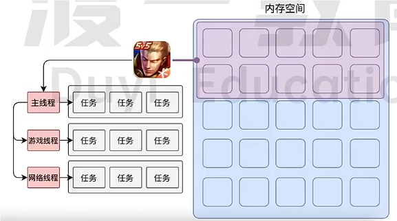
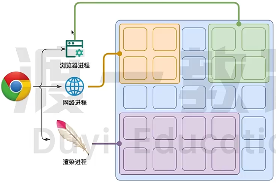
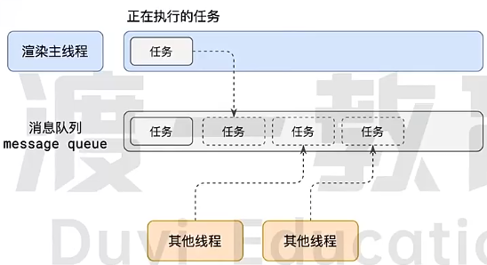
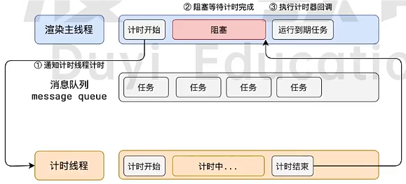
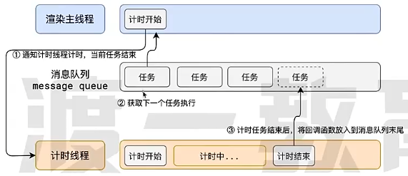
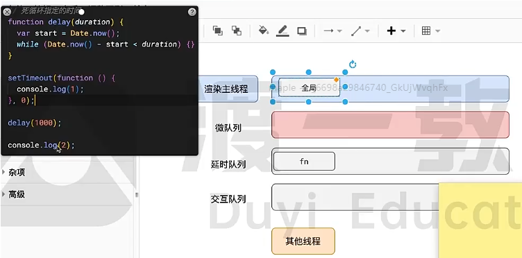

## 浏览器的进程模型

### 何为进程？

程序运行需要有它自己的专属内存空间，可以把这块内存空间简单的理解为进程，一个进程崩溃不会影响另一个进程的运行。

每一个应用至少有一个进程，进程之间相互独立，即使要通信，也需要双方同意

### 何为线程？

有了进程之后，就有了内存空间了，就可以运行程序代码了。

运行代码的 【人】称之为 【线程】。

一个进程至少有一个线程，所以在进程开启后会自动创建一个线程来运行代码，该线程称之为主线程，主线程结束了。整个进程也就结束了。

如果程序需要执行多块代码，主线程就会启动更多的线程来执行代码，所以一个进程可以包含多个线程。



### 浏览器有哪些进程和线程？

 <strong>浏览器是一个多进程多线程的应用程序</strong>

浏览器内部工作极其复杂。

为了避免互相影响，为了减少连环崩溃的机率，当启动浏览器后，浏览器会启动多个进程。

注：网络进程、渲染进程都是由浏览器进程启动起来的



> 可以在浏览器的任务管理器中查看当前的所有进程

其中主要的进程有：

1. 浏览器进程：主要负责界面显示、用户交互、子进程管理。浏览器内部会启动多个线程处理不同的任务。

2. 网络进程：负责加载网络资源。网络进程内部会启动多个线程来处理不同的网络任务。

3. **渲染进程：（本节课重点讲解的进程）**

   渲染进程启动后，会开启一个**渲染主线程**，主线程负责执行HTML、CSS、JS代码。
   默认情况下，浏览器会为每个标签页开启一个新的渲染进程，以保证不同的标签页之间不相互影响。

> 将来该默认模式可能会有所改变，有兴趣的同学可参见chrome官方说明文档

## 渲染主线程是如何工作的？

**事件循环也是发生在渲染主线程里面**

渲染主线程是浏览器中最繁忙的线程，需要它处理的任务包括但不限于:

+ 解析 HTML
+ 解析 CSS
+ 计算样式
+ 布局
+ 处理图层
+ 每秒把页面画60次（FPS：帧率）
+ 执行全局 JS 代码
+ 执行事件处理函数
+ 执行计时器的回调函数
+ .......

> 思考题：为什么渲染进程不适用多个线程来处理这些事情？

要处理这么多的任多，主线程遇到了一个前所未有的难题:如何调度任务?

比如:

+ 我正在执行一个 JS 函数，执行到一半的时候用户点击了按钮，我该立即去执行点击事件的处理函数吗?
+ 我正在执行一个 JS 函数，执行到一半的时候某个计时器到达了时间，我该立即去执行它的回调吗?
+ 浏览器进程通知我“用户点击了按钮"，与此同时，某个计时器也到达了时间，我应该处理哪一个呢?
+ ......

渲染主线程想出了一个绝妙的主意来处理这个问题：排队



1. 在最开始的时候，渲主线程会进入一个无限循环
2. 每一次循环会检查消息队列中是否有任务存在。如果有，就取出第一个任务执行，执行完一个后进入下一次循环;如果没有，则进入休眠状态。
3. 其他所有线程(包括其他进程的线程)可以随时向消息队列添加任务。新任务会加到消息队列的未尾。在添加
   新任务时，如果主线程是休眠状态，则会将其唤醒以继续循环拿取任务

这样一来，就可以让每个任务有条不紊的、持续的进行下去了。

整个过程，被称之为事件循环(消息循环)

## 若干解释

### 何为异步？

代码在执行过程中，会遇到一些无法立即处理的任务，比如:

+ 计时完成后需要执行的任务--setTimeout、setInterval
+ 网络通信完成后需要执行的任务--XHR、Fetch
+ 用户操作后需要执行的任务--addEventListener

如果让渲染主线程等待这些任务的时机达到，就会导致主线程长期处于「阻塞」的状态，从而导致浏览
器「卡死」



**主线程承担只极其重要的工作，无论如何都不能阻塞**

因此，浏览器选择异步来解决这个问题



**使用异步的方式，渲染主线程永不阻塞**

> 面试题:如何理解 JS 的异步?
>
> 参考答案:
> JS是一门单线程的语言，这是因为它运行在浏览器的渲染主线程中，而渲染主线程只有一个。
> 而渲染主线程承担着诸多的工作，渲染页面、执行 JS 都在其中运行。
> 如果使用同步的方式，就极有可能导致主线程产生阻塞，从而导致消息队列中的很多其他任务无法得到执行。
> 这样一来，一方面会导致繁忙的主线程白白的消耗时间，另一方面导致页面无法及时更新，给用户造成卡死现
> 象。
> 所以浏览器采用异步的方式来避免。具体做法是当某些任务发生时，比如计时器、网络、事件监听，主线程将
> 任务交给其他线程去处理，自身立即结束任务的执行，转而执行后续代码。当其他线程完成时，将事先传递的
> 回调函数包装成任务，加入到消息队列的末尾排队，等待主线程调度执行。
> 在这种异步模式下，浏览器永不阻塞，从而最大限度的保证了单线程的流畅运行，

### JS为何会阻碍页面渲染？

先看代码

```html
<!DOCTYPE html>
<html lang="en">

<head>
    <meta charset="UTF-8">
    <meta name="viewport" content="width=device-width, initial-scale=1.0">
    <title>Document</title>
</head>

<body>
    <h1>Mr.Yuan is awesome!</h1>
    <button>changes</button>
    <script>
        var h1 = document.querySelector('h1');
        var btn = document.querySelector('button');
        
        //死循环指定的时间
        function delay(duration) {
            var start = Date.now();
            while (Date.now() - start < duration) { };
        }

        btn.onclick = function () {
            h1.textContent = "袁老师很帅!";
            delay(3000);
        }
    </script>
</body>

</html>
```


1. 一开始执行全局js代码
2. 发现给btn按钮注册了一个点击事件，渲染主线程通知交互线程监听用户的点击事件，此刻渲染主线程没有任务，消息队列也为空，渲染主线程进入休眠状态。
3. 当用户点击了按钮之后，交互线程监听到用户点击了按钮，交互线程会把点击函数包装成任务，添加到消息队列的后面，此时，渲染主线程被唤醒，执行点击函数的那个任务。
4. 渲染主线程发现修改了h1中的文本被修改了，但是确实是修改了，但是用户看不到，因为修改之后需要重新绘制页面，重新绘制页面也属于渲染主线程的任务，所以产生绘制任务，在消息队列后面排队。但是当前任务还没结束，需要等待3秒。
5. 3秒之后在执行绘制任务，用户就看到了修改后的文本。

答案是：因为JS的执行和渲染都是在渲染主线程上执行。

### 任务有优先级吗?

任务没有优先级，在消息队列中先进先出。

但消息队列是有优先级的。

根据 W3C 的最新解释:

+ 每个任务都有一个任务类型，同一个类型的任务必须在一个队列，不同类型的任务可以分属于不同的队列。
  在一次事件循环中，浏览器可以根据实际情况从不同的队列中取出任务执行。
+ 浏览器必须准备好一个微队列，微队列中的任务优先所有其他任务执行

https://html.spec.whatwg.org/multipage/webappapis.html#perform-a-microtask-checkpoint

>  随着浏览器的复杂度急剧提升，W3C 不再使用宏队列的说法

在目前 chrome 的实现中，至少包含了下面的队列:

- 延时队列:用于存放计时器到达后的回调任务，优先级「中」
- 交互队列:用于存放用户操作后产生的事件处理任务，优先级「高」
- 微队列:用户存放需要最快执行的任务，优先级「最高」



> 面试题:阐述-下 JS 的事件循环
>
> 参考答案:
> 事件循环又叫做消息循环，是浏览器渲染主线程的工作方式，
> 在 Chrome 的源码中，它开启一个不会结束的 for 循环，每次循环从消息队列中取出第一个任务执行，而其
> 他线程只需要在合适的时候将任务加入到队列未尾即可。
> 过去把消息队列简单分为宏队列和微队列，这种说法目前已无法满足复杂的浏览器环境，取而代之的是一种更
> 加灵活多变的处理方式。
> 根据 W3C 官方的解释，每个任务有不同的类型，同类型的任务必须在同一个队列，不同的任务可以属于不同的
> 队列。不同任务队列有不同的优先级，在一次事件循环中，由浏览器自行决定取哪一个队列的任务。但浏览器
> 必须有一个微队列，微队列的任务一定具有最高的优先级，必须优先调度执行

>面试题:JS 中的计时器能做到精确计时吗?为什么?
>
>参考答案:
>不行，因为:
>
>1. 计算机硬件没有原子钟，无法做到精确计时
>2. 操作系统的计时函数本身就有少量偏差，由于 JS 的计时器最终调用的是操作系统的函数，也就携带了这
>   些偏差。
>3. 按照 W3C 的标准，浏览器实现计时器时，如果嵌套层级超过 5 层，则会带有 4 毫秒的最少时间，这样
>   在计时时间少于。
>4. 毫秒时又带来了偏差受事件循环的影响，计时器的回调函数只能在主线程空闲时运行，因此又带来了偏差