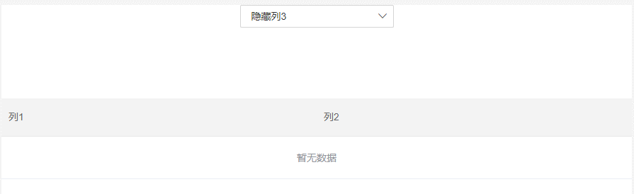
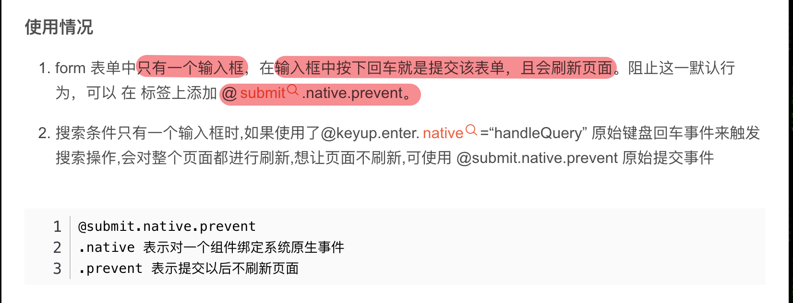

# 各种官网

[dataV官方文档](http://datav.jiaminghi.com/ "dataV官方文档")

[RuoYi-Vue官方文档](http://doc.ruoyi.vip/ "RuoYi-Vue官方文档")

[Markdowm官方文档](https://markdown.com.cn/ "Markdown官方文档")

[VSCode主题网站](https://vscodethemes.com/ "VSCode主题网站")

[Vue官方文档](https://vuejs.org "Vue官方文档")

[SRI哈希生成器](https://www.srihash.org/ "SRI哈希生成器")

[密钥对生成器](http://web.chacuo.net/netrsakeypair "密钥对生成器")

[Chrome浏览器插件集合](https://chrome.zzzmh.cn/#/index)

[npm查包官网](https://www.npmjs.com/ "npm查包官网")

# 关于Node和npm

`npm -g install npm@6.14.15` 切换npm到指定版本

`npm install -g npm` 更换最新版本本机最新版本为8.11.0

## Node版本管理工具(window系统)

nvm是node版本管理工具可以操作node版本切换、安装、查看等

[nvm下载地址](https://github.com/coreybutler/nvm-windows/releases "下载地址")

[nvm安装教程](https://blog.csdn.net/qq_41287052/article/details/125105858 "nvm安装教程")

`<font color=red>`注意：版本切换时需以管理员身份运行cmd，否则会出现乱码，无法正常切换`</font>`

`nvm -v` 查看当前node版本

`nvm ls` 查看已安装node版本

`nvm install 14.18.0` 安装对应vXX版本的node

`nvm use 14.18.0`选择使用14.18.0版本   切无需修改系统环境变量等，轻松无缝切换各版本

`nvm list` 版本列表

`nvm uninstall 16.15.1` 卸载对应v16.15.1版本的node

### Node版本管理工具(Mac os系统)

`sudo npm cache clean -f` 清除node.js的cache

`sudo npm install -g n`使用npm安装n模块 [教程](https://so.csdn.net/so/search?q=npm%E5%AE%89%E8%A3%85&spm=1001.2101.3001.7020)

`npm view node versions` 查看node所有版本

`sudo n latest` 升级到最新版本

`sudo n stable` 升级到稳定版本

`sudo n xx.xx` 升级到具体版本号

`node -v` 查看当前node版本

`n` 检查目前安装了哪些版本的node，会出现已安装的node版本，选一个就可以直接切换了

## nrm对npm源进行切换

`npm install -g nrm` 安装nrm

`nrm ls` 查看可选源列表

`nrm current` 查看当前源

`nrm use taobao` 切换到淘宝镜像源

`nrm add newtaobao https://registry.npmmirror.com` 阿里镜像源

`nrm add tencent http://mirrors.cloud.tencent.com/npm/` 添加源

`nrm del tencent` 删除源

`nrm test taobao` 测试源传输速度

### 各种源

+ npm -------https://registry.npmjs.org/    npm
+ yarn -------https://registry.yarnpkg.com/   yarn
+ tencent ------http://mirrors.cloud.tencent.com/npm/  腾讯
+ cnpm --------https://r.cnpmjs.org/  淘宝
+ ali ------https://registry.npmmirror.com/   阿里（新镜像源）

# 关于git操作

## git初始化配置

1. 设置username和email

   `git config --global user.name "xxx" `设置username
   `git config --global user.email "xxx@xxx.com" `设置git邮箱
2. 生成密钥，执行过程中遇到啥都 `回车`或者按 `y`, 这时候，就会在 `~/.ssh`目录下面生成 `id_rsa`和 `id_rsa.pub`两个密钥文件，其中不带 `.pub`的是私钥，带 `.pub`的是公钥

   `ssh-keygen -t rsa -C "xxx@xxx.com"`
3. 检查本机是否存在 `ssh key`

   `cd ~/.ssh` 切换到.ssh文件夹下

   `ls` 查看ssh文件
4. 获取 `ssh key`公钥内容

   `cd ~/.ssh`

   `cat id_rsa.pub`
5. 登录github，`ssh`添加公钥

## git项目相关操作命令

`git config --global user.name hufeg` 设置git用户名

`git config --global user.email 985311845@qq.com` 设置git邮箱

`git config --list` 查看git配置

`git config user.name` 查看用户名

`git config user.email` 查看邮箱

`git config user.password` 查看密码

`git diff branch1 branch2 --stat`       显示branch1和branch2中差异部分

`git diff branch1 branch2 具体文件路径`       显示指定文件的详细差异

`git stast push vue.config.js`       将vue.config.js存起来不需要提交到暂存区或者仓库

`git diff branch1 branch2`        显示出所有有差异的文件的详细差异

`git log branch1 ^branch2`       查看branch1分支有，而branch2中没有的log

`git log branch1..branch2`       查看branch2中比branch1中多提交了哪些内容(**注意，列出来的是两个点后边（此处即dev）多提交的内容。**)

<font color='red'>**`git stash`命令用于保存当前工作目录的临时状态，包括暂存区和已修改但未暂存的文件。它会将这些修改保存在一个临时区域（即“堆栈”）中，让你能够回到一个干净的工作目录，可以进行其他操作。等到你完成其他任务后，可以再回到之前的状态，继续之前的开发</font>

`git branch -r`    查看远程所有分支

`git branch`      查看本地所有分支

`git branch -a`    查看本地及远程的所有分支

`git fetch`  将某个远程主机的更新，全部取回本地

`git checkout 分支名`       切换到某个分支

`git branch -d 分支名`      删除本地某个分支

`git remote show origin`  查看远程分支和本地分支的对应关系

`git pull`      拉去本分支的最新代码

`git add .` 提交所有修改到暂存区

`git commit -m'提交消息'` 提交在暂存区到本地仓库

`git push` 推送本地仓库到远程仓库

### git撤销命令

1. 撤销add

   ```javascript
   git reset HEAD //后面什么都不跟的，就是上一次add 里面的内容全部撤销
   git reset HEAD XXX //后面跟文件名，就是对某个文件进行撤销
   ```

2. 撤销commit

   ```javascript
   //参数:
   –mixed:意思是：不删除工作空间改动代码，撤销commit，并且撤销git add . 操作,这个为默认参数,git reset --mixed HEAD^ 和 git reset HEAD^ 效果是一样的。
   –soft:不删除工作空间改动代码，撤销commit，不撤销git add .
   –hard:删除工作空间改动代码，撤销commit，撤销git add注意完成这个操作后，就恢复到了上一次的commit状态。.
   
   git reset --soft HEAD^  //仅仅是撤销commit操作，你所写的代码任然保留   HEAD^是上一个版本，也可以写成HEAD~1。如果commit了2次可以HEAD~2
   ```

3. 修改commit注释

> 1.git commit --amend
>
> 2.输入新的注释
>
> 3.esc键退出vim编辑模式
>
> 4.:wq保存已编辑的注释
>
> 5.git push提交代码

### git合并分支

1. 对当前的dev分支的代码进行存储 
   1. 如果当前代码没有编写完成，不想提交，可将当前代码临时保存：git stash save '临时保存的描述'
   2. 如果当前代码已经编辑完成，可将当前代码提交到本地仓库
      1. 提交到暂存区：`git add .`
      2. 将暂存区的文件提交到本地仓库：`git commit -m'本次提交描述'`
2. 切换到master分支：`git checkout master`
3. 拉取master最新代码：`git pull origin master`
4. 切换到dev分支：`git checkout dev`
5. 将master分支的代码合并到dev分支：`git merge master`
6. 将dev分支代码提交至远程仓库(如没有提交的代码，此步骤跳过)：`git push -u origin dev`
7. dev分支合并到master分支：`git checkout master`
8. dev分支的代码合并到master分支：`git merge dev `
9. 查看状态：`git status`
10. 将master分支提交到远程仓库：`git push origin master`
11. 如有临时存储文件（如：git stash），切换至dev分支：`git checkout dev`
12. 回滚第一个临时存储：`git stash pop`

### 其他常用git命令

* 更新远程分支列表：`git remote update origin —prune`
* 删除远程分支-dev：`git push origin --delete dev`
* 删除本地分支-dev：`git branch -d dev`
* 创建新的分支：`git checkout -b 'dev'`
* 将创建的本地分支推送到远程仓库：`git push origin dev`
* 同步远程分支：`git fetch`
* #### 默认情况下git是不区分大小写的，修改文件名大小写后，git提交不了

```
解决方案：默认情况下git不区分大小写，如果需要修改已提交至git系统中的文件名称大小写，需要开启本地客户端配置，让其区分大小写
设置区分大小写
git config core.ignorecase fasle
查看当前git是否区分大小写
git config --get core.ignorecase
```

### git回滚操作

```
git 误删之后如何恢复
1. 删除了远程分支，本地分支又git pull后最新代码被覆盖了，或者远程分支被删除，本地分支也被删除
	git reflog  git reflog 可以查看本地库的所有分支的所有操作记录（包括已经被删除的 commit 记录和 reset 的操作）。用git log则是看不出来被删除的commitid。
	git checkout -b new_branch_name hash 其中 hash 是误删除前的版本的 commit id。注意：这种情况下新拉出的分支，要使用 git push 推送到远端仓库才能和其他开发者共享。
	或者：
	git reset --hard commit_id 回退到某个历史版本
	
	git push  提交代码
	
二、使用reflog恢复之后的注意事项
1、误删后如果一直在进行分支切换和代码修改，会导致误删的那个版本号被 reflog 给覆盖掉，无法找回

2、恢复回来的最新版本，无法直接 push 到一个已经被其他开发从远端仓库获取的分支上去，否则会发生冲突

3、这种方式只适用于本地代码库，如果误删的是远程库的 commit，需要重新 clone 一份远程库的代码进行修复。

三、使用git reset --hard恢复之后的方法
在通常的情况下，在本地代码库中误删可以通过 git reset 来恢复。但是如果误删的是远程库的代码，这时候只能通过 git reset --hard 来恢复。以下是 git reset --hard 的几种使用方式：

1、本地代码库误删文件:
git reset --hard 

2、回退到某个历史版本：
git reset --hard commit_id

3、回退到某个分支：
git reset --hard origin/test

4、回退到当前版本之前的两个版本:
git reset --hard HEAD~2

四、使用git reset --hard恢复之后的注意事项
1、使用 git reset --hard 会彻底清除误删之后的修改，慎用
2、对于远程仓库中误删需要通过 reset --hard 恢复的情况，需要重新 clone 一份远端库的代码进行修复，否则会造成代码库的混乱。
	
```


## github

```
生成ssh
ssh-keygen -t rsa -C "xxx@qq.com"

查看公钥和私钥
cat ~/.ssh/id_rsa.pub

PS：如果忘了Git密码，放弃如何修改，选择删除后重新创建一个新的SSH密钥吧。据调查Git为了保证安全并没有重新修改密码的功能

1、首页：查看本地是否有.ssh文件
找到 Git Bash 打开后 运行 cd ~/.ssh 查看是否有该文件
如果本地有ssh密钥的话会有id_rsa、id_rsa.pub、known_hosts等文件。
如果没有的话运行上步骤命令就会找不到文件的提示
2、也可以删除ssh
复制并运行 rm -rf ~/.ssh/* 把现有的ssh key都删掉，这句命令行如果你多打一个空格，可能就要重装系统了，建议复制运行。
3、运行 ssh-keygen -t rsa -b 4096 -C “你的邮箱” ，注意填写你的真实邮箱。
4、按回车三次
5、运行 cat ~/.ssh/id_rsa.pub ，得到一串东西，完整的复制这串东西
6、打开GitHub->点击头像->setting->SSH adn GPG keys->New SSh key
7、输入你的title、把刚才复制的那段粘贴到key中保存
8、运行 ssh -T git@github.com ，你可能会看到这样的提示。
9、输入yse
10、然后如果你看到 Permission denied (publickey). 就说明你失败了，请回到第 1 步重来，是的，回到第 1步重来；
如果你看到 Hi FrankFang! You’ve successfully authenticated, but GitHub does not provide shell access.
那就说明你成功了
```


## vim编辑器操作命令

```javascript
:q  
//退出

:q! 
//退出且不保存（:quit!的缩写）

:wq
//保存并退出

:wq!
//保存并退出即使文件没有写入权限（强制保存退出）

:x
//保存并退出（类似:wq，但是只有在有更改的情况下才保存）

:exit
//保存并退出（和:x相同）

:qa
//退出所有(:quitall的缩写)

:cq
//退出且不保存（即便有错误）

```

# 关于浏览器

### 鉴权

session与token的区别

> 用户第一次登录的时候，服务器进行检验，校验成功后，服务器会产生一个session，然把sessionId返回给客户端，客户端将sessionId存储在cookie中，服务器将产生的sessionId存储在内存中，下次访问服务器的时候，客户端会携带cookie，服务器拿到cookie中的sessionId之后，与内存中的sessionId进行鉴权。
> 注意：session是基于cookie之上的，所以不能跨域，因为session是存储再内存中的，所以不能做分布式部署，但是也有解决方案
> 解决方案：第三方存储、session复制等等

> token跟session类似，第一次登录时候会产生一个token，然后返回给客户端，客户端拿到token之后进行存储，之后的每次请求都带上token，后端拿到token之后进行鉴权。
>
> 普通的token需要存储在服务器端的数据库上，每次服务器都需要拿着token到数据库中进行对比。
>
> jwt token不需要存储在服务器上，只需要存储在客户端。服务器拿到token之后，对token的 `第一部分的头部`和 `第二部分的载体`再进行一次加密，然后和第三部分的密钥进行对比

# 关于vue

## 生命周期

1. 监听子组件生命周期

   ```vue
   //parent.vue
   <Children @mounted="doSomething"></Children>
   
   //Children
   mounted(){
   	this.$emit("mounted")
   }
   ```

   ```vue
   //parent
   <Children @hook:mounted="doSomething"></Children>
   
   doSomething(){
   	console.log('父组件监听到Children的munted钩子函数')
   }
   //Children
   mounted(){
   	consolelog("子组件触发mounted钩子函数")
   }
   //输出顺序为：子组件触发mounted钩子函数=》父组件监听到Children的munted钩子函数
   ```

   ## 组件缓存

   keep-alive内置组件


   ```vue
   //一般配合动态路由一起使用，用于缓存当前组件状态，避免重新渲染
   //或者配合<component is="componentName"></component>使用
   //三个钩子函数：actived、deactived、errorCaptured(子组件保存时，会触发这个钩子函数)
   <keep-alive>
   	<component is="myComponent"></component>
   </keep-alive>
   //注意： exclude 的优先级比 include 高
   ```

# 关于Echart

## echart根据屏幕大小自适应

```javascript
import echarts from 'echarts';
import Vue from 'vue';
import elementResizeDetectorMaker from "element-resize-detector"

export var version = '0.0.1';
var compatible = (/^2\./).test(Vue.version);
if (!compatible) {
  Vue.util.warn('vue echarts resize directive ' + version + ' only supports Vue 2.x, and does not support Vue ' + Vue.version);
}
let HANDLER = "_vue_echarts_resize_handler"

function bind(el) {
  unbind(el);
  el[HANDLER] = function () {
    let chart = echarts.getInstanceByDom(el);
    if (!chart) {
      return;
    }
    chart.resize();
  }
  //监听window窗体变化，更新echarts大小
  //window.addEventListener("resize", el[HANDLER])
  //监听绑定的div大小变化，更新echarts大小
  elementResizeDetectorMaker().listenTo(el, el[HANDLER])

}
function unbind(el) {
  //window.removeEventListener("resize", el[HANDLER]);
  elementResizeDetectorMaker().removeListener(el, el[HANDLER])
  delete el[HANDLER];
}
var directive = {
  bind: bind,
  unbind: unbind
};

export default directive;
// Vue.directive("on-echart-resize", directive)

```

### 调整地图的label位置（有时候地市的名字歪了，需要调整）

```json
{
  "type": "FeatureCollection",
  "features": [
    {
      "id": "1001",
      "type": "Feature",
      "geometry": {
        "type": "MultiPolygon",
        "coordinates": [
          [
            "@@AAADA@@BBBA@CAGFAAAD@B@BCD@FDAHBBJDAFCJDDABBAADGCC@CBEDCAACBA@CAEC"
          ],
          [
            "@@@CAA@D@BB@"
          ],
          [
            "@@GBGLM@EAGFIFA@AFM@AHDDADIBIBCAKA@ABCCAADMJSBGFBDABMFUBE@[LEF[NUFQB]FUJE@CEG@KGYDCCIIGGMEUCOKƒMuGIDkL@NDPCRGJSRCJANDX@NCPCNGDmFCDAHC\\EHQFHVATAHCFEFEJADEBW\\Q\\CF@HELSPGBQ@_JaEC@E@GEACEECAKACDCVBDDBJAFHBJGBQJOf[p[XqbOB]@qMc]QY]oi{GS@KFGcMC@CFCBYII@KEADBPALCFELEBMCG@]N_LGFCJADGFEHBHNPBD^HDDBPBJHTHJBJAFCBQEKAODEFCT@FDB@DGPAL@DHF@DEFGDEFIDEHIVBBHJAJNRDH@DCBW@ACCAODM@YFEDAD@DJL@FEDIBBFHDTRDR@HHDjDN@D@HHRFJBJ@DHDPFNRLJNNNBHRVRRR@DBDRFPDHVNHNJFJEBIHMJ@RLBDEXD\\RdHDHID@BB@HTCVDLH\\\\DJIJ@FFPABEHULBHTJFFBFCDCBWFAD@FBFFFXRRZTX[FOVMCGEC@MNCPFJADE@GIIAQ@CB@DBJAFHD@BIH@DFBLABEBCDCNBDD@BEFELDNJTBFAFC@QAADBNDBHBHHDCDIJCDDFJLFFHDDL@HFN@PEFFHABDHEFD`NJ@HAF@\\KD@DHHBFB´GFAF@bK@ELIDBFHD@XE^@b[BBBFFBF@JCB@DZAHGRE^FbHJQVCjCXAF@HAHBDKHEN@BH@@DFFID@FFDCH@DCBHD@DADBDCJCDFHADBFCBBFEA@B@DFDBLCDEDBDBLDBB@F@BFHDDLDBD@AFFBBHEBCDHDBDEB@BHFADC@CB@JMRAHHJCHADEDKBAPHLLHBFCH@FPAF@DNJADB@J@BLH@FCB@BDJCHIFEJFHBJ@JEFBDEH@HFFRHbXFFVTBFBJLHDLVRJVADGF@NCFQREBMGC@CDC@IEABBLADIHCFCFODEHObERAN@LDHBBNBJAH@DB@FIPFFCNJLDNDDH@HALBT^HFJBBDATDLJDPDDBDDVHLLLFHDHCVSBE@GBGDCNBHCLSHCJ@JMB@LFRFRBDA@IFCFBBIDATDlCHFLBRE`@JCFCAC@IAAIEEG@KMMQeEGKGGIFYBE@GNIHKHEFGLCBABCHCPDFAHCHA@CGGBAZEREDC@CCEEAK@G@AC@IBCBGBCF@HDF@JKVIDCJQRCPAPAHE@GBCFA@MDKNK@AKO@EBGHG@EKQGKESEGCCEQDGUKAIEC@IHMJKBE@GDAZAHAXUFG@E@AFBBFD@DBB@DA@GLQb[LElKJcLIAQDEV@RHPDJL@FBBDABIFGFAPLP@BB@JHDDBFDVADFDBBACIBELEJ@FB@FKDAFEDADFDBFEFFNADCDBFPDDF@DB@FEJDT@HFJB@FFFLHJBJ@D@DGCEDABAJBDAAEE@CA@EDIBAAEEEFMD@HHFRFJBRDBVTHB@BF@@BBGECAEEADCB@PLD@DA@I@CFIAOECAEBANC@ED@DKBAHADBD@AEBC@EL@BDRADIfBHFJVLFBHGLEDBHADKFQBEHDHPAHBFJRLJHRDLCPA`TDEL_FCBD@FHFDCBEDA@CBABDBADB@DN@HFAGAC@EAABEFAHAHBHHAFRDAEBCJAFD@FFDFCAABGCCDCBCCCCAIACE@IJCFEFDF@DGC@GCCC@CECFOCC@CFALQJEDEJCBCF@LBLAB@BFDBB@NEEKIG@AHGJEHCHHFABCL@LG@CCCG@@ADCBCDAPAH@NCDABODCAEEEEAKCOGGCCEG@@GHC@CGEIBGCGII@GBCDHJGFGAOFKABICCEDEHC@E@MMDCCG@CPQDGEGIAGGAIBMAAICAF@LE@AAAICEKAAJC@EEKECAKAIC@GFCFALK@C@KEIECCDGLMJEHEDEBKCMOE@[HABALABIAIDKBKC@IBOAYCKGGCCKCeaKESCWGMIONIAACCG@CGI@AHSLMBEHKJIDE@EIECK@CFG@CFIHAFFJFBHBBJCTSFMJK@KF@FFFCFIAC@AE@A@GIuEkGQEECM@qOOI[UgQuOuI]IkUQBFQ@GBELGACAAG@AGBCB@HDFGF_BIGG@EHMAOHIBEACIIQ@CECOBGDEAAI@IDADKBGBIAE@ABI@CE@C@CFC@GIEEG@EHIFIBGAQFCASACAQ@MAQEK@KFOHIHEDOKsDcAIGMYQG@GECO@UIKe[AOBQG_KOGEE@MBACAKBQCCIC@GDCBGEKMM@CDC@MEECEDSPOLMBCAIFEH@PIBK@CDILGFE@EEGHIAI@GDKLSLCDGJEAAACE@UJCEDE@CCEI@ADIHA@AAAGJECE@CLKDEACI@EQCC@AD@FCAEIEHABEDABGMKC@"
          ],
          [
            "@@@BJFA@@DJNETGJFHHDFAJO@GCEAQBIB@FBBCECGHCB@CABAEQC"
          ]
        ],
        "encodeOffsets": [
          [
            [
              117698,
              31765
            ]
          ],
          [
            [
              116492,
              31026
            ]
          ],
          [
            [
              117282,
              30689
            ]
          ],
          [
            [
              117729,
              31738
            ]
          ]
        ]
      },
      "properties": {
        "cp": [
          114.298572,
          30.584355
        ],
        "name": "武汉",
        "childNum": 4,
        "id": "1001"
      }
    }
}
```

比如说武汉的名字歪了，需要找到武汉对应的地理坐标，然后调整properties属性中的cp，第一项表示横坐标（越大越靠右）第二项表示纵坐标（越大越靠上）

# 月份算法

```javascript
getNowMonth(monthLength) {
      let monthList = [];
      for (let i = 0; i < monthLength; i++) {
        let year = new Date().getFullYear(); //当前的年份
        let month = new Date().getMonth() + 1; //当前的月份
        if (month - i >= 1) {
          month -= i;
          if (month < 10) {
            monthList.push(`${year}0${month}`);
          } else {
            monthList.push(`${year}${month}`);
          }
        } else {
          let intNum = i - month;
          let years = Math.ceil((intNum + 1) / 12);
          let months = intNum % 12;
          let num = 12 - months;
          if (num < 10) {
            monthList.push(`${year - years}0${num}`);
          } else {
            monthList.push(`${year - years}${num}`);
          }
        }
      }
      this.monthList = monthList;
    }
```

# 关于项目配置

设置了alias以后vscode 点击路径跳转不了，也没有了智能提示路径，也找不到文件引用

```javascript
//webpack.config.js文件配置
resolve:{
    alias:{
        //这样设置就可以直接在组件中使用‘@/’直接访问src目录了
        '@':path.resolve('src')
    }
}
```

`<font color="green">`解决方案`</font>`

在项目的根目录下新建一个jsconfig.json文件

```json
{
    "compilerOptions":{
        "baseUrl":"/",
        "paths":{
            "@/*":["src/*"]
        }
    },
    "exclude":["node_modules","dist"]
}
```

# Element-UI

### 关于el-table行拖拽

[npm地址教程](https://www.npmjs.com/package/sortablejs "npm地址教程")

1. 安装sortablejs库

   ```javascript
   npm install sortablejs --save
   ```
2. 引入sortablejs库

   ```javascript
   import Sortable from 'sortablejs'
   ```
3. 初始化sortable实例

   ```javascript
   methods:{
       initSortable(){
       let _this = this;
       //获取绑定元素
       const ele = this.$refs.table.$el.querySelector('.el-table__bodt > tbody');
       //创建拖拽实例
       let dragTable = Sortable.create(ele,{
           animation: 150, //动画
           disabled: false, // 拖拽不可用? false 启用（刚刚渲染表格的时候起作用，后面不起作用）
           handle: '.move', //指定拖拽目标，点击此目标才可拖拽元素(此例中设置操作按钮拖拽)
           filter: '.disabled', //指定不可拖动的类名（el-table中可通过row-class-name设置行的class）
           dragClass: 'dragClass', //设置拖拽样式类名
           ghostClass: 'ghostClass', //设置拖拽停靠样式类名
           chosenClass: 'chosenClass', //设置选中样式类名
           // 开始拖动事件
           onStart: () => {
             console.log('开始拖动');
           },
           // 结束拖动事件
           onEnd: ({ newIndex, oldIndex }) => {
             console.log(
               '结束拖动',
               `拖动前索引${oldIndex}---拖动后索引${newIndex}`
             );
             const currRow = _this.tableData.splice(oldIndex, 1)[0];
             this.tableData.splice(newIndex, 0, currRow);
       	})
   	},
   	// 设置表格row的class
   	tableRowClassName({ row }) {
     	if (row.disabled) {
       	return 'disabled';
     	}
        return '';
   	}
   },
   mounted(){
       this.initSortable();
   }
   ```

#### <font color=red>注意：初始化函数必须等请求数据回来，页面渲染之后再调用</font>

###### <font color="orange">附加技术栈：[元素拖拽之----vuedraggable](https://www.npmjs.com/package/vuedraggable)</font>

### 关于el-table，table-cell与表头中的数据对比，不满足要求的标红

publicData.js

```javascript
export const compare = {
  primaryTarget: {
    zbName101Compare: '>=12',
    zbName102Compare: '>=2',
    zbName103Compare: '>=2.5',
    zbName104Compare: '>=30',
    zbName105Compare: '>=22',
    zbName106Compare: '>=60',
    zbName107Compare: '>=13.7',
    zbName110Compare: '>=1',
  },
  serve:{
    zbName201Compare: '>=96',
    zbName202Compare: '<=0.4',
    zbName203Compare: '>=97',
    zbName204Compare: '>=40',
    zbName205Compare: '==1',
    zbName206Compare: '>=99.2',
  },
  cncard:{
    zbName301Compare: '>80',
    zbName302Compare: '>80',
    zbName303Compare: '==100',
    zbName304Compare: '<20'
  },
  ditch:{
    zbName401Compare: '>1.1',
    zbName402Compare: '>=80',
  }
}
```

template模板

```vue
<el-table
   ref="table"
   :header-cell-style="headerRowStyle"
   :span-method="spanMethod"
   :data="tableData"
   @row-click="handleRowClick"
   @sort-change="sortChange"
   style="width: 100%">
      <el-table-column
        v-for="(item, index) of tableConfig"
        :key="index"
        :label="item.label"
        :prop="item.prop"
      >
        <template v-if="item.children">
          <el-table-column
            v-for="(childrenItem, index) of item.children"
            :key="index"
            :label="childrenItem.label"
            :prop="childrenItem.prop"
            :sortable="childrenItem.needSort"
          >
            <template slot-scope="scope">
              <div v-if="childrenItem.label === '指标值'">
                <span
                  v-if="
                    compareProperty(
                      scope.row,
                      scope.row[childrenItem.prop],
                      scope.row[childrenItem.prop + 'Compare']
                    )
                  "
                  >{{ scope.row[childrenItem.prop] }}</span
                >
                <span v-else style="color: red">{{
                  scope.row[childrenItem.prop]
                }}</span>
              </div>
              <div v-else>
                <span>{{ scope.row[childrenItem.prop] }}</span>
              </div>
            </template>
          </el-table-column>
        </template>
   </el-table-column>
</el-table>
<script>
import { compare } from './publicData';
export default {
    methods: {
    	compareProperty(row, value, targetValue) {
      		if (value && targetValue && this.form.company === 'county' && row.countryAreaName !== '县域合计') {
        		return eval(value.replace('%', '') + targetValue);
      		} else {
        		return true;
      		}
    	},
        async getTableData() {
      		let url;
      		if (this.form.company === 'branchCom') {
        		url = '/system/analysisCountyplanApplyMonth/queryLatnPlan';
      		} else {
        		url = '/system/analysisCountyplanApplyMonth/queryCountyPlan';
      		}
      		let params = {
        		monthId: this.form.monthId,
        		zbType: this.title
      		};
      		const res = await getTableData(url, params);
      		if (res?.code == 200) {
        		if (this.form.company === 'county') {
          			res.data = res.data.map((item) => {
            			return { ...item, ...compare[this.activeName] };
          			});
        		}
        		this.tableData = res?.data;
        		this.oldData = [...res?.data];
      		}
    	}
    }
}
</script>
```

### el-table排序（纯前端排序，不分页，某些行固定）

```javascript
sortChange(column) {
  if (!column.order) {
    this.tableData = [...this.oldData];
    return;
  }
  const reg = /^(order)/;
  this.tableData = this.tableData.map((item) => {
    if (
      item.latnName === '县域合计' ||
      item.countryAreaName === '县域合计'
    ) {
      let keys = Object.keys(item);
      for (let key of keys) {
        if (reg.test(key)) {
          if (column.order === 'ascending') {
            item[key] = 9999999999;
          } else if (column.order === 'descending') {
            item[key] = -9999999999;
          } else {
            item[key] = 9999999999;
          }
        }
      }
    }
    let keys = Object.keys(item);
    for (let key of keys) {
      if (reg.test(key)) {
        item[key] = item[key] * 1;
      }
    }
    return item;
  });
  this.tableData.sort((a, b) => {
    return a[column.prop] - b[column.prop];
  });
},
async getTableData() {
  let url;
  if (this.form.company === 'branchCom') {
    url = '/system/analysisCountyplanApplyMonth/queryLatnPlan';
  } else {
    url = '/system/analysisCountyplanApplyMonth/queryCountyPlan';
  }
  let params = {
    monthId: this.form.monthId,
    zbType: this.title
  };
  const res = await getTableData(url, params);
  if (res?.code == 200) {
    this.tableData = res?.data;
    this.oldData = [...res?.data];
  }
}
```

### el-table多选

```javascript
<el-table
      :data="tableData"
      ref="table"
      :row-key="getRowKeys"
      border
      style="width: 100%"
      @selection-change="handleSelectionChange"
    >
    	<el-table-column type="selection" :reserve-selection="true" width="55">
      	</el-table-column>
</el-table>
```

### 多选删除，最后一页没数据，自动回到上一页

```javascript
deleteFunction(){
    // 执行删除操作，删除后最后一页没有数据，但是页码还是删除前的页码，删除最后一页全部数据需要页码减1
 	this.reSizePage(String(ids).split(',').length);
	// 删除后清空上次选中的行，不然multipleSelection依然残留上次选中的内容，导致每次					multipleSelection会累
	this.$refs.table.clearSelection();
}


reSizePage(num) {
    // this.nowPageTotal为当前页的数据条数
	if (num === this.nowPageTotal) {
        this.pageNum = this.pageNum - 1 || 1;
     }
}
```

### el-table动态添加行(或者列)的时候，table出现闪动情况



```vue
<template>
  <div>
    <el-select v-model="select">
      <el-option label="显示列3" :value="true"></el-option>
      <el-option label="隐藏列3" :value="false"></el-option>
    </el-select>
    <div style="margin-top: 100px">
      <el-table style="width:100%">
        <el-table-column label="列1"></el-table-column>
        <el-table-column label="列2"></el-table-column>
        <el-table-column label="列3" v-if="select"></el-table-column>
      </el-table>
    </div>
  </div>
</template>

<script>
export default {
  data() {
    return {
      select: false
    };
  }
};
</script>
//如上代码，通过 v-if 来控制 “列3” 的显示隐藏。尽管成功实现了功能，这个闪烁效果并不是我们想要的。得想方法去除。
原因推断
仔细观察切换时候的表现效果可以发现：

当新增一列时，表头先是变高然后迅速复原；
当减少一列时，表头先是空出了提出那一列的位置，然后迅速将空出来的空间重新分配给剩余的两列；
通过这么一粗浅的分析，我们可以很容易的看出：无论是新增列还是删除列，vue 都需要重新计算单元格的高度和宽度，然后再重新渲染到页面上。因为这个过程被直接反馈到了页面上，所以导致了 table 发生闪烁。

解决方法
使用 element 提供的 doLayout 方法
官方描述如下:

beforeUpdate(){
  this.$nextTick(() => { //在数据加载完，重新渲染表格
    this.$refs['table'].doLayout();
  })
}

//给 el-table 设置 key
//除了doLayout 方法，还可以通过给 <el-table> 添加 key 来解决这个问题。设置key后，只要key值发生时变化，vue 就会对整个<el-//table>重新加载渲染。如下：
<template>
  <div>
    <el-select v-model="select">
      <el-option label="显示列3" :value="true"></el-option>
      <el-option label="隐藏列3" :value="false"></el-option>
    </el-select>
    <div style="margin-top: 100px">
      <el-table style="width:100%" :key="select">
        <el-table-column label="列1"></el-table-column>
        <el-table-column label="列2"></el-table-column>
        <el-table-column label="列3" v-if="select"></el-table-column>
      </el-table>
    </div>
  </div>
</template>

```


### 纯前端下载

```javascript
import { saveAs } from 'file-saver';
import XLSX from 'xlsx';

fileSaverDownload(){
  let xlsxParam = { raw: true };
  let wb = XLSX.utils.table_to_book(document.querySelector('#' + id), xlsxParam);
  var wt = XLSX.write(wb, {
      bookType: 'xlsx',
      bookSST: true,
      type: 'array'
  });
  try {
      saveAs(new Blob([wt], { type: 'application/octet-stream' }), fileName + '.xlsx');
   } catch (e) {
      if (typeof console !== 'undefined') console.log(e, wt);
   }
}
```


### 关于el-form中的resetFields不能初始化表单

**问题分析结果：**

> 1、resetFields 重置的是初始值
> 2、form 的初始值在 mounted [生命周期](https://so.csdn.net/so/search?q=生命周期&spm=1001.2101.3001.7020)执行的时候被调用
> 3、如果在 mounted 生命周期执行之前修改了初始值，那么resetFields 方法会把修改后的值作为初始值

**解决方案：**

> 将回显数据放到 setTimeout 或者 nextTick 里面
>
> this.$nextTick(()=>{ *//这里赋值回显数据* })
>
> *//或者*
>
> setTimeout(()=>{ *//这里赋值回显数据* }.bind(this),0)

**注意：** 如果上面还是没有解决问题，建议检查一下你的 el-form-item 元素上是不是添加了 prop 属性。

### el-form表单事件@submit.native.prevent的使用,防止搜索框回车键刷新整个页面



### el-table合并行[查看代码](https://blog.csdn.net/Kerwin__li/article/details/130573532)

```vue
<template>
<div>
  <el-table :data="tableData" :span-method="objectSpanMethod" border style="width: 100%">
  </el-table>
  </div>
</template>
<script>
  export default{
    data(){
      return {
        mergeObj: {}, // 用来记录需要合并行的下标，有时候需要手动添加需要合并的列名，如：mergeObj:{typeName:[]}
        mergeArr: ["typeName", "indexNameId", "indexName", "score"], // 表格中的列名Ï
    }
  },
    methods:{
      // getSpanArr方法
      getSpanArr(data) {
        this.mergeArr.forEach((key) => {
          let count = 0; // 用来记录需要合并行的起始位置
          this.mergeObj[key] = []; // 记录每一列的合并信息
          data.forEach((item, index) => {
            // index == 0表示数据为第一行，直接 push 一个 1
            if (index === 0) {
              this.mergeObj[key].push(1);
            } else {
                // 第一列的相同行合并完成之后，合并其他列的时候判断第一列是否相同，相同的话就合并，不相同的话，就算当前列的行与上									 一行相同也不能合并
                if (item.typeName === data[index - 1].typeName) {
                  if (item[key] === data[index - 1][key]) {
                    this.mergeObj[key][count] += 1;
                    this.mergeObj[key].push(0);
                  } else {
                    // 如果当前行和上一行其值不相等
                    count = index; // 记录当前位置
                    this.mergeObj[key].push(1); // 重新push 一个 1
                  }
                } else {
                  // 如果行相同，但是第一列相同，就不合并
                  count = index; // 记录当前位置
                  this.mergeObj[key].push(1); // 重新push 一个 1
                }
              
            }
          });
        });
      },
        // objectSpanMethod方法
        // 默认接受四个值 { 当前行的值, 当前列的值, 行的下标, 列的下标 }
        objectSpanMethod({ column, rowIndex }) {
          if (this.mergeArr.indexOf(column.property) !== -1) {
            // 判断列的属性
            // 判断其值是不是为0
            if (this.mergeObj[column.property][rowIndex]) {
              return [this.mergeObj[column.property][rowIndex], 1];
            } else {
              // 如果为0则为需要合并的行
              return [0, 0];
            }
          }
        },
    },
      watch: {
        tableData: {
          immediate: true,
            deep: true,
              handler(value) {
              if (Array.isArray(value)) this.getSpanArr(value);
            },
        },
      },
  }
</script>
```

### el-table合并相同`行`和`列` [查看代码](https://blog.csdn.net/qq_43432158/article/details/126402868/)

```vue
<template>
    <div class="table">
        <el-table :data="tableData" :span-method="objectSpanMethods" border style="width: 100%">
            <!-- <template v-for="cols in colConfigs"> -->
                <!-- 无需合并的列 -->
                <!-- <el-table-column v-if="cols.type === 'label' && !cols.children" :key="cols.prop" :prop="cols.prop"
                    :label="cols.label">
                </el-table-column> -->
                <!-- 需要合并的列 -->
                <!-- <template v-else-if="cols.type === 'label' && cols.children">
                    <el-table-column v-for="children in cols.children" :key="children.prop" :prop="children.prop"
                        :label="children.label" />
                </template> -->
                
            <!-- </template> -->
             <el-table-column label="时间" prop="time"></el-table-column>
             <el-table-column label="个人信息">
                <el-table-column label="年级" prop="grade"></el-table-column>
                <el-table-column label="姓名" prop="name"></el-table-column>
             </el-table-column>
             <el-table-column label="科目" prop="subjects"></el-table-column>
             <el-table-column label="成绩" prop="score"></el-table-column>
        </el-table>
    </div>
</template>

<script>
export default {
    name: 'Table',
    data() {
        return {
            tableData: [
                { time: '2020-08-10', grade: '三年二班', name: '小明', subjects: '语文', score: 80 },
                { time: '2020-08-10', grade: '三年二班', name: '小明', subjects: '数学', score: 80 },
                { time: '2020-08-10', grade: '成绩', name: '成绩', subjects: '总成绩', score: 160 },
                { time: '2020-08-10', grade: '三年一班', name: '小雷', subjects: '语文', score: 70 },
                { time: '2020-08-10', grade: '三年一班', name: '小雷', subjects: '数学', score: 80 },
                { time: '2020-08-10', grade: '总成绩', name: '成绩', subjects: '成绩', score: 150 },
                { time: '2020-08-11', grade: '三年三班', name: '小花', subjects: '语文', score: 60 },
                { time: '2020-08-11', grade: '三年三班', name: '小花', subjects: '数学', score: 60 },
                { time: '2020-08-11', grade: '总成绩', name: '总成绩', subjects: '总成绩', score: 120 }
            ],
            // 表格的信息 需要合并的需要放在 children 中
            // colConfigs: [
            //     {
            //         type: 'label',
            //         children: [
            //             { prop: 'time', label: '时间' },
            //             { prop: 'grade', label: '年级' },
            //             { prop: 'name', label: '姓名' },
            //             { prop: 'subjects', label: '科目' },
            //             { prop: 'score', label: '成绩' }
            //         ]
            //     },
            //     // { type: 'label', prop: 'age', label: '年龄' }
            // ],
            // 需要合并的行列信息 index必须是table表格对应的下标 不能随意修改
            mergeCols: [
                { index: 0, name: 'time' },
                { index: 1, name: 'grade' },
                { index: 2, name: 'name' },
                { index: 3, name: 'subjects' },
                { index: 4, name: 'score' },
                // { index: 5, name: 'age' }
            ],
            // 用来记录每一个单元格的下标
            tableMergeIndex: [],
        };
    },
    methods: {
        objectSpanMethods({ row, column, rowIndex, columnIndex }) {
            let key = columnIndex + '_' + rowIndex;
            if (this.tableMergeIndex[key]) {
                return this.tableMergeIndex[key];
            }
        },
        newTableMergeData() {
            for (let i = 0; i < this.tableData.length; i++) {
                for (let j = 0; j < this.mergeCols.length; j++) {
                    // 初始化行、列坐标信息
                    let rowIndex = 1;
                    let columnIndex = 1;
                    // 比较横坐标左方的第一个元素
                    if (j > 0 && this.tableData[i][this.mergeCols[j]['name']] === this.tableData[i][this.mergeCols[j - 1]['name']]) {
                        columnIndex = 0;
                    }
                    // 比较纵坐标上方的第一个元素
                    if (i > 0 && this.tableData[i][this.mergeCols[j]['name']] === this.tableData[i - 1][this.mergeCols[j]['name']]) {
                        rowIndex = 0;
                    }
                    // 比较横坐标右方元素
                    if (columnIndex > 0) {
                        columnIndex = this.onColIndex(this.tableData[i], j, j + 1, 1, this.mergeCols.length);
                    }
                    // 比较纵坐标下方元素
                    if (rowIndex > 0) {
                        rowIndex = this.onRowIndex(this.tableData, i, i + 1, 1, this.mergeCols[j]['name']);
                    }
                    let key = this.mergeCols[j]['index'] + '_' + i;
                    this.tableMergeIndex[key] = [rowIndex, columnIndex];
                }
            }
        },
        /**
         * 计算列坐标信息
         * data 单元格所在行数据
         * index 当前下标
         * nextIndex 下一个元素坐标
         * count 相同内容的数量
         * maxLength 当前行的列总数
         */
        onColIndex(data, index, nextIndex, count, maxLength) {
            // 比较当前单元格中的数据与同一行之后的单元格是否相同
            if (nextIndex < maxLength && data[this.mergeCols[index]['name']] === data[this.mergeCols[nextIndex]['name']]) {
                return this.onColIndex(data, index, ++nextIndex, ++count, maxLength);
            }
            return count;
        },
        /**
         * 计算行坐标信息
         * data 表格总数据
         * index 当前下标
         * nextIndex 下一个元素坐标
         * count 相同内容的数量
         * name 数据的key
         */
        onRowIndex(data, index, nextIndex, count, name) {
            // 比较当前单元格中的数据与同一列之后的单元格是否相同
            if (nextIndex < data.length && data[index][name] === data[nextIndex][name]) {
                return this.onRowIndex(data, index, ++nextIndex, ++count, name);
            }
            return count;
        }
    },
    mounted() {
        if (this.mergeCols.length > 0) {
            this.newTableMergeData();
        }
    }
};
</script>

<style lang="scss" scoped>
.table {
    height: 100vh;
    width: 100%;
    padding: 40px;
    box-sizing: border-box;

    ::v-deep .el-table__body tr :hover>td {
        background-color: #fff
    }
}
</style>

```


# javascript基础

1. 二进制数据表示

   ```javascript
   // 二进制数据用 0b 开头的8位数标识、八进制用 0 开头、十六进制用 0x 开头
   // 十进制转任何进制都是短除法,注意第一个余数跟被除数对齐
   //任何进制转10进制就是：比如八进制数00000102 ===》1*8**2+2*8**0
   ```
2. 二进制中的原码、反码、补码

   **有符号数**

   ```
   对于有符号数而言，用 0 表示正，用 1 表示负，并且规定将它放在有效数字的前面，所以二进制数中用最高位（第一位）来表示符号
   ```

   **无符号数**

   ```
   无符号数是针对二进制来讲的无符号数的表示范围是非负数。全部二进制均代表数值（所有位都用来表示数的大小，没有符号位）
   ```

   有符号数的性质

   ```
   (1) 二进制的最高位是符号位：0表示正，1表示负。
   (2) 正数的原码、反码、补码都一样。
   (3) 负数的反码 = 它的原码符号位不变，其它位取反（0=>1,1=>0）。
   (4) 负数的补码 = 它的反码 + 1。
   (5) 0的反码、补码都是0。
   (6) 在计算机运算的时候，都是以补码的方式来运算的。
   ```
3. 位移运算符左移(<<)、右移(>>)、无符号右移(>>>)

   ```
   注意：如果任意十进制数字左移32位，右边补32个0，十进制岂不是都变成0了？当然不是。当int类型的数据进行左移的时候，当左移的位数大于等于32时，先对移动的位数除以32求余，也就是说左移32位，就相当于左移0位，左移33位就相当于左移1位
   ```

   ```
   左移无需转成补码，直接转成二进制，然后左移，低位补0即可
   ```

   ```
   有符号右移：
   正数右移：因为正数的补码就是它本身，所以直接右移之后，高位补0就行
   
   负数右移：先转成补码，然后右移，高位补符号位，移完之后，再取反（符号不变）加一
   
   无符号右移：
   直接补码，右移高位补0
   ```

# javascript中的循环

### ES6

1. **forEach**

   + forEach总是返回undefined
   + `callback`仅对已赋值的项调用，对稀疏数组中的空槽，他不会被调用
   + forEach不会改变数组本身，但是，作为 `callback`的函数可以更改数组。注意：在第一次调用 `callback`之前，数组的长度已经被保存。因此：
     + 当调用forEach时，`callback`不会访问数组初始长度之外的值
     + 已经访问过的索引的更改不会导致 `callback`再次调用它
     + 如果更改了数组中已经存在但未访问的元素，则传递给 `callback`的值是在访问该元素时的值，已经被删除的元素不会被访问
   + forEach方法是通用的，它只期望 `this`具有 `length`属性和整数的键
   + 除非抛出异常，否则无法停止或者终端forEach循环

   > `<font color="red">`注意：`forEach()` 期望的是一个同步函数，它不会等待 Promise 兑现。在使用 Promise（或异步函数）作为 `forEach` 回调时，请确保你意识到这一点可能带来的影响。`</font>`
